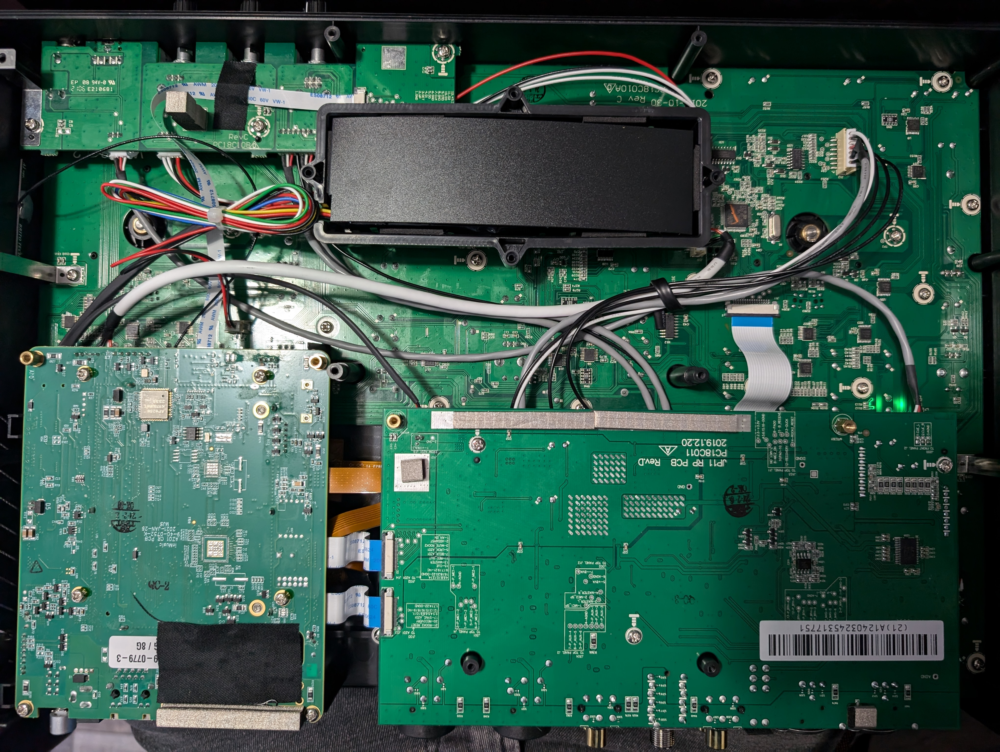
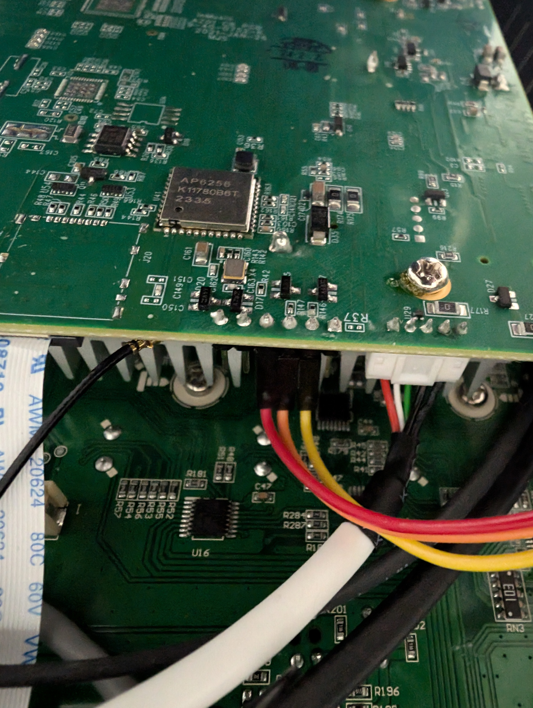

# UART

[UART](https://en.wikipedia.org/wiki/Universal_asynchronous_receiver-transmitter) is used to send data back and forth
between some devices. We can use this for console access.

## Prime Go

On the Prime Go, the UART is located on an empty header that's already on the board.

### Internal Image



NOTE: There is a `RECOVERY` button located on the other side of the board in the bottom left of this image. Hold it
down, press the power button, and it'll go into firmware update mode.

### UART Connection



This image is of the board on the bottom left of the internal image.

Wiring:

| Color  | UART Pin |
|--------|----------|
| Red    | GND      |
| Orange | TX       |
| Yellow | RX       |

UART Speed: 115200 Baud

### U-Boot

#### U-Boot Boot Log {collapsible="true"}

```
U-Boot SPL 2016.05-inmusic-20230621 (Nov 14 2023 - 10:30:29)
Trying to boot from MMC1


U-Boot 2016.05-inmusic-20230621 (Nov 14 2023 - 10:30:29 +0000), Build: jenkins-Planck-Embedded_Release-1943

Model: Denon DJ Prime GO
DRAM:  2 GiB
TSADC last_tshut_cru=1 (auto_con=0x03000000)
MMC:   dwmmc@ff0f0000: 0
In:    gpio-keys
Out:   serial
Err:   serial
AZ01  PCB revK (raw=9)
Hit any key to stop autoboot:  0 
switch to partitions #0, OK
mmc0(part 0) is current device
Scanning mmc 0:6...
Found U-Boot script /boot/boot.scr.uimg
489 bytes read in 7 ms (67.4 KiB/s)
## Executing script at 00000000
5583032 bytes read in 262 ms (20.3 MiB/s)
49752 bytes read in 10 ms (4.7 MiB/s)
Kernel image @ 0x2000000 [ 0x000000 - 0x5530b8 ]
## Flattened Device Tree blob at 01f00000
   Booting using the fdt blob at 0x1f00000
   Loading Device Tree to 1fff0000, end 1ffff257 ... OK
```

#### Environment Variables {collapsible="true"}

```
=> printenv
arch=arm
az01_bootcmd=if test x${dorecovery} = x1; then run az01_recovercmd; fi; run distro_bootcmd; echo 'Boot failed, resetting to bootloader...'; reset_bootloader
az01_recovercmd=echo 'Starting fastboot...'; fastboot 0
baudrate=115200
board=az01
board_name=az01
boot_a_script=load ${devtype} ${devnum}:${distro_bootpart} ${scriptaddr} ${prefix}${script}; source ${scriptaddr}
boot_extlinux=sysboot ${devtype} ${devnum}:${distro_bootpart} any ${scriptaddr} ${prefix}extlinux/extlinux.conf
boot_prefixes=/ /boot/
boot_script_dhcp=boot.scr.uimg
boot_scripts=boot.scr.uimg boot.scr
boot_targets=mmc0 mmc1 
bootargs=root=PARTUUID=24d1deac-3434-1a4e-98d1-68ee2945a5f1 rootwait ro rfkill.default_state=0 
bootcmd=run az01_bootcmd
bootcmd_mmc0=setenv devnum 0; run mmc_boot
bootcmd_mmc1=setenv devnum 1; run mmc_boot
bootdelay=0
cpu=armv7
distro_bootcmd=for target in ${boot_targets}; do run bootcmd_${target}; done
dorecovery=0
ethaddr=00:05:95:04:D8:20
fastboot.partition-type:data=ext4
fastboot.partition-type:rootfs=ext4
fdt_addr_r=0x01f00000
fdt_high=0x1fffffff
fdtcontroladdr=7b3a8368
fdtfile=rk3288-az01-jp11.dtb
initrd_high=0x1fffffff
kernel_addr_r=0x02000000
loadaddr=0x00800800
mmc_boot=if mmc dev ${devnum}; then setenv devtype mmc; run scan_dev_for_boot_part; fi
panel_compatible=urt,umoh-9522md-t
partitions=uuid_disk=02bebde5-b5a4-48cd-b262-512fe8b6ae06;name=uboot-spl,size=64KiB,start=32KiB,uuid=f6217a3c-1c7d-4969-8f05-88c0b9c0f0e6;name=env,size=32KiB,start=96KiB,uuid=be8b868f-89d8-4ff8-a64d-d077e73b4f09;name=uboot,size=384KiB,start=128KiB,uuid=461be792-3b29-4c0a-a6a2-3460c0119cbe;name=splash,size=4MiB,uuid=40bfa9cd-6d2c-4e22-a662-f0a803794462;name=recoverysplash,size=4MiB,uuid=e050b8e2-ee92-43ca-98ad-9aa4fbca8616;name=rootfs,bootable,size=500MiB,uuid=acded124-3434-4e1a-98d1-68ee2945a5f1;name=data,size=0,uuid=9dd41a93-59ad-4908-833a-9bf00af5b60e;
pcb_rev=K
pxefile_addr_r=0x00100000
ramdisk_addr_r=0x04000000
scan_dev_for_boot=echo Scanning ${devtype} ${devnum}:${distro_bootpart}...; for prefix in ${boot_prefixes}; do run scan_dev_for_extlinux; run scan_dev_for_scripts; done;
scan_dev_for_boot_part=part list ${devtype} ${devnum} -bootable devplist; env exists devplist || setenv devplist 1; for distro_bootpart in ${devplist}; do if fstype ${devtype} ${devnum}:${distro_bootpart} bootfstype; then run scan_dev_for_boot; fi; done
scan_dev_for_extlinux=if test -e ${devtype} ${devnum}:${distro_bootpart} ${prefix}extlinux/extlinux.conf; then echo Found ${prefix}extlinux/extlinux.conf; run boot_extlinux; echo SCRIPT FAILED: continuing...; fi
scan_dev_for_scripts=for script in ${boot_scripts}; do if test -e ${devtype} ${devnum}:${distro_bootpart} ${prefix}${script}; then echo Found U-Boot script ${prefix}${script}; run boot_a_script; echo SCRIPT FAILED: continuing...; fi; done
scriptaddr=0x00000000
serial#=A12403245317751
soc=rockchip
splashpos=m
stderr=serial
stdin=serial,gpio-keys
stdout=serial
vendor=inmusic

Environment size: 3037/8188 bytes
```

#### Clocks {collapsible="true"}

```
=> clock
osc: 24000000
apll: 1608000000
dpll: 533000000
cpll: 400000000
gpll: 594000000
npll: 73000000
```

#### Console Info {collapsible="true"}

```
=> coninfo
List of available devices:
serial@ff690000 00000003 IO 
gpio-keys 00000001 I. stdin 
vidconsole 00000002 .O 
serial   00000003 IO stdout stderr 
nulldev  00000003 IO
```

#### MMC Info {collapsible="true"}

```
=> mmc info
Device: dwmmc@ff0f0000
Manufacturer ID: 15
OEM: 100
Name: 8GTF4 
Tran Speed: 52000000
Rd Block Len: 512
MMC version 4.0
High Capacity: Yes
Capacity: 7.3 GiB
Bus Width: 8-bit
Erase Group Size: 512 KiB
```

#### Hush Shell Variables {collapsible="true"}

```
=> showvar
HUSH_VERSION=0.01
```

#### Version {collapsible="true"}

```
=> version

U-Boot 2016.05-inmusic-20230621 (Nov 14 2023 - 10:30:29 +0000)
arm-buildroot-linux-gnueabihf-gcc.br_real (Buildroot 2023.02.3-4-g189b0a5875) 12.3.0
GNU ld (GNU Binutils) 2.38
```

### Linux

#### Linux Boot Log {collapsible="true"}

```
Booting Linux on physical CPU 0x500
Linux version 6.1.78-inmusic-2024-02-16-p2-rt24 (jenkins@673a7630a96e) (arm-buildroot-linux-gnueabihf-gcc.br_real (Buildroot 2023.02.9-5-gc80b63ff32) 12.3.0, GNU ld (GNU Binutils) 2.38) #1 SMP PREEMPT_RT Wed Sep 11 02:54:27 UTC 2024
CPU: ARMv7 Processor [410fc0d1] revision 1 (ARMv7), cr=10c5387d
CPU: div instructions available: patching division code
CPU: PIPT / VIPT nonaliasing data cache, VIPT aliasing instruction cache
OF: fdt: Machine model: Denon DJ Prime GO
Memory policy: Data cache writealloc
OF: reserved mem: initialized node framebuffer, compatible id rockchip,framebuffer-memory
Zone ranges:
  Normal   [mem 0x0000000000000000-0x000000002fffffff]
  HighMem  [mem 0x0000000030000000-0x000000007fffffff]
Movable zone start for each node
Early memory node ranges
  node   0: [mem 0x0000000000000000-0x000000007fffffff]
Initmem setup node 0 [mem 0x0000000000000000-0x000000007fffffff]
percpu: Embedded 12 pages/cpu s17632 r8192 d23328 u49152
Built 1 zonelists, mobility grouping on.  Total pages: 522752
Kernel command line: root=PARTUUID=24d1deac-3434-1a4e-98d1-68ee2945a5f1 rootwait ro rfkill.default_state=0  isolcpus=1-3
Dentry cache hash table entries: 131072 (order: 7, 524288 bytes, linear)
Inode-cache hash table entries: 65536 (order: 6, 262144 bytes, linear)
mem auto-init: stack:all(zero), heap alloc:off, heap free:off
Memory: 2053884K/2097152K available (8192K kernel code, 815K rwdata, 2556K rodata, 1024K init, 279K bss, 30980K reserved, 12288K cma-reserved, 1298432K highmem)
SLUB: HWalign=64, Order=0-3, MinObjects=0, CPUs=4, Nodes=1
rcu: Preemptible hierarchical RCU implementation.
rcu: 	RCU event tracing is enabled.
rcu: 	RCU priority boosting: priority 1 delay 500 ms.
rcu: 	RCU_SOFTIRQ processing moved to rcuc kthreads.
	No expedited grace period (rcu_normal_after_boot).
rcu: RCU calculated value of scheduler-enlistment delay is 100 jiffies.
NR_IRQS: 16, nr_irqs: 16, preallocated irqs: 16
rcu: srcu_init: Setting srcu_struct sizes based on contention.
rockchip: reset MMC AHB arbitor
arch_timer: cp15 timer(s) running at 24.00MHz (phys).
clocksource: arch_sys_counter: mask: 0xffffffffffffff max_cycles: 0x588fe9dc0, max_idle_ns: 440795202592 ns
sched_clock: 56 bits at 24MHz, resolution 41ns, wraps every 4398046511097ns
Switching to timer-based delay loop, resolution 41ns
Console: colour dummy device 80x30
printk: console [tty0] enabled
Calibrating delay loop (skipped), value calculated using timer frequency.. 48.00 BogoMIPS (lpj=24000)
CPU: Testing write buffer coherency: ok
Spectre V2: workarounds disabled by configuration
pid_max: default: 32768 minimum: 301
Mount-cache hash table entries: 2048 (order: 1, 8192 bytes, linear)
Mountpoint-cache hash table entries: 2048 (order: 1, 8192 bytes, linear)
CPU0: thread -1, cpu 0, socket 5, mpidr 80000500
Setting up static identity map for 0x100000 - 0x100060
rcu: Hierarchical SRCU implementation.
rcu: 	Max phase no-delay instances is 400.
printk: console [tty0] printing thread started
smp: Bringing up secondary CPUs ...
CPU1: thread -1, cpu 1, socket 5, mpidr 80000501
CPU2: thread -1, cpu 2, socket 5, mpidr 80000502
CPU3: thread -1, cpu 3, socket 5, mpidr 80000503
smp: Brought up 1 node, 4 CPUs
SMP: Total of 4 processors activated (192.00 BogoMIPS).
CPU: All CPU(s) started in SVC mode.
devtmpfs: initialized
VFP support v0.3: implementor 41 architecture 3 part 30 variant d rev 0
clocksource: jiffies: mask: 0xffffffff max_cycles: 0xffffffff, max_idle_ns: 1911260446275000 ns
futex hash table entries: 1024 (order: 4, 65536 bytes, linear)
pinctrl core: initialized pinctrl subsystem
NET: Registered PF_NETLINK/PF_ROUTE protocol family
DMA: preallocated 256 KiB pool for atomic coherent allocations
thermal_sys: Registered thermal governor 'step_wise'
thermal_sys: Registered thermal governor 'user_space'
cpuidle: using governor menu
No ATAGs?
hw-breakpoint: found 5 (+1 reserved) breakpoint and 4 watchpoint registers.
hw-breakpoint: maximum watchpoint size is 4 bytes.
platform ff960000.mipi: Fixed dependency cycle(s) with /mipi@ff960000/panel@0/ports/port@0/endpoint
platform ff960000.mipi: Fixed dependency cycle(s) with /vop@ff940000/port/endpoint@2
platform pinctrl: Fixed dependency cycle(s) with /pinctrl/az01/az01-pcb-rev
rockchip-gpio ff750000.gpio: probed /pinctrl/gpio@ff750000
rockchip-gpio ff780000.gpio: probed /pinctrl/gpio@ff780000
rockchip-gpio ff790000.gpio: probed /pinctrl/gpio@ff790000
rockchip-gpio ff7a0000.gpio: probed /pinctrl/gpio@ff7a0000
rockchip-gpio ff7b0000.gpio: probed /pinctrl/gpio@ff7b0000
rockchip-gpio ff7c0000.gpio: probed /pinctrl/gpio@ff7c0000
rockchip-gpio ff7d0000.gpio: probed /pinctrl/gpio@ff7d0000
rockchip-gpio ff7e0000.gpio: probed /pinctrl/gpio@ff7e0000
rockchip-gpio ff7f0000.gpio: probed /pinctrl/gpio@ff7f0000
iommu: Default domain type: Translated 
iommu: DMA domain TLB invalidation policy: strict mode 
SCSI subsystem initialized
usbcore: registered new interface driver usbfs
usbcore: registered new interface driver hub
usbcore: registered new device driver usb
pps_core: LinuxPPS API ver. 1 registered
pps_core: Software ver. 5.3.6 - Copyright 2005-2007 Rodolfo Giometti <giometti@linux.it>
PTP clock support registered
Advanced Linux Sound Architecture Driver Initialized.
Bluetooth: Core ver 2.22
NET: Registered PF_BLUETOOTH protocol family
Bluetooth: HCI device and connection manager initialized
Bluetooth: HCI socket layer initialized
Bluetooth: L2CAP socket layer initialized
Bluetooth: SCO socket layer initialized
clocksource: Switched to clocksource arch_sys_counter
NET: Registered PF_INET protocol family
IP idents hash table entries: 16384 (order: 5, 131072 bytes, linear)
tcp_listen_portaddr_hash hash table entries: 512 (order: 1, 10240 bytes, linear)
Table-perturb hash table entries: 65536 (order: 6, 262144 bytes, linear)
TCP established hash table entries: 8192 (order: 3, 32768 bytes, linear)
TCP bind hash table entries: 8192 (order: 6, 327680 bytes, linear)
TCP: Hash tables configured (established 8192 bind 8192)
UDP hash table entries: 512 (order: 2, 24576 bytes, linear)
UDP-Lite hash table entries: 512 (order: 2, 24576 bytes, linear)
NET: Registered PF_UNIX/PF_LOCAL protocol family
hw perfevents: enabled with armv7_cortex_a12 PMU driver, 7 counters available
Initialise system trusted keyrings
workingset: timestamp_bits=30 max_order=19 bucket_order=0
squashfs: version 4.0 (2009/01/31) Phillip Lougher
fuse: init (API version 7.37)
NET: Registered PF_ALG protocol family
Key type asymmetric registered
Asymmetric key parser 'x509' registered
Asymmetric key parser 'pkcs8' registered
alg: self-tests for CTR-KDF (hmac(sha256)) passed
bounce: pool size: 64 pages
Block layer SCSI generic (bsg) driver version 0.4 loaded (major 248)
io scheduler mq-deadline registered
io scheduler kyber registered
io scheduler bfq registered
dma-pl330 ff250000.dma-controller: Loaded driver for PL330 DMAC-241330
dma-pl330 ff250000.dma-controller: 	DBUFF-128x8bytes Num_Chans-8 Num_Peri-20 Num_Events-16
dma-pl330 ffb20000.dma-controller: Loaded driver for PL330 DMAC-241330
dma-pl330 ffb20000.dma-controller: 	DBUFF-64x8bytes Num_Chans-5 Num_Peri-6 Num_Events-10
Serial: 8250/16550 driver, 4 ports, IRQ sharing disabled
ff180000.serial: ttyS0 at MMIO 0xff180000 (irq = 47, base_baud = 1500000) is a 16550A
serial serial0: tty port ttyS0 registered
ff690000.serial: ttyS2 at MMIO 0xff690000 (irq = 48, base_baud = 1500000) is a 16550A
printk: console [ttyS2] enabled
ff1b0000.serial: ttyS3 at MMIO 0xff1b0000 (irq = 49, base_baud = 1500000) is a 16550A
printk: console [ttyS2] printing thread started
i2c_dev: i2c /dev entries driver
i2c 0-005a: Fixed dependency cycle(s) with /i2c@ff650000/act8846@5a/regulators/REG4
i2c 0-005a: Fixed dependency cycle(s) with /i2c@ff650000/act8846@5a/regulators/REG2
fan53555-regulator 0-0040: FAN53555 Option[8] Rev[1] Detected!
fan53555-regulator 0-0041: FAN53555 Option[8] Rev[1] Detected!
dw-apb-uart ff180000.serial: Failed to create device link (0x180) with 0-0051
mali ffa30000.gpu: GPU identified as 0x0750 r1p0 status 0
mali ffa30000.gpu: Protected mode not available
Error -19 getting thermal zone 'gpu-thermal', not yet ready?
mali ffa30000.gpu: recalculation of power model mali-simple-power-model returned error -517
mali ffa30000.gpu: IPA initialization failed
------------[ cut here ]------------
WARNING: CPU: 0 PID: 1 at drivers/opp/core.c:1516 _opp_table_kref_release+0x88/0x104
Modules linked in:
CPU: 0 PID: 1 Comm: swapper/0 Not tainted 6.1.78-inmusic-2024-02-16-p2-rt24 #1
Hardware name: Rockchip (Device Tree)
 unwind_backtrace from show_stack+0x10/0x14
 show_stack from dump_stack_lvl+0x40/0x4c
 dump_stack_lvl from __warn+0x70/0xd4
 __warn from warn_slowpath_fmt+0xc4/0x158
 warn_slowpath_fmt from _opp_table_kref_release+0x88/0x104
 _opp_table_kref_release from kbase_platform_device_remove+0x2cc/0x3ac
 kbase_platform_device_remove from kbase_platform_device_probe+0x5e0/0xb20
 kbase_platform_device_probe from platform_probe+0x58/0xac
 platform_probe from really_probe+0x1ac/0x3c8
 really_probe from __driver_probe_device+0x1ac/0x1e0
 __driver_probe_device from driver_probe_device+0x3c/0xbc
 driver_probe_device from __driver_attach+0x148/0x16c
 __driver_attach from bus_for_each_dev+0x6c/0xac
 bus_for_each_dev from bus_add_driver+0xd4/0x1ec
 bus_add_driver from driver_register+0xac/0xf4
 driver_register from do_one_initcall+0x74/0x1fc
 do_one_initcall from kernel_init_freeable+0x198/0x1dc
 kernel_init_freeable from kernel_init+0x14/0x12c
 kernel_init from ret_from_fork+0x14/0x28
Exception stack(0xf0831fb0 to 0xf0831ff8)
1fa0:                                     00000000 00000000 00000000 00000000
1fc0: 00000000 00000000 00000000 00000000 00000000 00000000 00000000 00000000
1fe0: 00000000 00000000 00000000 00000000 00000013 00000000
---[ end trace 0000000000000000 ]---
rockchip-vop ff930000.vop: Adding to iommu group 0
rockchip-vop ff940000.vop: Adding to iommu group 1
mipi-dsi ff960000.mipi.0: Fixed dependency cycle(s) with /mipi@ff960000/ports/port@1/endpoint
rockchip_framebuffer_rmem_device_init: initializing with base address 0x7f400000 size=0x00c00000
rockchip-drm display-subsystem: assigned reserved memory node framebuffer
rockchip-drm display-subsystem: bound ff930000.vop (ops 0xc0964c38)
rockchip-vop ff940000.vop: enabled by bootloader
rockchip-drm display-subsystem: bound ff940000.vop (ops 0xc0964c38)
rockchip-drm display-subsystem: bound ff960000.mipi (ops 0xc0968a80)
[drm] Initialized rockchip 1.0.0 20140818 for display-subsystem on minor 0
rockchip-drm display-subsystem: framebugger sg_size=12582912 size=12288000
rockchip-drm display-subsystem: [drm] fb0: rockchipdrmfb frame buffer device
brd: module loaded
loop: module loaded
rk_gmac-dwmac ff290000.ethernet: IRQ eth_lpi not found
rk_gmac-dwmac ff290000.ethernet: PTP uses main clock
rk_gmac-dwmac ff290000.ethernet: clock input or output? (input).
rk_gmac-dwmac ff290000.ethernet: TX delay(0x30).
rk_gmac-dwmac ff290000.ethernet: RX delay(0x10).
rk_gmac-dwmac ff290000.ethernet: integrated PHY? (no).
rk_gmac-dwmac ff290000.ethernet: clock input from PHY
rk_gmac-dwmac ff290000.ethernet: init for RGMII
rk_gmac-dwmac ff290000.ethernet: User ID: 0x10, Synopsys ID: 0x35
rk_gmac-dwmac ff290000.ethernet: 	DWMAC1000
rk_gmac-dwmac ff290000.ethernet: DMA HW capability register supported
rk_gmac-dwmac ff290000.ethernet: RX Checksum Offload Engine supported
rk_gmac-dwmac ff290000.ethernet: COE Type 2
rk_gmac-dwmac ff290000.ethernet: TX Checksum insertion supported
rk_gmac-dwmac ff290000.ethernet: Wake-Up On Lan supported
rk_gmac-dwmac ff290000.ethernet: Normal descriptors
rk_gmac-dwmac ff290000.ethernet: Ring mode enabled
rk_gmac-dwmac ff290000.ethernet: Enable RX Mitigation via HW Watchdog Timer
dwc2 ff540000.usb: supply vusb_d not found, using dummy regulator
dwc2 ff540000.usb: supply vusb_a not found, using dummy regulator
dwc2 ff540000.usb: dwc2_check_params: Invalid parameter lpm_clock_gating=1
dwc2 ff540000.usb: dwc2_check_params: Invalid parameter besl=1
dwc2 ff540000.usb: dwc2_check_params: Invalid parameter hird_threshold_en=1
dwc2 ff540000.usb: DWC OTG Controller
dwc2 ff540000.usb: new USB bus registered, assigned bus number 1
usb usb1: New USB device found, idVendor=1d6b, idProduct=0002, bcdDevice= 6.01
usb usb1: New USB device strings: Mfr=3, Product=2, SerialNumber=1
usb usb1: Product: DWC OTG Controller
usb usb1: Manufacturer: Linux 6.1.78-inmusic-2024-02-16-p2-rt24 dwc2_hsotg
usb usb1: SerialNumber: ff540000.usb
hub 1-0:1.0: USB hub found
hub 1-0:1.0: 1 port detected
dwc2 ff580000.usb: supply vusb_d not found, using dummy regulator
dwc2 ff580000.usb: supply vusb_a not found, using dummy regulator
dwc2 ff580000.usb: dwc2_check_params: Invalid parameter lpm_clock_gating=1
dwc2 ff580000.usb: dwc2_check_params: Invalid parameter besl=1
dwc2 ff580000.usb: dwc2_check_params: Invalid parameter hird_threshold_en=1
dwc2 ff580000.usb: EPs: 10, dedicated fifos, 972 entries in SPRAM
dwc2 ff580000.usb: DWC OTG Controller
dwc2 ff580000.usb: new USB bus registered, assigned bus number 2
usb usb2: New USB device found, idVendor=1d6b, idProduct=0002, bcdDevice= 6.01
usb usb2: New USB device strings: Mfr=3, Product=2, SerialNumber=1
usb usb2: Product: DWC OTG Controller
usb usb2: Manufacturer: Linux 6.1.78-inmusic-2024-02-16-p2-rt24 dwc2_hsotg
usb usb2: SerialNumber: ff580000.usb
hub 2-0:1.0: USB hub found
hub 2-0:1.0: 1 port detected
ehci-platform ff500000.usb: EHCI Host Controller
ehci-platform ff500000.usb: new USB bus registered, assigned bus number 3
ohci-platform ff520000.usb: Generic Platform OHCI controller
ohci-platform ff520000.usb: new USB bus registered, assigned bus number 4
usbcore: registered new interface driver uas
usbcore: registered new interface driver usb-storage
usbcore: registered new interface driver usbserial_generic
usbserial: USB Serial support registered for generic
usbcore: registered new interface driver cp210x
usbserial: USB Serial support registered for cp210x
usbcore: registered new interface driver ftdi_sio
usbserial: USB Serial support registered for FTDI USB Serial Device
usbcore: registered new interface driver pl2303
usbserial: USB Serial support registered for pl2303
usbcore: registered new interface driver usb_serial_simple
usbserial: USB Serial support registered for carelink
usbserial: USB Serial support registered for flashloader
usbserial: USB Serial support registered for funsoft
usbserial: USB Serial support registered for google
usbserial: USB Serial support registered for hp4x
usbserial: USB Serial support registered for kaufmann
usbserial: USB Serial support registered for libtransistor
usbserial: USB Serial support registered for moto_modem
usbserial: USB Serial support registered for motorola_tetra
usbserial: USB Serial support registered for nokia
usbserial: USB Serial support registered for novatel_gps
usbserial: USB Serial support registered for siemens_mpi

usbserial: USB Serial support registered for suunto
Welcome to Buildroot 2023.02.9!

usbserial: USB Serial support registered for vivopay
usbserial: USB Serial support registered for zio
ehci-platform ff500000.usb: irq 66, io mem 0xff500000
ohci-platform ff520000.usb: irq 67, io mem 0xff520000
rtc-hym8563 0-0051: registered as rtc0
rtc-hym8563 0-0051: setting system clock to 2024-10-16T18:02:19 UTC (1729101739)
dw-apb-uart ff180000.serial: Failed to create device link (0x180) with 0-0051
dw_wdt ff800000.watchdog: No valid TOPs array specified
device-mapper: uevent: version 1.0.3
device-mapper: ioctl: 4.47.0-ioctl (2022-07-28) initialised: dm-devel@redhat.com
Synopsys Designware Multimedia Card Interface Driver
hid: raw HID events driver (C) Jiri Kosina
usbcore: registered new interface driver usbhid
usbhid: USB HID core driver
usb usb4: New USB device found, idVendor=1d6b, idProduct=0001, bcdDevice= 6.01
usb usb4: New USB device strings: Mfr=3, Product=2, SerialNumber=1
usb usb4: Product: Generic Platform OHCI controller
usb usb4: Manufacturer: Linux 6.1.78-inmusic-2024-02-16-p2-rt24 ohci_hcd
usb usb4: SerialNumber: ff520000.usb
hub 4-0:1.0: USB hub found
hub 4-0:1.0: 1 port detected
dwmmc_rockchip ff0d0000.dwmmc: IDMAC supports 32-bit address mode.
dwmmc_rockchip ff0d0000.dwmmc: Using internal DMA controller.
dwmmc_rockchip ff0d0000.dwmmc: Version ID is 270a
dwmmc_rockchip ff0d0000.dwmmc: DW MMC controller at irq 73,32 bit host data width,256 deep fifo
dwmmc_rockchip ff0d0000.dwmmc: allocated mmc-pwrseq
mmc_host mmc2: card is non-removable.
usbcore: registered new interface driver snd-usb-audio
NET: Registered PF_PACKET protocol family
Bluetooth: HIDP (Human Interface Emulation) ver 1.2
Bluetooth: HIDP socket layer initialized
Registering SWP/SWPB emulation handler
Loading compiled-in X.509 certificates
Key type .fscrypt registered
Key type fscrypt-provisioning registered
ili2117 4-0026: ILI2117 vendor 0x00 firmware version 5.0
input: ILI2117 Touchscreen as /devices/platform/ff160000.i2c/i2c-4/4-0026/input/input0
ili2117 4-0026: bad packet ID (expected 0x5a): 0x00
usb 1-1: new full-speed USB device number 2 using dwc2
ehci-platform ff500000.usb: USB 2.0 started, EHCI 1.00
usb usb3: New USB device found, idVendor=1d6b, idProduct=0002, bcdDevice= 6.01
usb usb3: New USB device strings: Mfr=3, Product=2, SerialNumber=1
usb usb3: Product: EHCI Host Controller
usb usb3: Manufacturer: Linux 6.1.78-inmusic-2024-02-16-p2-rt24 ehci_hcd
usb usb3: SerialNumber: ff500000.usb
hub 3-0:1.0: USB hub found
hub 3-0:1.0: 1 port detected
mmc_host mmc2: Bus speed (slot 0) = 400000Hz (slot req 400000Hz, actual 400000HZ div = 0)
mali ffa30000.gpu: GPU identified as 0x0750 r1p0 status 0
mali ffa30000.gpu: Protected mode not available
mali ffa30000.gpu: Using configured power model mali-simple-power-model, and fallback mali-simple-power-model
mali ffa30000.gpu: Probed as mali0
sbs-battery 3-000b: bq40z50: battery gas gauge device registered
dwmmc_rockchip ff0f0000.dwmmc: IDMAC supports 32-bit address mode.
dwmmc_rockchip ff0f0000.dwmmc: Using internal DMA controller.
dwmmc_rockchip ff0f0000.dwmmc: Version ID is 270a
dwmmc_rockchip ff0c0000.dwmmc: IDMAC supports 32-bit address mode.
dwmmc_rockchip ff0c0000.dwmmc: Using internal DMA controller.
dwmmc_rockchip ff0c0000.dwmmc: Version ID is 270a
dwmmc_rockchip ff0f0000.dwmmc: DW MMC controller at irq 74,32 bit host data width,256 deep fifo
dwmmc_rockchip ff0c0000.dwmmc: DW MMC controller at irq 76,32 bit host data width,256 deep fifo
input: gpio-keys as /devices/platform/gpio-keys/input/input1
dwmmc_rockchip ff0f0000.dwmmc: allocated mmc-pwrseq
mmc_host mmc0: card is non-removable.
ALSA device list:
  No soundcards found.
dwmmc_rockchip ff0c0000.dwmmc: Got CD GPIO
dwmmc_rockchip ff0c0000.dwmmc: Got WP GPIO
sbs-battery 3-000b: I2C adapter does not support I2C_FUNC_SMBUS_READ_BLOCK_DATA.
Fallback method does not support PEC.
dw-apb-uart ff690000.serial: forbid DMA for kernel console
usb 1-1: New USB device found, idVendor=15e4, idProduct=800c, bcdDevice= 0.59
usb 1-1: New USB device strings: Mfr=1, Product=2, SerialNumber=0
usb 1-1: Product: PRIME GO Control Surface
[  OK  ] Created slice Slice /system/gettsb 1-1: Manufacturer: Denon DJ
0m.
mmc_host mmc1: Bus speed (slot 0) = 400000Hz (slot req 400000Hz, actual 400000HZ div = 0)
[  OK  ] Created slice Slice /system/modprobmmc_host mmc0: Bus speed (slot 0) = 400000Hz (slot req 400000Hz, actual 400000HZ div = 0)
e.
Waiting for root device PARTUUID=24d1deac-3434-1a4e-98d1-68ee2945a5f1...
[  OK  ] Created slice Slice /system/serial-mmc_host mmc2: Bus speed (slot 0) = 25000000Hz (slot req 25000000Hz, actual 25000000HZ div = 0)
getty.
mmc2: new ultra high speed SDR12 SDIO card at address 0001
[  OK  ] Started Dispatch Password b&ts to mmc_host mmc0: Bus speed (slot 0) = 50000000Hz (slot req 52000000Hz, actual 50000000HZ div = 0)
Console Directory Watch.
mmc0: new high speed MMC card at address 0001
[  OK  ] Started Forward Password Rb&uests mmcblk0: mmc0:0001 8GTF4R 7.28 GiB 
to Wall Directory Watch.
 mmcblk0: p1 p2 p3 p4 p5 p6 p7
[  OK  ] Reached target Path Units.mmcblk0boot0: mmc0:0001 8GTF4R 4.00 MiB 

mmcblk0boot1: mmc0:0001 8GTF4R 4.00 MiB 
[  OK  ] Reached target Remote File Systemsmcblk0rpmb: mmc0:0001 8GTF4R 512 KiB, chardev (245:0)
[0m.
EXT4-fs (mmcblk0p6): mounted filesystem without journal. Quota mode: disabled.
[  OK  ] Reached target Slice Units.VFS: Mounted root (ext4 filesystem) readonly on device 179:6.

devtmpfs: mounted
Freeing unused kernel image (initmem) memory: 1024K
[  OK  ] Reached target Swaps.Run /sbin/init as init process

mmc_host mmc1: Bus speed (slot 0) = 25000000Hz (slot req 25000000Hz, actual 25000000HZ div = 0)
mmc1: new SDXC card at address aaaa
mmcblk1: mmc1:aaaa SN256 238 GiB 
 mmcblk1: p1
systemd[1]: systemd 252 running in system mode (-PAM -AUDIT -SELINUX -APPARMOR -IMA -SMACK -SECCOMP -GCRYPT -GNUTLS +OPENSSL -ACL +BLKID +CURL +ELFUTILS -FIDO2 -IDN2 -IDN +IPTC +KMOD -LIBCRYPTSETUP +LIBFDISK +PCRE2 -PWQUALITY -P11KIT -QRENCODE -TPM2 +BZIP2 -LZ4 +XZ +ZLIB +ZSTD -BPF_FRAMEWORK +XKBCOMMON -UTMP -SYSVINIT default-hierarchy=unified)
[  OK  ] Listening on Journal Socket (/dev/lsystemd[1]: Detected architecture arm.
og).
systemd[1]: Hostname set to <buildroot>.
[  OK  ] Listening on Journal Socket.systemd[1]: Initializing machine ID from random generator.

systemd[1]: Installed transient /etc/machine-id file.
systemd[1]: Queued start job for default target Multi-User System.
[  OK  ] Listening on udev Control Socketystemd[1]: Created slice Slice /system/getty.
m.
systemd[1]: Created slice Slice /system/modprobe.
[  OK  ] Listening on udev Kernel Socketsystemd[1]: Created slice Slice /system/serial-getty.
.
systemd[1]: Started Dispatch Password Requests to Console Directory Watch.
systemd[1]: Started Forward Password Requests to Wall Directory Watch.
systemd[1]: Reached target Path Units.
systemd[1]: Reached target Remote File Systems.
systemd[1]: Reached target Slice Units.
systemd[1]: Reached target Swaps.
systemd[1]: Journal Audit Socket was skipped because of an unmet condition check (ConditionSecurity=audit).
         Mounting Mount /media...systemd[1]: Listening on Journal Socket (/dev/log).

systemd[1]: Listening on Journal Socket.
systemd[1]: Listening on udev Control Socket.
         Mounting Mount /secure-media...systemd[1]: Listening on udev Kernel Socket.

systemd[1]: Huge Pages File System was skipped because of an unmet condition check (ConditionPathExists=/sys/kernel/mm/hugepages).
         Mounting Kernel Debug File System...systemd[1]: POSIX Message Queue File System was skipped because of an unmet condition check (ConditionPathExists=/proc/sys/fs/mqueue).

systemd[1]: Mounting Mount /media...
systemd[1]: Mounting Mount /secure-media...
         Mounting Temporary Directory /tmp...systemd[1]: Mounting Kernel Debug File System...

systemd[1]: Kernel Trace File System was skipped because of an unmet condition check (ConditionPathExists=/sys/kernel/tracing).
         Starting Mali GPU driver setup for AZ01...systemd[1]: Mounting Temporary Directory /tmp...

systemd[1]: Starting Mali GPU driver setup for AZ01...
[  OK  ] Started Entropy Daemon based on thesystemd[1]: Started Entropy Daemon based on the HAVEGE algorithm.
 HAVEGE algorithm.
         Starting Load Kernel Module configfs...systemd[1]: Create List of Static Device Nodes was skipped because of an unmet condition check (ConditionFileNotEmpty=/lib/modules/6.1.78-inmusic-2024-02-16-p2-rt24/modules.devname).

         Starting Load Kernel Module efi_pstore...systemd[1]: Starting Load Kernel Module configfs...

systemd[1]: Starting Load Kernel Module efi_pstore...
         Starting Load Kernel Module fuse...systemd[1]: Starting Load Kernel Module fuse...

         Starting File System Check on Root Device.systemd[1]: Starting File System Check on Root Device...
..
         Starting Journal Service...systemd[1]: systemd-journald.service: unit configures an IP firewall, but the local system does not support BPF/cgroup firewalling.

systemd[1]: (This warning is only shown for the first unit using IP firewalling.)
systemd[1]: Starting Journal Service...
systemd[1]: Load Kernel Modules was skipped because no trigger condition checks were met.
         Starting Generate network b&ts from Kernel command line...
         Starting Apply Kernel Variables...
         Starting Create Static Device Nodsystemd[1]: Starting Generate network units from Kernel command line...
es in /dev...
         Starting Coldplug All udev Devices...
[  OK  ] Mounted Mount /media.
systemd[1]: Starting Apply Kernel Variables...
systemd[1]: Starting Create Static Device Nodes in /dev...
[  OK  ] Mounted Mount /secure-media.systemd[1]: Starting Coldplug All udev Devices...

[  OK  ] Mounted Kernel Debug File System.
[  OK  ] Mounted Temporary Directory /tmp.
[  OK  ] Finished Mali GPU driver setup for AZ01.
[  OK  ] Finished Load Kernel Module configfs.
[  OK  ] Finished Load Kernel Module efi_pstore.
[  OK  ] Finished Load Kernel Module fuse.
[  OK  ] Finished File System Check on Root Device.
[  OK  ] Finished Generate network units from Kernel command line.
[  OK  ] Finished Apply Kernel Variables.
         Mounting FUSE Control File System...
         Mounting Kernel Configuration File System...
         Starting Remount Root and Kernel File Systems...
[  OK  ] Mounted FUSE Control File System.
[  OK  ] Mounted Kernel Configuration File System.
[  OK  ] Finished Create Static Device Nodes in /dev.
         Starting Rule-based Manageb&for Device Events and Files...
[  OK  ] Finished Remount Root and Kernel File Systems.
[  OK  ] Reached target Preparation for Local File Systems.
[  OK  ] Started Journal Service.
[  OK  ] Started Rule-based Manager for Device Events and Files.
[  OK  ] Found device /dev/ttyS2.
[  OK  ] Finished Coldplug All udev Devices.
[  OK  ] Found device /dev/disk/by-b&d-ad59-0849-833a-9bf00af5b60e.
[  OK  ] Reached target Sound Card.
[  OK  ] Reached target Hardware activated USB gadget.
         Starting Create /data filesystem if necessary...
         Starting Load Kernel Module efi_pstore...
[  OK  ] Finished Load Kernel Module efi_pstore.
[  OK  ] Finished Create /data filesystem if necessary.
         Mounting Mount /data...
[  OK  ] Mounted Mount /data.
         Mounting Mount /media/az01-internal...
         Starting Setup directories for overlayfs mounts...
[  OK  ] Mounted Mount /media/az01-internal.
[  OK  ] Finished Setup directories for overlayfs mounts.
         Mounting Writable /etc via OverlayFS...
         Mounting Writable /var via OverlayFS...
[  OK  ] Mounted Writable /etc via OverlayFS.
[  OK  ] Mounted Writable /var via OverlayFS.
[  OK  ] Reached target Local File Systems.
         Starting Fix transient machine-id after mounting /etc...
         Starting Flush Journal to Persistent Storage...
         Starting Commit a transient machine-id on disk...
[  OK  ] Finished Fix transient machine-id after mounting /etc.
[  OK  ] Finished Flush Journal to Persistent Storage.
         Starting Create Volatile Files and Directories...
[  OK  ] Finished Commit a transient machine-id on disk.
[  OK  ] Finished Create Volatile Files and Directories.
         Starting Network Time Synchronization...
[  OK  ] Started Network Time Synchronization.
[  OK  ] Reached target System Initialization.
[  OK  ] Started Daily Cleanup of Temporary Directories.
[  OK  ] Reached target System Time Set.
[  OK  ] Started Discard unused blocks once a week.
[  OK  ] Reached target Timer Units.
[  OK  ] Listening on Avahi mDNS/DNS-SD Stack Activation Socket.
[  OK  ] Listening on D-Bus System Message Bus Socket.
[  OK  ] Reached target Socket Units.
[  OK  ] Reached target Basic System.
         Starting Avahi mDNS/DNS-SD Stack...
[  OK  ] Started Avahi DNS Configuration Daemon.
[  OK  ] Started AZ01 power button emergency shutdown service.
         Starting Hostname setup for AZ01...
[  OK  ] Started AZ01 JMicron USB-SATA bridge configuration fixer.
         Starting AZ0x system info logging...
         Starting Bluetooth service...
[  OK  ] Started D-Bus System Message Bus.
[  OK  ] Started Getty on tty1.
         Starting Network Connectivity...
[  OK  ] Started Serial Getty on ttyS2.
[  OK  ] Reached target Login Prompts.
         Starting Engine...
         Starting WPA supplicant...
[  OK  ] Finished AZ0x system info logging.
[  OK  ] Started Avahi mDNS/DNS-SD Stack.
         Starting Hostname Service...
[  OK  ] Started WPA supplicant.
[  OK  ] Finished Network Connectivity.
[  OK  ] Started Bluetooth service.
[  OK  ] Reached target Bluetooth Support.
[  OK  ] Started Engine.
[  OK  ] Started Hostname Service.
[  OK  ] Finished Hostname setup for AZ01.
[  OK  ] Reached target Preparation for Network.
         Starting Connection service...
[  OK  ] Started Connection service.
[  OK  ] Reached target Network.
         Starting Flush IP Tables...
[  OK  ] Started AZ01 script runner service.
[  OK  ] Finished Flush IP Tables.
         Starting OpenSSH server daemon...
[  OK  ] Started OpenSSH server daemon.
[  OK  ] Reached target Multi-User System.

Welcome to Buildroot
primego login: 
```

## MPC Live

Refer to Tadeáš Miňha's work on the [brmlab wiki](https://brmlab.cz/user/trimen/mpclive) or Niklas Nisbeth's work on [their site](https://niklasnisbeth.gitlab.io/mpc-internals/).
