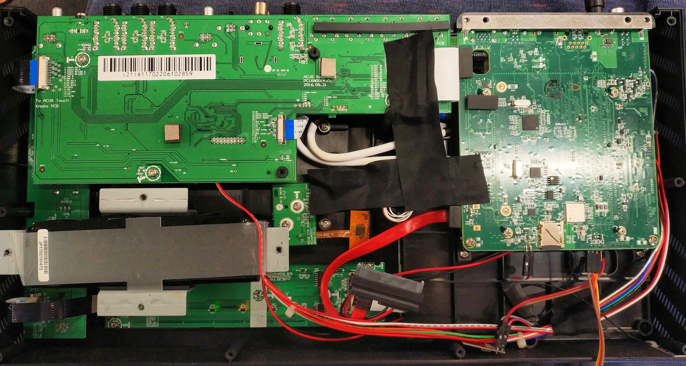
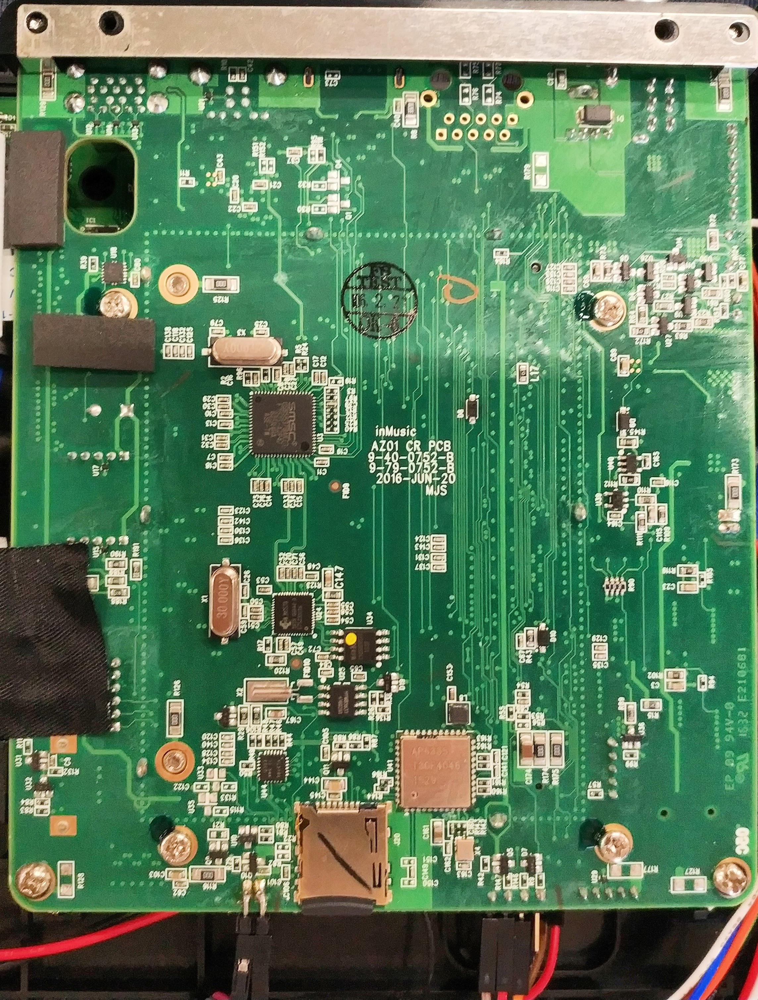

# UART

[UART](https://en.wikipedia.org/wiki/Universal_asynchronous_receiver-transmitter) is used to send data back and forth
between some devices. We can use this for console access.

## Prime Go

On the Prime Go, the UART is located on an empty header that's already on the board.

### Internal Image {id="internal-image_Prime_Go"}


> There is a `RECOVERY` button located on the other side of the board in the bottom left of this image. Hold it
> down, press the power button, and it'll go into firmware update mode.
> {style="note"}

### UART Connection {id="uart-connection_Prime_Go"}


This image is of the board on the bottom left of the internal image.

Wiring:

| Color  | UART Pin |
|--------|----------|
| Red    | GND      |
| Orange | TX       |
| Yellow | RX       |

UART Speed: 115200 Baud

### U-Boot

To get into recovery mode, run `fastboot 0` at the U-Boot command line. This will allow you to use the desktop updater
app to recover.

#### Fastboot OEM Commands {collapsible="true"}

Fastboot's OEM commands are specific to a device manufacturer. Here are the commands that I've found:

```
oem set-flag:%s
oem format
oem resetenv
oem update-bootloader
oem set-panel-map:%s
oem flash-bootloader
oem inmusic-unlock-magic-7de5fbc22b8c524e
oem fetch-pubkey:%s
```

These were found by dumping `/dev/mmcblk0p6`, then running `strings mmcblk0p6 | grep oem`.

#### U-Boot Boot Log {collapsible="true"}

```
U-Boot SPL 2016.05-inmusic-20230621 (Nov 14 2023 - 10:30:29)
Trying to boot from MMC1


U-Boot 2016.05-inmusic-20230621 (Nov 14 2023 - 10:30:29 +0000), Build: jenkins-Planck-Embedded_Release-1943

Model: Denon DJ Prime GO
DRAM:  2 GiB
TSADC last_tshut_cru=0 (auto_con=0x01000000)
MMC:   dwmmc@ff0f0000: 0
In:    gpio-keys
Out:   serial
Err:   serial
AZ01  PCB revK (raw=9)
Hit any key to stop autoboot:  0 
switch to partitions #0, OK
mmc0(part 0) is current device
Scanning mmc 0:6...
Found U-Boot script /boot/boot.scr.uimg
489 bytes read in 6 ms (79.1 KiB/s)
## Executing script at 00000000
5588344 bytes read in 262 ms (20.3 MiB/s)
49752 bytes read in 11 ms (4.3 MiB/s)
Kernel image @ 0x2000000 [ 0x000000 - 0x554578 ]
## Flattened Device Tree blob at 01f00000
   Booting using the fdt blob at 0x1f00000
   Loading Device Tree to 1fff0000, end 1ffff257 ... OK

Starting kernel ...
```

#### Environment Variables {collapsible="true"}

```
=> printenv
arch=arm
az01_bootcmd=if test x${dorecovery} = x1; then run az01_recovercmd; fi; run distro_bootcmd; echo 'Boot failed, resetting to bootloader...'; reset_bootloader
az01_recovercmd=echo 'Starting fastboot...'; fastboot 0
baudrate=115200
board=az01
board_name=az01
boot_a_script=load ${devtype} ${devnum}:${distro_bootpart} ${scriptaddr} ${prefix}${script}; source ${scriptaddr}
boot_extlinux=sysboot ${devtype} ${devnum}:${distro_bootpart} any ${scriptaddr} ${prefix}extlinux/extlinux.conf
boot_prefixes=/ /boot/
boot_script_dhcp=boot.scr.uimg
boot_scripts=boot.scr.uimg boot.scr
boot_targets=mmc0 mmc1 
bootargs=root=PARTUUID=24d1deac-3434-1a4e-98d1-68ee2945a5f1 rootwait ro rfkill.default_state=0 
bootcmd=run az01_bootcmd
bootcmd_mmc0=setenv devnum 0; run mmc_boot
bootcmd_mmc1=setenv devnum 1; run mmc_boot
bootdelay=0
cpu=armv7
distro_bootcmd=for target in ${boot_targets}; do run bootcmd_${target}; done
dorecovery=0
ethaddr=00:05:95:04:D8:20
fastboot.partition-type:data=ext4
fastboot.partition-type:rootfs=ext4
fdt_addr_r=0x01f00000
fdt_high=0x1fffffff
fdtcontroladdr=7b3a8368
fdtfile=rk3288-az01-jp11.dtb
initrd_high=0x1fffffff
kernel_addr_r=0x02000000
loadaddr=0x00800800
mmc_boot=if mmc dev ${devnum}; then setenv devtype mmc; run scan_dev_for_boot_part; fi
panel_compatible=urt,umoh-9522md-t
partitions=uuid_disk=02bebde5-b5a4-48cd-b262-512fe8b6ae06;name=uboot-spl,size=64KiB,start=32KiB,uuid=f6217a3c-1c7d-4969-8f05-88c0b9c0f0e6;name=env,size=32KiB,start=96KiB,uuid=be8b868f-89d8-4ff8-a64d-d077e73b4f09;name=uboot,size=384KiB,start=128KiB,uuid=461be792-3b29-4c0a-a6a2-3460c0119cbe;name=splash,size=4MiB,uuid=40bfa9cd-6d2c-4e22-a662-f0a803794462;name=recoverysplash,size=4MiB,uuid=e050b8e2-ee92-43ca-98ad-9aa4fbca8616;name=rootfs,bootable,size=500MiB,uuid=acded124-3434-4e1a-98d1-68ee2945a5f1;name=data,size=0,uuid=9dd41a93-59ad-4908-833a-9bf00af5b60e;
pcb_rev=K
pxefile_addr_r=0x00100000
ramdisk_addr_r=0x04000000
scan_dev_for_boot=echo Scanning ${devtype} ${devnum}:${distro_bootpart}...; for prefix in ${boot_prefixes}; do run scan_dev_for_extlinux; run scan_dev_for_scripts; done;
scan_dev_for_boot_part=part list ${devtype} ${devnum} -bootable devplist; env exists devplist || setenv devplist 1; for distro_bootpart in ${devplist}; do if fstype ${devtype} ${devnum}:${distro_bootpart} bootfstype; then run scan_dev_for_boot; fi; done
scan_dev_for_extlinux=if test -e ${devtype} ${devnum}:${distro_bootpart} ${prefix}extlinux/extlinux.conf; then echo Found ${prefix}extlinux/extlinux.conf; run boot_extlinux; echo SCRIPT FAILED: continuing...; fi
scan_dev_for_scripts=for script in ${boot_scripts}; do if test -e ${devtype} ${devnum}:${distro_bootpart} ${prefix}${script}; then echo Found U-Boot script ${prefix}${script}; run boot_a_script; echo SCRIPT FAILED: continuing...; fi; done
scriptaddr=0x00000000
serial#=A12403245317751
soc=rockchip
splashpos=m
stderr=serial
stdin=serial,gpio-keys
stdout=serial
vendor=inmusic

Environment size: 3037/8188 bytes
```

#### Clocks {collapsible="true"}

```
=> clock
osc: 24000000
apll: 1608000000
dpll: 533000000
cpll: 400000000
gpll: 594000000
npll: 73000000
```

#### Console Info {collapsible="true"}

```
=> coninfo
List of available devices:
serial@ff690000 00000003 IO 
gpio-keys 00000001 I. stdin 
vidconsole 00000002 .O 
serial   00000003 IO stdout stderr 
nulldev  00000003 IO
```

#### MMC Info {collapsible="true"}

```
=> mmc info
Device: dwmmc@ff0f0000
Manufacturer ID: 15
OEM: 100
Name: 8GTF4 
Tran Speed: 52000000
Rd Block Len: 512
MMC version 4.0
High Capacity: Yes
Capacity: 7.3 GiB
Bus Width: 8-bit
Erase Group Size: 512 KiB
```

#### Hush Shell Variables {collapsible="true"}

```
=> showvar
HUSH_VERSION=0.01
```

#### Version {collapsible="true"}

```
=> version

U-Boot 2016.05-inmusic-20230621 (Nov 14 2023 - 10:30:29 +0000)
arm-buildroot-linux-gnueabihf-gcc.br_real (Buildroot 2023.02.3-4-g189b0a5875) 12.3.0
GNU ld (GNU Binutils) 2.38
```

### Linux

#### dmesg {collapsible="true"}

```
Booting Linux on physical CPU 0x500
Linux version 6.1.92-inmusic-2024-05-28-rt32 (jenkins@d73a305bf18b) (arm-buildroot-linux-gnueabihf-gcc.br_real (Buildroot 2023.02.11-5-gfbf213aa23) 12.3.0, GNU ld (GNU Binutils) 2.38) #1 SMP PREEMPT_RT Fri Sep 20 07:36:09 UTC 2024
CPU: ARMv7 Processor [410fc0d1] revision 1 (ARMv7), cr=10c5387d
CPU: div instructions available: patching division code
CPU: PIPT / VIPT nonaliasing data cache, VIPT aliasing instruction cache
OF: fdt: Machine model: Denon DJ Prime GO
Memory policy: Data cache writealloc
OF: reserved mem: initialized node framebuffer, compatible id rockchip,framebuffer-memory
Zone ranges:
  Normal   [mem 0x0000000000000000-0x000000002fffffff]
  HighMem  [mem 0x0000000030000000-0x000000007fffffff]
Movable zone start for each node
Early memory node ranges
  node   0: [mem 0x0000000000000000-0x000000007fffffff]
Initmem setup node 0 [mem 0x0000000000000000-0x000000007fffffff]
percpu: Embedded 12 pages/cpu s17632 r8192 d23328 u49152
pcpu-alloc: s17632 r8192 d23328 u49152 alloc=12*4096
pcpu-alloc: [0] 0 [0] 1 [0] 2 [0] 3 
Built 1 zonelists, mobility grouping on.  Total pages: 522752
Kernel command line: root=PARTUUID=24d1deac-3434-1a4e-98d1-68ee2945a5f1 rootwait rw rfkill.default_state=0 isolcpus=1-3
Dentry cache hash table entries: 131072 (order: 7, 524288 bytes, linear)
Inode-cache hash table entries: 65536 (order: 6, 262144 bytes, linear)
mem auto-init: stack:all(zero), heap alloc:off, heap free:off
Memory: 2053884K/2097152K available (8192K kernel code, 815K rwdata, 2556K rodata, 1024K init, 278K bss, 30980K reserved, 12288K cma-reserved, 1298432K highmem)
SLUB: HWalign=64, Order=0-3, MinObjects=0, CPUs=4, Nodes=1
rcu: Preemptible hierarchical RCU implementation.
rcu: 	RCU event tracing is enabled.
rcu: 	RCU priority boosting: priority 1 delay 500 ms.
rcu: 	RCU_SOFTIRQ processing moved to rcuc kthreads.
	No expedited grace period (rcu_normal_after_boot).
rcu: RCU calculated value of scheduler-enlistment delay is 100 jiffies.
NR_IRQS: 16, nr_irqs: 16, preallocated irqs: 16
rcu: srcu_init: Setting srcu_struct sizes based on contention.
rockchip: reset MMC AHB arbitor
arch_timer: cp15 timer(s) running at 24.00MHz (phys).
clocksource: arch_sys_counter: mask: 0xffffffffffffff max_cycles: 0x588fe9dc0, max_idle_ns: 440795202592 ns
sched_clock: 56 bits at 24MHz, resolution 41ns, wraps every 4398046511097ns
Switching to timer-based delay loop, resolution 41ns
Console: colour dummy device 80x30
printk: console [tty0] enabled
Calibrating delay loop (skipped), value calculated using timer frequency.. 48.00 BogoMIPS (lpj=24000)
CPU: Testing write buffer coherency: ok
Spectre V2: workarounds disabled by configuration
pid_max: default: 32768 minimum: 301
Mount-cache hash table entries: 2048 (order: 1, 8192 bytes, linear)
Mountpoint-cache hash table entries: 2048 (order: 1, 8192 bytes, linear)
CPU0: thread -1, cpu 0, socket 5, mpidr 80000500
Setting up static identity map for 0x100000 - 0x100060
rcu: Hierarchical SRCU implementation.
rcu: 	Max phase no-delay instances is 400.
printk: console [tty0] printing thread started
smp: Bringing up secondary CPUs ...
CPU1: thread -1, cpu 1, socket 5, mpidr 80000501
CPU2: thread -1, cpu 2, socket 5, mpidr 80000502
CPU3: thread -1, cpu 3, socket 5, mpidr 80000503
smp: Brought up 1 node, 4 CPUs
SMP: Total of 4 processors activated (192.00 BogoMIPS).
CPU: All CPU(s) started in SVC mode.
devtmpfs: initialized
VFP support v0.3: implementor 41 architecture 3 part 30 variant d rev 0
clocksource: jiffies: mask: 0xffffffff max_cycles: 0xffffffff, max_idle_ns: 1911260446275000 ns
futex hash table entries: 1024 (order: 4, 65536 bytes, linear)
pinctrl core: initialized pinctrl subsystem
regulator-dummy: no parameters, enabled
NET: Registered PF_NETLINK/PF_ROUTE protocol family
DMA: preallocated 256 KiB pool for atomic coherent allocations
thermal_sys: Registered thermal governor 'step_wise'
thermal_sys: Registered thermal governor 'user_space'
cpuidle: using governor menu
No ATAGs?
hw-breakpoint: found 5 (+1 reserved) breakpoint and 4 watchpoint registers.
hw-breakpoint: maximum watchpoint size is 4 bytes.
platform ff940000.vop: Fixed dependency cycle(s) with /mipi@ff960000
platform ff960000.mipi: Fixed dependency cycle(s) with /mipi@ff960000/panel@0
platform ff960000.mipi: Fixed dependency cycle(s) with /vop@ff940000
platform pinctrl: Fixed dependency cycle(s) with /pinctrl/az01/az01-pcb-rev
rockchip-gpio ff750000.gpio: probed /pinctrl/gpio@ff750000
rockchip-gpio ff780000.gpio: probed /pinctrl/gpio@ff780000
rockchip-gpio ff790000.gpio: probed /pinctrl/gpio@ff790000
rockchip-gpio ff7a0000.gpio: probed /pinctrl/gpio@ff7a0000
rockchip-gpio ff7b0000.gpio: probed /pinctrl/gpio@ff7b0000
rockchip-gpio ff7c0000.gpio: probed /pinctrl/gpio@ff7c0000
rockchip-gpio ff7d0000.gpio: probed /pinctrl/gpio@ff7d0000
rockchip-gpio ff7e0000.gpio: probed /pinctrl/gpio@ff7e0000
rockchip-gpio ff7f0000.gpio: probed /pinctrl/gpio@ff7f0000
vcc_sys: 5000 mV, enabled
reg-fixed-voltage vsys-regulator: vcc_sys supplying 5000000uV
reg-fixed-voltage vcc-mipi: Looking up vin-supply from device tree
vcc_mipi: supplied by vcc_sys
vcc_sys: could not add device link regulator.2: -ENOENT
vcc_mipi: 3300 mV, enabled
reg-fixed-voltage vcc-mipi: vcc_mipi supplying 3300000uV
reg-fixed-voltage vcc-sata: Looking up vin-supply from device tree
vcc_sata: supplied by vcc_sys
vcc_sys: could not add device link regulator.3: -ENOENT
vcc_sata: 5000 mV, enabled
reg-fixed-voltage vcc-sata: vcc_sata supplying 5000000uV
vcc_host: no parameters, enabled
reg-fixed-voltage vcc-host-regulator: vcc_host supplying 0uV
vcc_otg_5v: 5000 mV, enabled
reg-fixed-voltage usb-otg-regulator: vcc_otg_5v supplying 5000000uV
iommu: Default domain type: Translated 
iommu: DMA domain TLB invalidation policy: strict mode 
SCSI subsystem initialized
usbcore: registered new interface driver usbfs
usbcore: registered new interface driver hub
usbcore: registered new device driver usb
pps_core: LinuxPPS API ver. 1 registered
pps_core: Software ver. 5.3.6 - Copyright 2005-2007 Rodolfo Giometti <giometti@linux.it>
PTP clock support registered
Advanced Linux Sound Architecture Driver Initialized.
Bluetooth: Core ver 2.22
NET: Registered PF_BLUETOOTH protocol family
Bluetooth: HCI device and connection manager initialized
Bluetooth: HCI socket layer initialized
Bluetooth: L2CAP socket layer initialized
Bluetooth: SCO socket layer initialized
clocksource: Switched to clocksource arch_sys_counter
NET: Registered PF_INET protocol family
IP idents hash table entries: 16384 (order: 5, 131072 bytes, linear)
tcp_listen_portaddr_hash hash table entries: 512 (order: 1, 10240 bytes, linear)
Table-perturb hash table entries: 65536 (order: 6, 262144 bytes, linear)
TCP established hash table entries: 8192 (order: 3, 32768 bytes, linear)
TCP bind hash table entries: 8192 (order: 6, 327680 bytes, linear)
TCP: Hash tables configured (established 8192 bind 8192)
UDP hash table entries: 512 (order: 2, 24576 bytes, linear)
UDP-Lite hash table entries: 512 (order: 2, 24576 bytes, linear)
NET: Registered PF_UNIX/PF_LOCAL protocol family
hw perfevents: enabled with armv7_cortex_a12 PMU driver, 7 counters available
Initialise system trusted keyrings
workingset: timestamp_bits=30 max_order=19 bucket_order=0
squashfs: version 4.0 (2009/01/31) Phillip Lougher
fuse: init (API version 7.37)
NET: Registered PF_ALG protocol family
Key type asymmetric registered
Asymmetric key parser 'x509' registered
Asymmetric key parser 'pkcs8' registered
alg: self-tests for CTR-KDF (hmac(sha256)) passed
bounce: pool size: 64 pages
Block layer SCSI generic (bsg) driver version 0.4 loaded (major 248)
io scheduler mq-deadline registered
io scheduler kyber registered
io scheduler bfq registered
phy phy-ff770000.syscon:usbphy.0: Looking up phy-supply from device tree
phy phy-ff770000.syscon:usbphy.0: Looking up phy-supply property in node /syscon@ff770000/usbphy/usb-phy@320 failed
phy phy-ff770000.syscon:usbphy.0: Looking up vbus-supply from device tree
phy phy-ff770000.syscon:usbphy.0: Looking up vbus-supply property in node /syscon@ff770000/usbphy/usb-phy@320 failed
phy phy-ff770000.syscon:usbphy.1: Looking up phy-supply from device tree
phy phy-ff770000.syscon:usbphy.1: Looking up phy-supply property in node /syscon@ff770000/usbphy/usb-phy@334 failed
phy phy-ff770000.syscon:usbphy.1: Looking up vbus-supply from device tree
phy phy-ff770000.syscon:usbphy.1: Looking up vbus-supply property in node /syscon@ff770000/usbphy/usb-phy@334 failed
phy phy-ff770000.syscon:usbphy.2: Looking up phy-supply from device tree
phy phy-ff770000.syscon:usbphy.2: Looking up phy-supply property in node /syscon@ff770000/usbphy/usb-phy@348 failed
phy phy-ff770000.syscon:usbphy.2: Looking up vbus-supply from device tree
phy phy-ff770000.syscon:usbphy.2: Looking up vbus-supply property in node /syscon@ff770000/usbphy/usb-phy@348 failed
pwm-backlight mipi-backlight: Looking up power-supply from device tree
dma-pl330 ff250000.dma-controller: WARN: Device release is not defined so it is not safe to unbind this driver while in use
dma-pl330 ff250000.dma-controller: Loaded driver for PL330 DMAC-241330
dma-pl330 ff250000.dma-controller: 	DBUFF-128x8bytes Num_Chans-8 Num_Peri-20 Num_Events-16
dma-pl330 ffb20000.dma-controller: WARN: Device release is not defined so it is not safe to unbind this driver while in use
dma-pl330 ffb20000.dma-controller: Loaded driver for PL330 DMAC-241330
dma-pl330 ffb20000.dma-controller: 	DBUFF-64x8bytes Num_Chans-5 Num_Peri-6 Num_Events-10
Serial: 8250/16550 driver, 4 ports, IRQ sharing disabled
ff180000.serial: ttyS0 at MMIO 0xff180000 (irq = 47, base_baud = 1500000) is a 16550A
serial serial0: tty port ttyS0 registered
ff690000.serial: ttyS2 at MMIO 0xff690000 (irq = 48, base_baud = 1500000) is a 16550A
printk: console [ttyS2] enabled
ff1b0000.serial: ttyS3 at MMIO 0xff1b0000 (irq = 49, base_baud = 1500000) is a 16550A
printk: console [ttyS2] printing thread started
i2c_dev: i2c /dev entries driver
i2c 0-005a: Fixed dependency cycle(s) with /i2c@ff650000/act8846@5a/regulators/REG4
i2c 0-005a: Fixed dependency cycle(s) with /i2c@ff650000/act8846@5a/regulators/REG2
act8865 0-005a: Looking up vp1-supply from device tree
VCC_DDR: supplied by vcc_sys
vcc_sys: could not add device link regulator.6: -ENOENT
VCC_DDR: 1200 <--> 1500 mV at 1500 mV, enabled
act8865 0-005a: Looking up vp2-supply from device tree
VCC_IO: supplied by vcc_sys
vcc_sys: could not add device link regulator.7: -ENOENT
VCC_IO: 3300 mV, enabled
act8865 0-005a: Looking up vp3-supply from device tree
VDD_LOG: supplied by vcc_sys
vcc_sys: could not add device link regulator.8: -ENOENT
VDD_LOG: 950 <--> 1400 mV at 1200 mV, enabled
act8865 0-005a: Looking up vp4-supply from device tree
VCC_20: supplied by vcc_sys
vcc_sys: could not add device link regulator.9: -ENOENT
VCC_20: 2000 mV, enabled
act8865 0-005a: Looking up inl1-supply from device tree
VCCIO_SD: supplied by VCC_IO
VCC_IO: could not add device link regulator.10: -ENOENT
VCCIO_SD: 1800 <--> 3300 mV at 3300 mV, enabled
act8865 0-005a: Looking up inl1-supply from device tree
VDD10_LCD: supplied by VCC_IO
VCC_IO: could not add device link regulator.11: -ENOENT
VDD10_LCD: 1000 mV, enabled
act8865 0-005a: Looking up inl1-supply from device tree
VCCA_CODEC: supplied by VCC_IO
VCC_IO: could not add device link regulator.12: -ENOENT
VCCA_CODEC: 3300 mV, enabled
act8865 0-005a: Looking up inl2-supply from device tree
VCCA_TP: supplied by vcc_sys
vcc_sys: could not add device link regulator.13: -ENOENT
VCCA_TP: 3300 mV, enabled
act8865 0-005a: Looking up inl2-supply from device tree
VCCIO_PMU: supplied by vcc_sys
vcc_sys: could not add device link regulator.14: -ENOENT
VCCIO_PMU: 3300 mV, enabled
act8865 0-005a: Looking up inl3-supply from device tree
VDD_10: supplied by VCC_20
VCC_20: could not add device link regulator.15: -ENOENT
VDD_10: 1000 mV, enabled
act8865 0-005a: Looking up inl3-supply from device tree
VCC_18: supplied by VCC_20
VCC_20: could not add device link regulator.16: -ENOENT
VCC_18: 1800 mV, enabled
act8865 0-005a: Looking up inl3-supply from device tree
VCC18_LCD: supplied by VCC_20
VCC_20: could not add device link regulator.17: -ENOENT
VCC18_LCD: 1800 mV, enabled
fan53555-regulator 0-0040: FAN53555 Option[8] Rev[1] Detected!
fan53555-regulator 0-0040: Looking up vin-supply from device tree
vdd_cpu: supplied by vcc_sys
vcc_sys: could not add device link regulator.18: -ENOENT
vdd_cpu: 850 <--> 1500 mV at 1350 mV, enabled
fan53555-regulator 0-0041: FAN53555 Option[8] Rev[1] Detected!
fan53555-regulator 0-0041: Looking up vin-supply from device tree
vdd_gpu: supplied by vcc_sys
vcc_sys: could not add device link regulator.19: -ENOENT
vdd_gpu: 850 <--> 1350 mV at 1250 mV, enabled
dw-apb-uart ff180000.serial: Failed to create device link (0x180) with 0-0051
mali ffa30000.gpu: Looking up mali-supply from device tree
mali ffa30000.gpu: GPU identified as 0x0750 r1p0 status 0
mali ffa30000.gpu: Protected mode not available
Error -19 getting thermal zone 'gpu-thermal', not yet ready?
mali ffa30000.gpu: recalculation of power model mali-simple-power-model returned error -517
mali ffa30000.gpu: IPA initialization failed
------------[ cut here ]------------
WARNING: CPU: 0 PID: 1 at drivers/opp/core.c:1516 _opp_table_kref_release+0x88/0x104
Modules linked in:
CPU: 0 PID: 1 Comm: swapper/0 Not tainted 6.1.92-inmusic-2024-05-28-rt32 #1
Hardware name: Rockchip (Device Tree)
 unwind_backtrace from show_stack+0x10/0x14
 show_stack from dump_stack_lvl+0x40/0x4c
 dump_stack_lvl from __warn+0x70/0xd4
 __warn from warn_slowpath_fmt+0xc4/0x158
 warn_slowpath_fmt from _opp_table_kref_release+0x88/0x104
 _opp_table_kref_release from kbase_platform_device_remove+0x2cc/0x3ac
 kbase_platform_device_remove from kbase_platform_device_probe+0x5e0/0xb20
 kbase_platform_device_probe from platform_probe+0x58/0xac
 platform_probe from really_probe+0x1ac/0x3c8
 really_probe from __driver_probe_device+0x1ac/0x1e0
 __driver_probe_device from driver_probe_device+0x3c/0xbc
 driver_probe_device from __driver_attach+0x148/0x16c
 __driver_attach from bus_for_each_dev+0x6c/0xac
 bus_for_each_dev from bus_add_driver+0xd4/0x1ec
 bus_add_driver from driver_register+0xac/0xf4
 driver_register from do_one_initcall+0x74/0x1fc
 do_one_initcall from kernel_init_freeable+0x198/0x1dc
 kernel_init_freeable from kernel_init+0x14/0x12c
 kernel_init from ret_from_fork+0x14/0x28
Exception stack(0xf0831fb0 to 0xf0831ff8)
1fa0:                                     00000000 00000000 00000000 00000000
1fc0: 00000000 00000000 00000000 00000000 00000000 00000000 00000000 00000000
1fe0: 00000000 00000000 00000000 00000000 00000013 00000000
---[ end trace 0000000000000000 ]---
rockchip-vop ff930000.vop: Adding to iommu group 0
rockchip-vop ff940000.vop: Adding to iommu group 1
phy phy-ff960000.mipi.3: Looking up phy-supply from device tree
phy phy-ff960000.mipi.3: Looking up phy-supply property in node /mipi@ff960000 failed
dw-mipi-dsi-rockchip ff960000.mipi: Fixed dependency cycle(s) with /mipi@ff960000/panel@0
mipi-dsi ff960000.mipi.0: Fixed dependency cycle(s) with /mipi@ff960000
panel-urt-umoh-9522md-t ff960000.mipi.0: Looking up power-supply from device tree
rockchip_framebuffer_rmem_device_init: initializing with base address 0x7f400000 size=0x00c00000
rockchip-drm display-subsystem: assigned reserved memory node framebuffer
rockchip-drm display-subsystem: bound ff930000.vop (ops 0xc0964c38)
rockchip-vop ff940000.vop: enabled by bootloader
rockchip-drm display-subsystem: bound ff940000.vop (ops 0xc0964c38)
rockchip-drm display-subsystem: bound ff960000.mipi (ops 0xc0968a80)
[drm] Initialized rockchip 1.0.0 20140818 for display-subsystem on minor 0
rockchip-drm display-subsystem: framebugger sg_size=12582912 size=12288000
rockchip-drm display-subsystem: [drm] fb0: rockchipdrmfb frame buffer device
brd: module loaded
loop: module loaded
rk_gmac-dwmac ff290000.ethernet: IRQ eth_lpi not found
rk_gmac-dwmac ff290000.ethernet: PTP uses main clock
rk_gmac-dwmac ff290000.ethernet: Looking up phy-supply from device tree
rk_gmac-dwmac ff290000.ethernet: clock input or output? (input).
rk_gmac-dwmac ff290000.ethernet: TX delay(0x30).
rk_gmac-dwmac ff290000.ethernet: RX delay(0x10).
rk_gmac-dwmac ff290000.ethernet: integrated PHY? (no).
rk_gmac-dwmac ff290000.ethernet: clock input from PHY
rk_gmac-dwmac ff290000.ethernet: init for RGMII
rk_gmac-dwmac ff290000.ethernet: User ID: 0x10, Synopsys ID: 0x35
rk_gmac-dwmac ff290000.ethernet: 	DWMAC1000
rk_gmac-dwmac ff290000.ethernet: DMA HW capability register supported
rk_gmac-dwmac ff290000.ethernet: RX Checksum Offload Engine supported
rk_gmac-dwmac ff290000.ethernet: COE Type 2
rk_gmac-dwmac ff290000.ethernet: TX Checksum insertion supported
rk_gmac-dwmac ff290000.ethernet: Wake-Up On Lan supported
rk_gmac-dwmac ff290000.ethernet: Normal descriptors
rk_gmac-dwmac ff290000.ethernet: Ring mode enabled
rk_gmac-dwmac ff290000.ethernet: Enable RX Mitigation via HW Watchdog Timer
dwc2 ff540000.usb: Looking up vusb_d-supply from device tree
dwc2 ff540000.usb: Looking up vusb_d-supply property in node /usb@ff540000 failed
dwc2 ff540000.usb: supply vusb_d not found, using dummy regulator
dwc2 ff540000.usb: Looking up vusb_a-supply from device tree
dwc2 ff540000.usb: Looking up vusb_a-supply property in node /usb@ff540000 failed
dwc2 ff540000.usb: supply vusb_a not found, using dummy regulator
dwc2 ff540000.usb: Looking up vbus-supply from device tree
dwc2 ff540000.usb: Looking up vbus-supply property in node /usb@ff540000 failed
dwc2 ff540000.usb: dwc2_check_params: Invalid parameter lpm_clock_gating=1
dwc2 ff540000.usb: dwc2_check_params: Invalid parameter besl=1
dwc2 ff540000.usb: dwc2_check_params: Invalid parameter hird_threshold_en=1
dwc2 ff540000.usb: DWC OTG Controller
dwc2 ff540000.usb: new USB bus registered, assigned bus number 1
usb usb1: New USB device found, idVendor=1d6b, idProduct=0002, bcdDevice= 6.01
usb usb1: New USB device strings: Mfr=3, Product=2, SerialNumber=1
usb usb1: Product: DWC OTG Controller
usb usb1: Manufacturer: Linux 6.1.92-inmusic-2024-05-28-rt32 dwc2_hsotg
usb usb1: SerialNumber: ff540000.usb
hub 1-0:1.0: USB hub found
hub 1-0:1.0: 1 port detected
dwc2 ff580000.usb: Looking up vusb_d-supply from device tree
dwc2 ff580000.usb: Looking up vusb_d-supply property in node /usb@ff580000 failed
dwc2 ff580000.usb: supply vusb_d not found, using dummy regulator
dwc2 ff580000.usb: Looking up vusb_a-supply from device tree
dwc2 ff580000.usb: Looking up vusb_a-supply property in node /usb@ff580000 failed
dwc2 ff580000.usb: supply vusb_a not found, using dummy regulator
dwc2 ff580000.usb: Looking up vbus-supply from device tree
dwc2 ff580000.usb: Looking up vbus-supply property in node /usb@ff580000 failed
dwc2 ff580000.usb: dwc2_check_params: Invalid parameter lpm_clock_gating=1
dwc2 ff580000.usb: dwc2_check_params: Invalid parameter besl=1
dwc2 ff580000.usb: dwc2_check_params: Invalid parameter hird_threshold_en=1
dwc2 ff580000.usb: EPs: 10, dedicated fifos, 972 entries in SPRAM
dwc2 ff580000.usb: DWC OTG Controller
dwc2 ff580000.usb: new USB bus registered, assigned bus number 2
usb usb2: New USB device found, idVendor=1d6b, idProduct=0002, bcdDevice= 6.01
usb usb2: New USB device strings: Mfr=3, Product=2, SerialNumber=1
usb usb2: Product: DWC OTG Controller
usb usb2: Manufacturer: Linux 6.1.92-inmusic-2024-05-28-rt32 dwc2_hsotg
usb usb2: SerialNumber: ff580000.usb
hub 2-0:1.0: USB hub found
hub 2-0:1.0: 1 port detected
ehci-platform ff500000.usb: EHCI Host Controller
ehci-platform ff500000.usb: new USB bus registered, assigned bus number 3
ohci-platform ff520000.usb: Generic Platform OHCI controller
ohci-platform ff520000.usb: new USB bus registered, assigned bus number 4
usbcore: registered new interface driver uas
usbcore: registered new interface driver usb-storage
usbcore: registered new interface driver usbserial_generic
usbserial: USB Serial support registered for generic
usbcore: registered new interface driver cp210x
usbserial: USB Serial support registered for cp210x
usbcore: registered new interface driver ftdi_sio
usbserial: USB Serial support registered for FTDI USB Serial Device
usbcore: registered new interface driver pl2303
usbserial: USB Serial support registered for pl2303
usbcore: registered new interface driver usb_serial_simple
usbserial: USB Serial support registered for carelink
usbserial: USB Serial support registered for flashloader
usbserial: USB Serial support registered for funsoft
usbserial: USB Serial support registered for google
usbserial: USB Serial support registered for hp4x
usbserial: USB Serial support registered for kaufmann
usbserial: USB Serial support registered for libtransistor
usbserial: USB Serial support registered for moto_modem
usbserial: USB Serial support registered for motorola_tetra
usbserial: USB Serial support registered for nokia
usbserial: USB Serial support registered for novatel_gps
usbserial: USB Serial support registered for siemens_mpi
usbserial: USB Serial support registered for suunto
usbserial: USB Serial support registered for vivopay
usbserial: USB Serial support registered for zio
ehci-platform ff500000.usb: irq 66, io mem 0xff500000
ohci-platform ff520000.usb: irq 67, io mem 0xff520000
rtc-hym8563 0-0051: registered as rtc0
rtc-hym8563 0-0051: setting system clock to 2024-10-22T19:29:50 UTC (1729625390)
dw-apb-uart ff180000.serial: Failed to create device link (0x180) with 0-0051
dw_wdt ff800000.watchdog: No valid TOPs array specified
device-mapper: uevent: version 1.0.3
device-mapper: ioctl: 4.47.0-ioctl (2022-07-28) initialised: dm-devel@redhat.com
cpu cpu0: Looking up cpu0-supply from device tree
Synopsys Designware Multimedia Card Interface Driver
hid: raw HID events driver (C) Jiri Kosina
usbcore: registered new interface driver usbhid
usbhid: USB HID core driver
usb usb4: New USB device found, idVendor=1d6b, idProduct=0001, bcdDevice= 6.01
usb usb4: New USB device strings: Mfr=3, Product=2, SerialNumber=1
usb usb4: Product: Generic Platform OHCI controller
usb usb4: Manufacturer: Linux 6.1.92-inmusic-2024-05-28-rt32 ohci_hcd
usb usb4: SerialNumber: ff520000.usb
hub 4-0:1.0: USB hub found
hub 4-0:1.0: 1 port detected
dwmmc_rockchip ff0d0000.dwmmc: IDMAC supports 32-bit address mode.
dwmmc_rockchip ff0d0000.dwmmc: Using internal DMA controller.
dwmmc_rockchip ff0d0000.dwmmc: Version ID is 270a
dwmmc_rockchip ff0d0000.dwmmc: DW MMC controller at irq 73,32 bit host data width,256 deep fifo
dwmmc_rockchip ff0d0000.dwmmc: Looking up vmmc-supply from device tree
rockchip-saradc ff100000.saradc: Looking up vref-supply from device tree
dwmmc_rockchip ff0d0000.dwmmc: Looking up vqmmc-supply from device tree
dwmmc_rockchip ff0d0000.dwmmc: allocated mmc-pwrseq
mmc_host mmc2: card is non-removable.
usbcore: registered new interface driver snd-usb-audio
NET: Registered PF_PACKET protocol family
Bluetooth: HIDP (Human Interface Emulation) ver 1.2
Bluetooth: HIDP socket layer initialized
Registering SWP/SWPB emulation handler
Loading compiled-in X.509 certificates
Key type .fscrypt registered
Key type fscrypt-provisioning registered
ili2117 4-0026: ILI2117 vendor 0x00 firmware version 5.0
input: ILI2117 Touchscreen as /devices/platform/ff160000.i2c/i2c-4/4-0026/input/input0
ili2117 4-0026: bad packet ID (expected 0x5a): 0x00
usb 1-1: new full-speed USB device number 2 using dwc2
ehci-platform ff500000.usb: USB 2.0 started, EHCI 1.00
usb usb3: New USB device found, idVendor=1d6b, idProduct=0002, bcdDevice= 6.01
usb usb3: New USB device strings: Mfr=3, Product=2, SerialNumber=1
usb usb3: Product: EHCI Host Controller
usb usb3: Manufacturer: Linux 6.1.92-inmusic-2024-05-28-rt32 ehci_hcd
usb usb3: SerialNumber: ff500000.usb
hub 3-0:1.0: USB hub found
hub 3-0:1.0: 1 port detected
vcc_flash: will resolve supply early: vin
reg-fixed-voltage flash-regulator: Looking up vin-supply from device tree
vcc_flash: supplied by VCC_IO
VCC_IO: could not add device link regulator.20: -ENOENT
vcc_flash: 1800 mV, enabled
reg-fixed-voltage flash-regulator: vcc_flash supplying 1800000uV
vcc_sd: 3300 mV, disabled
reg-fixed-voltage sdmmc-regulator: Looking up vin-supply from device tree
vcc_sd: supplied by VCC_IO
reg-fixed-voltage sdmmc-regulator: vcc_sd supplying 3300000uV
rockchip-iodomain ff770000.syscon:io-domains: Looking up lcdc-supply from device tree
rockchip-iodomain ff770000.syscon:io-domains: Looking up dvp-supply from device tree
rockchip-iodomain ff770000.syscon:io-domains: Looking up flash0-supply from device tree
rockchip-iodomain ff770000.syscon:io-domains: Looking up flash1-supply from device tree
rockchip-iodomain ff770000.syscon:io-domains: Looking up wifi-supply from device tree
rockchip-iodomain ff770000.syscon:io-domains: Looking up bb-supply from device tree
rockchip-iodomain ff770000.syscon:io-domains: Looking up audio-supply from device tree
mmc_host mmc2: Bus speed (slot 0) = 400000Hz (slot req 400000Hz, actual 400000HZ div = 0)
rockchip-iodomain ff770000.syscon:io-domains: Looking up sdcard-supply from device tree
rockchip-iodomain ff770000.syscon:io-domains: Looking up gpio30-supply from device tree
rockchip-iodomain ff770000.syscon:io-domains: Looking up gpio1830-supply from device tree
mali ffa30000.gpu: Looking up mali-supply from device tree
mali ffa30000.gpu: GPU identified as 0x0750 r1p0 status 0
mali ffa30000.gpu: Protected mode not available
mali ffa30000.gpu: Using configured power model mali-simple-power-model, and fallback mali-simple-power-model
mali ffa30000.gpu: Probed as mali0
sbs-battery 3-000b: bq40z50: battery gas gauge device registered
dwmmc_rockchip ff0f0000.dwmmc: IDMAC supports 32-bit address mode.
dwmmc_rockchip ff0f0000.dwmmc: Using internal DMA controller.
dwmmc_rockchip ff0f0000.dwmmc: Version ID is 270a
dwmmc_rockchip ff0c0000.dwmmc: IDMAC supports 32-bit address mode.
dwmmc_rockchip ff0c0000.dwmmc: Using internal DMA controller.
dwmmc_rockchip ff0c0000.dwmmc: Version ID is 270a
dwmmc_rockchip ff0c0000.dwmmc: DW MMC controller at irq 76,32 bit host data width,256 deep fifo
dwmmc_rockchip ff0c0000.dwmmc: Looking up vmmc-supply from device tree
dwmmc_rockchip ff0c0000.dwmmc: Looking up vqmmc-supply from device tree
dwmmc_rockchip ff0f0000.dwmmc: DW MMC controller at irq 74,32 bit host data width,256 deep fifo
dwmmc_rockchip ff0f0000.dwmmc: Looking up vmmc-supply from device tree
input: gpio-keys as /devices/platform/gpio-keys/input/input1
dwmmc_rockchip ff0c0000.dwmmc: Got CD GPIO
dwmmc_rockchip ff0c0000.dwmmc: Got WP GPIO
dwmmc_rockchip ff0f0000.dwmmc: Looking up vqmmc-supply from device tree
dwmmc_rockchip ff0f0000.dwmmc: allocated mmc-pwrseq
mmc_host mmc0: card is non-removable.
clk: Disabling unused clocks
ALSA device list:
  No soundcards found.
dw-apb-uart ff690000.serial: forbid DMA for kernel console
mmc_host mmc0: Bus speed (slot 0) = 400000Hz (slot req 400000Hz, actual 400000HZ div = 0)
sbs-battery 3-000b: I2C adapter does not support I2C_FUNC_SMBUS_READ_BLOCK_DATA.
Fallback method does not support PEC.
usb 1-1: New USB device found, idVendor=15e4, idProduct=800c, bcdDevice= 0.62
usb 1-1: New USB device strings: Mfr=1, Product=2, SerialNumber=0
usb 1-1: Product: PRIME GO Control Surface
usb 1-1: Manufacturer: Denon DJ
mmc_host mmc0: Bus speed (slot 0) = 50000000Hz (slot req 52000000Hz, actual 50000000HZ div = 0)
mmc0: new high speed MMC card at address 0001
mmcblk0: mmc0:0001 8GTF4R 7.28 GiB 
 mmcblk0: p1 p2 p3 p4 p5 p6 p7
mmcblk0boot0: mmc0:0001 8GTF4R 4.00 MiB 
mmcblk0boot1: mmc0:0001 8GTF4R 4.00 MiB 
mmcblk0rpmb: mmc0:0001 8GTF4R 512 KiB, chardev (245:0)
EXT4-fs (mmcblk0p6): mounted filesystem without journal. Quota mode: disabled.
VFS: Mounted root (ext4 filesystem) on device 179:6.
devtmpfs: mounted
Freeing unused kernel image (initmem) memory: 1024K
Run /sbin/init as init process
  with arguments:
    /sbin/init
  with environment:
    HOME=/
    TERM=linux
mmc_host mmc2: Bus speed (slot 0) = 25000000Hz (slot req 25000000Hz, actual 25000000HZ div = 0)
mmc2: new ultra high speed SDR12 SDIO card at address 0001
systemd[1]: systemd 252 running in system mode (-PAM -AUDIT -SELINUX -APPARMOR -IMA -SMACK -SECCOMP -GCRYPT -GNUTLS +OPENSSL -ACL +BLKID +CURL +ELFUTILS -FIDO2 -IDN2 -IDN +IPTC +KMOD -LIBCRYPTSETUP +LIBFDISK +PCRE2 -PWQUALITY -P11KIT -QRENCODE -TPM2 +BZIP2 -LZ4 +XZ +ZLIB +ZSTD -BPF_FRAMEWORK +XKBCOMMON -UTMP -SYSVINIT default-hierarchy=unified)
systemd[1]: Detected architecture arm.
systemd[1]: Hostname set to <buildroot>.
systemd[1]: /etc/systemd/system/connman.service.d/disable_onlinecheck.conf:1: Unknown section 'General'. Ignoring.
systemd[1]: Queued start job for default target Multi-User System.
systemd[1]: Created slice Slice /system/getty.
systemd[1]: Created slice Slice /system/modprobe.
systemd[1]: Created slice Slice /system/serial-getty.
systemd[1]: Started Dispatch Password Requests to Console Directory Watch.
systemd[1]: Started Forward Password Requests to Wall Directory Watch.
systemd[1]: Reached target Path Units.
systemd[1]: Reached target Remote File Systems.
systemd[1]: Reached target Slice Units.
systemd[1]: Reached target Swaps.
systemd[1]: Journal Audit Socket was skipped because of an unmet condition check (ConditionSecurity=audit).
systemd[1]: Listening on Journal Socket (/dev/log).
systemd[1]: Listening on Journal Socket.
systemd[1]: Listening on udev Control Socket.
systemd[1]: Listening on udev Kernel Socket.
systemd[1]: Huge Pages File System was skipped because of an unmet condition check (ConditionPathExists=/sys/kernel/mm/hugepages).
systemd[1]: POSIX Message Queue File System was skipped because of an unmet condition check (ConditionPathExists=/proc/sys/fs/mqueue).
systemd[1]: Mounting Mount /media...
systemd[1]: Mounting Mount /secure-media...
systemd[1]: Mounting Kernel Debug File System...
systemd[1]: Kernel Trace File System was skipped because of an unmet condition check (ConditionPathExists=/sys/kernel/tracing).
systemd[1]: Mounting Temporary Directory /tmp...
systemd[1]: Starting Mali GPU driver setup for AZ01...
systemd[1]: Started Entropy Daemon based on the HAVEGE algorithm.
systemd[1]: Create List of Static Device Nodes was skipped because of an unmet condition check (ConditionFileNotEmpty=/lib/modules/6.1.92-inmusic-2024-05-28-rt32/modules.devname).
systemd[1]: Starting Load Kernel Module configfs...
systemd[1]: Starting Load Kernel Module efi_pstore...
systemd[1]: Starting Load Kernel Module fuse...
systemd[1]: File System Check on Root Device was skipped because of an unmet condition check (ConditionPathIsReadWrite=!/).
systemd[1]: systemd-journald.service: unit configures an IP firewall, but the local system does not support BPF/cgroup firewalling.
systemd[1]: (This warning is only shown for the first unit using IP firewalling.)
systemd[1]: Starting Journal Service...
systemd[1]: Load Kernel Modules was skipped because no trigger condition checks were met.
systemd[1]: Starting Generate network units from Kernel command line...
systemd[1]: Starting Remount Root and Kernel File Systems...
systemd[1]: Starting Apply Kernel Variables...
systemd[1]: Starting Create Static Device Nodes in /dev...
EXT4-fs (mmcblk0p6): re-mounted. Quota mode: disabled.
systemd[1]: Starting Coldplug All udev Devices...
systemd[1]: Mounted Mount /media.
systemd[1]: Mounted Mount /secure-media.
systemd[1]: Mounted Kernel Debug File System.
systemd[1]: Mounted Temporary Directory /tmp.
systemd[1]: Finished Mali GPU driver setup for AZ01.
systemd[1]: modprobe@configfs.service: Deactivated successfully.
systemd[1]: Finished Load Kernel Module configfs.
systemd[1]: modprobe@efi_pstore.service: Deactivated successfully.
systemd[1]: Finished Load Kernel Module efi_pstore.
systemd[1]: modprobe@fuse.service: Deactivated successfully.
systemd[1]: Finished Load Kernel Module fuse.
systemd[1]: Finished Generate network units from Kernel command line.
systemd[1]: Finished Remount Root and Kernel File Systems.
systemd[1]: Finished Apply Kernel Variables.
systemd[1]: Mounting FUSE Control File System...
systemd[1]: Mounting Kernel Configuration File System...
systemd[1]: Mounted FUSE Control File System.
systemd[1]: Finished Create Static Device Nodes in /dev.
systemd[1]: Mounted Kernel Configuration File System.
systemd[1]: Reached target Preparation for Local File Systems.
systemd[1]: Starting Rule-based Manager for Device Events and Files...
systemd[1]: Started Journal Service.
random: crng init done
Bluetooth: HCI UART driver ver 2.3
Bluetooth: HCI UART protocol H4 registered
Bluetooth: HCI UART protocol Broadcom registered
hci_uart_bcm serial0-0: Looking up vbat-supply from device tree
hci_uart_bcm serial0-0: Looking up vbat-supply property in node /serial@ff180000/bluetooth failed
hci_uart_bcm serial0-0: supply vbat not found, using dummy regulator
hci_uart_bcm serial0-0: Looking up vddio-supply from device tree
hci_uart_bcm serial0-0: Looking up vddio-supply property in node /serial@ff180000/bluetooth failed
hci_uart_bcm serial0-0: supply vddio not found, using dummy regulator
cfg80211: Loading compiled-in X.509 certificates for regulatory database
dw-apb-uart ff180000.serial: failed to request DMA
cfg80211: Loaded X.509 cert 'sforshee: 00b28ddf47aef9cea7'
cfg80211: Loaded X.509 cert 'wens: 61c038651aabdcf94bd0ac7ff06c7248db18c600'
brcmfmac: brcmf_fw_alloc_request: using brcm/brcmfmac43456-sdio for chip BCM4345/9
brcmfmac mmc2:0001:1: Direct firmware load for brcm/brcmfmac43456-sdio.inmusic,jp11.bin failed with error -2
brcmfmac mmc2:0001:1: Direct firmware load for brcm/brcmfmac43456-sdio.clm_blob failed with error -2
Bluetooth: hci0: BCM: chip id 130
Bluetooth: hci0: BCM: features 0x0f
Bluetooth: hci0: BCM4345C5
Bluetooth: hci0: BCM4345C5 (003.006.006) build 0000
Bluetooth: hci0: BCM4345C5 'brcm/BCM4345C5.hcd' Patch
jp07-audio sound: jp07_get_dai_fmt: gpio_val=-1, fmt=0x00001001
jp07-codec sound-codec: jp07_codec_set_bias_level: 0 -> 1; mute=1
brcmfmac: brcmf_c_process_clm_blob: no clm_blob available (err=-2), device may have limited channels available
brcmfmac: brcmf_c_preinit_dcmds: Firmware: BCM4345/9 wl0: Aug 25 2022 12:38:28 version 7.45.96.150 (g31bd2ca8) FWID 01-af0bb8b0 es7.c5.n4.a3
EXT4-fs (mmcblk0p7): mounted filesystem with ordered data mode. Quota mode: disabled.
systemd-journald[168]: Received client request to flush runtime journal.
Bluetooth: hci0: BCM: features 0x0f
Bluetooth: hci0: BCM4345C5 Ampak_CL1 UART 37.4 MHz BT 5.2 [Version: 1021.1043]
Bluetooth: hci0: BCM4345C5 (003.006.006) build 1043
Bluetooth: MGMT ver 1.22
rk_gmac-dwmac ff290000.ethernet eth0: Register MEM_TYPE_PAGE_POOL RxQ-0
rk_gmac-dwmac ff290000.ethernet eth0: PHY [stmmac-0:01] driver [RTL8211E Gigabit Ethernet] (irq=63)
rk_gmac-dwmac ff290000.ethernet eth0: No Safety Features support found
rk_gmac-dwmac ff290000.ethernet eth0: PTP not supported by HW
rk_gmac-dwmac ff290000.ethernet eth0: configuring for phy/rgmii link mode
process '/usr/Engine/Engine' started with executable stack
fscrypt: AES-256-CTS-CBC using implementation "cts(cbc(aes-generic))"
jp07-codec sound-codec: jp07_codec_set_bias_level: 1 -> 2; mute=1
jp07-codec sound-codec: jp07_codec_set_bias_level: 2 -> 3; mute=0
```

#### journalctl {collapsible="true"}

```
Oct 17 11:03:08 buildroot kernel: Booting Linux on physical CPU 0x500
Oct 17 11:03:08 buildroot kernel: Linux version 6.1.78-inmusic-2024-02-16-p2-rt24 (jenkins@673a7630a96e) (arm-buildroot-linux-gnueabihf-gcc.br_real (Buildroot 2023.02.9-5-gc80b63ff32) 12.3.0, GNU ld (GNU Binutils) 2.38) #1 SMP PREEMPT_RT Wed Sep 11 02:54:27 UTC 2024
Oct 17 11:03:08 buildroot kernel: CPU: ARMv7 Processor [410fc0d1] revision 1 (ARMv7), cr=10c5387d
Oct 17 11:03:08 buildroot kernel: CPU: div instructions available: patching division code
Oct 17 11:03:08 buildroot kernel: CPU: PIPT / VIPT nonaliasing data cache, VIPT aliasing instruction cache
Oct 17 11:03:08 buildroot kernel: OF: fdt: Machine model: Denon DJ Prime GO
Oct 17 11:03:08 buildroot kernel: Memory policy: Data cache writealloc
Oct 17 11:03:08 buildroot kernel: OF: reserved mem: initialized node framebuffer, compatible id rockchip,framebuffer-memory
Oct 17 11:03:08 buildroot kernel: Zone ranges:
Oct 17 11:03:08 buildroot kernel:   Normal   [mem 0x0000000000000000-0x000000002fffffff]
Oct 17 11:03:08 buildroot kernel:   HighMem  [mem 0x0000000030000000-0x000000007fffffff]
Oct 17 11:03:08 buildroot kernel: Movable zone start for each node
Oct 17 11:03:08 buildroot kernel: Early memory node ranges
Oct 17 11:03:08 buildroot kernel:   node   0: [mem 0x0000000000000000-0x000000007fffffff]
Oct 17 11:03:08 buildroot kernel: Initmem setup node 0 [mem 0x0000000000000000-0x000000007fffffff]
Oct 17 11:03:08 buildroot kernel: percpu: Embedded 12 pages/cpu s17632 r8192 d23328 u49152
Oct 17 11:03:08 buildroot kernel: pcpu-alloc: s17632 r8192 d23328 u49152 alloc=12*4096
Oct 17 11:03:08 buildroot kernel: pcpu-alloc: [0] 0 [0] 1 [0] 2 [0] 3 
Oct 17 11:03:08 buildroot kernel: Built 1 zonelists, mobility grouping on.  Total pages: 522752
Oct 17 11:03:08 buildroot kernel: Kernel command line: root=PARTUUID=24d1deac-3434-1a4e-98d1-68ee2945a5f1 rootwait ro rfkill.default_state=0  isolcpus=1-3
Oct 17 11:03:08 buildroot kernel: Dentry cache hash table entries: 131072 (order: 7, 524288 bytes, linear)
Oct 17 11:03:08 buildroot kernel: Inode-cache hash table entries: 65536 (order: 6, 262144 bytes, linear)
Oct 17 11:03:08 buildroot kernel: mem auto-init: stack:all(zero), heap alloc:off, heap free:off
Oct 17 11:03:08 buildroot kernel: Memory: 2053884K/2097152K available (8192K kernel code, 815K rwdata, 2556K rodata, 1024K init, 279K bss, 30980K reserved, 12288K cma-reserved, 1298432K highmem)
Oct 17 11:03:08 buildroot kernel: SLUB: HWalign=64, Order=0-3, MinObjects=0, CPUs=4, Nodes=1
Oct 17 11:03:08 buildroot kernel: rcu: Preemptible hierarchical RCU implementation.
Oct 17 11:03:08 buildroot kernel: rcu:         RCU event tracing is enabled.
Oct 17 11:03:08 buildroot kernel: rcu:         RCU priority boosting: priority 1 delay 500 ms.
Oct 17 11:03:08 buildroot kernel: rcu:         RCU_SOFTIRQ processing moved to rcuc kthreads.
Oct 17 11:03:08 buildroot kernel:         No expedited grace period (rcu_normal_after_boot).
Oct 17 11:03:08 buildroot kernel: rcu: RCU calculated value of scheduler-enlistment delay is 100 jiffies.
Oct 17 11:03:08 buildroot kernel: NR_IRQS: 16, nr_irqs: 16, preallocated irqs: 16
Oct 17 11:03:08 buildroot kernel: rcu: srcu_init: Setting srcu_struct sizes based on contention.
Oct 17 11:03:08 buildroot kernel: rockchip: reset MMC AHB arbitor
Oct 17 11:03:08 buildroot kernel: arch_timer: cp15 timer(s) running at 24.00MHz (phys).
Oct 17 11:03:08 buildroot kernel: clocksource: arch_sys_counter: mask: 0xffffffffffffff max_cycles: 0x588fe9dc0, max_idle_ns: 440795202592 ns
Oct 17 11:03:08 buildroot kernel: sched_clock: 56 bits at 24MHz, resolution 41ns, wraps every 4398046511097ns
Oct 17 11:03:08 buildroot kernel: Switching to timer-based delay loop, resolution 41ns
Oct 17 11:03:08 buildroot kernel: Console: colour dummy device 80x30
Oct 17 11:03:08 buildroot kernel: printk: console [tty0] enabled
Oct 17 11:03:08 buildroot kernel: Calibrating delay loop (skipped), value calculated using timer frequency.. 48.00 BogoMIPS (lpj=24000)
Oct 17 11:03:08 buildroot kernel: CPU: Testing write buffer coherency: ok
Oct 17 11:03:08 buildroot kernel: Spectre V2: workarounds disabled by configuration
Oct 17 11:03:08 buildroot kernel: pid_max: default: 32768 minimum: 301
Oct 17 11:03:08 buildroot kernel: Mount-cache hash table entries: 2048 (order: 1, 8192 bytes, linear)
Oct 17 11:03:08 buildroot kernel: Mountpoint-cache hash table entries: 2048 (order: 1, 8192 bytes, linear)
Oct 17 11:03:08 buildroot kernel: CPU0: thread -1, cpu 0, socket 5, mpidr 80000500
Oct 17 11:03:08 buildroot kernel: Setting up static identity map for 0x100000 - 0x100060
Oct 17 11:03:08 buildroot kernel: rcu: Hierarchical SRCU implementation.
Oct 17 11:03:08 buildroot kernel: rcu:         Max phase no-delay instances is 400.
Oct 17 11:03:08 buildroot kernel: printk: console [tty0] printing thread started
Oct 17 11:03:08 buildroot kernel: smp: Bringing up secondary CPUs ...
Oct 17 11:03:08 buildroot kernel: CPU1: thread -1, cpu 1, socket 5, mpidr 80000501
Oct 17 11:03:08 buildroot kernel: CPU2: thread -1, cpu 2, socket 5, mpidr 80000502
Oct 17 11:03:08 buildroot kernel: CPU3: thread -1, cpu 3, socket 5, mpidr 80000503
Oct 17 11:03:08 buildroot kernel: smp: Brought up 1 node, 4 CPUs
Oct 17 11:03:08 buildroot kernel: SMP: Total of 4 processors activated (192.00 BogoMIPS).
Oct 17 11:03:08 buildroot kernel: CPU: All CPU(s) started in SVC mode.
Oct 17 11:03:08 buildroot kernel: devtmpfs: initialized
Oct 17 11:03:08 buildroot kernel: VFP support v0.3: implementor 41 architecture 3 part 30 variant d rev 0
Oct 17 11:03:08 buildroot kernel: clocksource: jiffies: mask: 0xffffffff max_cycles: 0xffffffff, max_idle_ns: 1911260446275000 ns
Oct 17 11:03:08 buildroot kernel: futex hash table entries: 1024 (order: 4, 65536 bytes, linear)
Oct 17 11:03:08 buildroot kernel: pinctrl core: initialized pinctrl subsystem
Oct 17 11:03:08 buildroot kernel: regulator-dummy: no parameters, enabled
Oct 17 11:03:08 buildroot kernel: NET: Registered PF_NETLINK/PF_ROUTE protocol family
Oct 17 11:03:08 buildroot kernel: DMA: preallocated 256 KiB pool for atomic coherent allocations
Oct 17 11:03:08 buildroot kernel: thermal_sys: Registered thermal governor 'step_wise'
Oct 17 11:03:08 buildroot kernel: thermal_sys: Registered thermal governor 'user_space'
Oct 17 11:03:08 buildroot kernel: cpuidle: using governor menu
Oct 17 11:03:08 buildroot kernel: No ATAGs?
Oct 17 11:03:08 buildroot kernel: hw-breakpoint: found 5 (+1 reserved) breakpoint and 4 watchpoint registers.
Oct 17 11:03:08 buildroot kernel: hw-breakpoint: maximum watchpoint size is 4 bytes.
Oct 17 11:03:08 buildroot kernel: platform ff960000.mipi: Fixed dependency cycle(s) with /mipi@ff960000/panel@0/ports/port@0/endpoint
Oct 17 11:03:08 buildroot kernel: platform ff960000.mipi: Fixed dependency cycle(s) with /vop@ff940000/port/endpoint@2
Oct 17 11:03:08 buildroot kernel: platform pinctrl: Fixed dependency cycle(s) with /pinctrl/az01/az01-pcb-rev
Oct 17 11:03:08 buildroot kernel: rockchip-gpio ff750000.gpio: probed /pinctrl/gpio@ff750000
Oct 17 11:03:08 buildroot kernel: rockchip-gpio ff780000.gpio: probed /pinctrl/gpio@ff780000
Oct 17 11:03:08 buildroot kernel: rockchip-gpio ff790000.gpio: probed /pinctrl/gpio@ff790000
Oct 17 11:03:08 buildroot kernel: rockchip-gpio ff7a0000.gpio: probed /pinctrl/gpio@ff7a0000
Oct 17 11:03:08 buildroot kernel: rockchip-gpio ff7b0000.gpio: probed /pinctrl/gpio@ff7b0000
Oct 17 11:03:08 buildroot kernel: rockchip-gpio ff7c0000.gpio: probed /pinctrl/gpio@ff7c0000
Oct 17 11:03:08 buildroot kernel: rockchip-gpio ff7d0000.gpio: probed /pinctrl/gpio@ff7d0000
Oct 17 11:03:08 buildroot kernel: rockchip-gpio ff7e0000.gpio: probed /pinctrl/gpio@ff7e0000
Oct 17 11:03:08 buildroot kernel: rockchip-gpio ff7f0000.gpio: probed /pinctrl/gpio@ff7f0000
Oct 17 11:03:08 buildroot kernel: vcc_sys: 5000 mV, enabled
Oct 17 11:03:08 buildroot kernel: reg-fixed-voltage vsys-regulator: vcc_sys supplying 5000000uV
Oct 17 11:03:08 buildroot kernel: reg-fixed-voltage vcc-mipi: Looking up vin-supply from device tree
Oct 17 11:03:08 buildroot kernel: vcc_mipi: supplied by vcc_sys
Oct 17 11:03:08 buildroot kernel: vcc_sys: could not add device link regulator.2: -ENOENT
Oct 17 11:03:08 buildroot kernel: vcc_mipi: 3300 mV, enabled
Oct 17 11:03:08 buildroot kernel: reg-fixed-voltage vcc-mipi: vcc_mipi supplying 3300000uV
Oct 17 11:03:08 buildroot kernel: reg-fixed-voltage vcc-sata: Looking up vin-supply from device tree
Oct 17 11:03:08 buildroot kernel: vcc_sata: supplied by vcc_sys
Oct 17 11:03:08 buildroot kernel: vcc_sys: could not add device link regulator.3: -ENOENT
Oct 17 11:03:08 buildroot kernel: vcc_sata: 5000 mV, enabled
Oct 17 11:03:08 buildroot kernel: reg-fixed-voltage vcc-sata: vcc_sata supplying 5000000uV
Oct 17 11:03:08 buildroot kernel: vcc_host: no parameters, enabled
Oct 17 11:03:08 buildroot kernel: reg-fixed-voltage vcc-host-regulator: vcc_host supplying 0uV
Oct 17 11:03:08 buildroot kernel: vcc_otg_5v: 5000 mV, enabled
Oct 17 11:03:08 buildroot kernel: reg-fixed-voltage usb-otg-regulator: vcc_otg_5v supplying 5000000uV
Oct 17 11:03:08 buildroot kernel: iommu: Default domain type: Translated 
Oct 17 11:03:08 buildroot kernel: iommu: DMA domain TLB invalidation policy: strict mode 
Oct 17 11:03:08 buildroot kernel: SCSI subsystem initialized
Oct 17 11:03:08 buildroot kernel: usbcore: registered new interface driver usbfs
Oct 17 11:03:08 buildroot kernel: usbcore: registered new interface driver hub
Oct 17 11:03:08 buildroot kernel: usbcore: registered new device driver usb
Oct 17 11:03:08 buildroot kernel: pps_core: LinuxPPS API ver. 1 registered
Oct 17 11:03:08 buildroot kernel: pps_core: Software ver. 5.3.6 - Copyright 2005-2007 Rodolfo Giometti <giometti@linux.it>
Oct 17 11:03:08 buildroot kernel: PTP clock support registered
Oct 17 11:03:08 buildroot kernel: Advanced Linux Sound Architecture Driver Initialized.
Oct 17 11:03:08 buildroot kernel: Bluetooth: Core ver 2.22
Oct 17 11:03:08 buildroot kernel: NET: Registered PF_BLUETOOTH protocol family
Oct 17 11:03:08 buildroot kernel: Bluetooth: HCI device and connection manager initialized
Oct 17 11:03:08 buildroot kernel: Bluetooth: HCI socket layer initialized
Oct 17 11:03:08 buildroot kernel: Bluetooth: L2CAP socket layer initialized
Oct 17 11:03:08 buildroot kernel: Bluetooth: SCO socket layer initialized
Oct 17 11:03:08 buildroot kernel: clocksource: Switched to clocksource arch_sys_counter
Oct 17 11:03:08 buildroot kernel: NET: Registered PF_INET protocol family
Oct 17 11:03:08 buildroot kernel: IP idents hash table entries: 16384 (order: 5, 131072 bytes, linear)
Oct 17 11:03:08 buildroot kernel: tcp_listen_portaddr_hash hash table entries: 512 (order: 1, 10240 bytes, linear)
Oct 17 11:03:08 buildroot kernel: Table-perturb hash table entries: 65536 (order: 6, 262144 bytes, linear)
Oct 17 11:03:08 buildroot kernel: TCP established hash table entries: 8192 (order: 3, 32768 bytes, linear)
Oct 17 11:03:08 buildroot kernel: TCP bind hash table entries: 8192 (order: 6, 327680 bytes, linear)
Oct 17 11:03:08 buildroot kernel: TCP: Hash tables configured (established 8192 bind 8192)
Oct 17 11:03:08 buildroot kernel: UDP hash table entries: 512 (order: 2, 24576 bytes, linear)
Oct 17 11:03:08 buildroot kernel: UDP-Lite hash table entries: 512 (order: 2, 24576 bytes, linear)
Oct 17 11:03:08 buildroot kernel: NET: Registered PF_UNIX/PF_LOCAL protocol family
Oct 17 11:03:08 buildroot kernel: hw perfevents: enabled with armv7_cortex_a12 PMU driver, 7 counters available
Oct 17 11:03:08 buildroot kernel: Initialise system trusted keyrings
Oct 17 11:03:08 buildroot kernel: workingset: timestamp_bits=30 max_order=19 bucket_order=0
Oct 17 11:03:08 buildroot kernel: squashfs: version 4.0 (2009/01/31) Phillip Lougher
Oct 17 11:03:08 buildroot kernel: fuse: init (API version 7.37)
Oct 17 11:03:08 buildroot kernel: NET: Registered PF_ALG protocol family
Oct 17 11:03:08 buildroot kernel: Key type asymmetric registered
Oct 17 11:03:08 buildroot kernel: Asymmetric key parser 'x509' registered
Oct 17 11:03:08 buildroot kernel: Asymmetric key parser 'pkcs8' registered
Oct 17 11:03:08 buildroot kernel: alg: self-tests for CTR-KDF (hmac(sha256)) passed
Oct 17 11:03:08 buildroot kernel: bounce: pool size: 64 pages
Oct 17 11:03:08 buildroot kernel: Block layer SCSI generic (bsg) driver version 0.4 loaded (major 248)
Oct 17 11:03:08 buildroot kernel: io scheduler mq-deadline registered
Oct 17 11:03:08 buildroot kernel: io scheduler kyber registered
Oct 17 11:03:08 buildroot kernel: io scheduler bfq registered
Oct 17 11:03:08 buildroot kernel: phy phy-ff770000.syscon:usbphy.0: Looking up phy-supply from device tree
Oct 17 11:03:08 buildroot kernel: phy phy-ff770000.syscon:usbphy.0: Looking up phy-supply property in node /syscon@ff770000/usbphy/usb-phy@320 failed
Oct 17 11:03:08 buildroot kernel: phy phy-ff770000.syscon:usbphy.0: Looking up vbus-supply from device tree
Oct 17 11:03:08 buildroot kernel: phy phy-ff770000.syscon:usbphy.0: Looking up vbus-supply property in node /syscon@ff770000/usbphy/usb-phy@320 failed
Oct 17 11:03:08 buildroot kernel: phy phy-ff770000.syscon:usbphy.1: Looking up phy-supply from device tree
Oct 17 11:03:08 buildroot kernel: phy phy-ff770000.syscon:usbphy.1: Looking up phy-supply property in node /syscon@ff770000/usbphy/usb-phy@334 failed
Oct 17 11:03:08 buildroot kernel: phy phy-ff770000.syscon:usbphy.1: Looking up vbus-supply from device tree
Oct 17 11:03:08 buildroot kernel: phy phy-ff770000.syscon:usbphy.1: Looking up vbus-supply property in node /syscon@ff770000/usbphy/usb-phy@334 failed
Oct 17 11:03:08 buildroot kernel: phy phy-ff770000.syscon:usbphy.2: Looking up phy-supply from device tree
Oct 17 11:03:08 buildroot kernel: phy phy-ff770000.syscon:usbphy.2: Looking up phy-supply property in node /syscon@ff770000/usbphy/usb-phy@348 failed
Oct 17 11:03:08 buildroot kernel: phy phy-ff770000.syscon:usbphy.2: Looking up vbus-supply from device tree
Oct 17 11:03:08 buildroot kernel: phy phy-ff770000.syscon:usbphy.2: Looking up vbus-supply property in node /syscon@ff770000/usbphy/usb-phy@348 failed
Oct 17 11:03:08 buildroot kernel: pwm-backlight mipi-backlight: Looking up power-supply from device tree
Oct 17 11:03:08 buildroot kernel: dma-pl330 ff250000.dma-controller: WARN: Device release is not defined so it is not safe to unbind this driver while in use
Oct 17 11:03:08 buildroot kernel: dma-pl330 ff250000.dma-controller: Loaded driver for PL330 DMAC-241330
Oct 17 11:03:08 buildroot kernel: dma-pl330 ff250000.dma-controller:         DBUFF-128x8bytes Num_Chans-8 Num_Peri-20 Num_Events-16
Oct 17 11:03:08 buildroot kernel: dma-pl330 ffb20000.dma-controller: WARN: Device release is not defined so it is not safe to unbind this driver while in use
Oct 17 11:03:08 buildroot kernel: dma-pl330 ffb20000.dma-controller: Loaded driver for PL330 DMAC-241330
Oct 17 11:03:08 buildroot kernel: dma-pl330 ffb20000.dma-controller:         DBUFF-64x8bytes Num_Chans-5 Num_Peri-6 Num_Events-10
Oct 17 11:03:08 buildroot kernel: Serial: 8250/16550 driver, 4 ports, IRQ sharing disabled
Oct 17 11:03:08 buildroot kernel: ff180000.serial: ttyS0 at MMIO 0xff180000 (irq = 47, base_baud = 1500000) is a 16550A
Oct 17 11:03:08 buildroot kernel: serial serial0: tty port ttyS0 registered
Oct 17 11:03:08 buildroot kernel: ff690000.serial: ttyS2 at MMIO 0xff690000 (irq = 48, base_baud = 1500000) is a 16550A
Oct 17 11:03:08 buildroot kernel: printk: console [ttyS2] enabled
Oct 17 11:03:08 buildroot kernel: ff1b0000.serial: ttyS3 at MMIO 0xff1b0000 (irq = 49, base_baud = 1500000) is a 16550A
Oct 17 11:03:08 buildroot kernel: printk: console [ttyS2] printing thread started
Oct 17 11:03:08 buildroot kernel: i2c_dev: i2c /dev entries driver
Oct 17 11:03:08 buildroot kernel: i2c 0-005a: Fixed dependency cycle(s) with /i2c@ff650000/act8846@5a/regulators/REG4
Oct 17 11:03:08 buildroot kernel: i2c 0-005a: Fixed dependency cycle(s) with /i2c@ff650000/act8846@5a/regulators/REG2
Oct 17 11:03:08 buildroot kernel: act8865 0-005a: Looking up vp1-supply from device tree
Oct 17 11:03:08 buildroot kernel: VCC_DDR: supplied by vcc_sys
Oct 17 11:03:08 buildroot kernel: vcc_sys: could not add device link regulator.6: -ENOENT
Oct 17 11:03:08 buildroot kernel: VCC_DDR: 1200 <--> 1500 mV at 1500 mV, enabled
Oct 17 11:03:08 buildroot kernel: act8865 0-005a: Looking up vp2-supply from device tree
Oct 17 11:03:08 buildroot kernel: VCC_IO: supplied by vcc_sys
Oct 17 11:03:08 buildroot kernel: vcc_sys: could not add device link regulator.7: -ENOENT
Oct 17 11:03:08 buildroot kernel: VCC_IO: 3300 mV, enabled
Oct 17 11:03:08 buildroot kernel: act8865 0-005a: Looking up vp3-supply from device tree
Oct 17 11:03:08 buildroot kernel: VDD_LOG: supplied by vcc_sys
Oct 17 11:03:08 buildroot kernel: vcc_sys: could not add device link regulator.8: -ENOENT
Oct 17 11:03:08 buildroot kernel: VDD_LOG: 950 <--> 1400 mV at 1200 mV, enabled
Oct 17 11:03:08 buildroot kernel: act8865 0-005a: Looking up vp4-supply from device tree
Oct 17 11:03:08 buildroot kernel: VCC_20: supplied by vcc_sys
Oct 17 11:03:08 buildroot kernel: vcc_sys: could not add device link regulator.9: -ENOENT
Oct 17 11:03:08 buildroot kernel: VCC_20: 2000 mV, enabled
Oct 17 11:03:08 buildroot kernel: act8865 0-005a: Looking up inl1-supply from device tree
Oct 17 11:03:08 buildroot kernel: VCCIO_SD: supplied by VCC_IO
Oct 17 11:03:08 buildroot kernel: VCC_IO: could not add device link regulator.10: -ENOENT
Oct 17 11:03:08 buildroot kernel: VCCIO_SD: 1800 <--> 3300 mV at 3300 mV, enabled
Oct 17 11:03:08 buildroot kernel: act8865 0-005a: Looking up inl1-supply from device tree
Oct 17 11:03:08 buildroot kernel: VDD10_LCD: supplied by VCC_IO
Oct 17 11:03:08 buildroot kernel: VCC_IO: could not add device link regulator.11: -ENOENT
Oct 17 11:03:08 buildroot kernel: VDD10_LCD: 1000 mV, enabled
Oct 17 11:03:08 buildroot kernel: act8865 0-005a: Looking up inl1-supply from device tree
Oct 17 11:03:08 buildroot kernel: VCCA_CODEC: supplied by VCC_IO
Oct 17 11:03:08 buildroot kernel: VCC_IO: could not add device link regulator.12: -ENOENT
Oct 17 11:03:08 buildroot kernel: VCCA_CODEC: 3300 mV, enabled
Oct 17 11:03:08 buildroot kernel: act8865 0-005a: Looking up inl2-supply from device tree
Oct 17 11:03:08 buildroot kernel: VCCA_TP: supplied by vcc_sys
Oct 17 11:03:08 buildroot kernel: vcc_sys: could not add device link regulator.13: -ENOENT
Oct 17 11:03:08 buildroot kernel: VCCA_TP: 3300 mV, enabled
Oct 17 11:03:08 buildroot kernel: act8865 0-005a: Looking up inl2-supply from device tree
Oct 17 11:03:08 buildroot kernel: VCCIO_PMU: supplied by vcc_sys
Oct 17 11:03:08 buildroot kernel: vcc_sys: could not add device link regulator.14: -ENOENT
Oct 17 11:03:08 buildroot kernel: VCCIO_PMU: 3300 mV, enabled
Oct 17 11:03:08 buildroot kernel: act8865 0-005a: Looking up inl3-supply from device tree
Oct 17 11:03:08 buildroot kernel: VDD_10: supplied by VCC_20
Oct 17 11:03:08 buildroot kernel: VCC_20: could not add device link regulator.15: -ENOENT
Oct 17 11:03:08 buildroot kernel: VDD_10: 1000 mV, enabled
Oct 17 11:03:08 buildroot kernel: act8865 0-005a: Looking up inl3-supply from device tree
Oct 17 11:03:08 buildroot kernel: VCC_18: supplied by VCC_20
Oct 17 11:03:08 buildroot kernel: VCC_20: could not add device link regulator.16: -ENOENT
Oct 17 11:03:08 buildroot kernel: VCC_18: 1800 mV, enabled
Oct 17 11:03:08 buildroot kernel: act8865 0-005a: Looking up inl3-supply from device tree
Oct 17 11:03:08 buildroot kernel: VCC18_LCD: supplied by VCC_20
Oct 17 11:03:08 buildroot kernel: VCC_20: could not add device link regulator.17: -ENOENT
Oct 17 11:03:08 buildroot kernel: VCC18_LCD: 1800 mV, enabled
Oct 17 11:03:08 buildroot kernel: fan53555-regulator 0-0040: FAN53555 Option[8] Rev[1] Detected!
Oct 17 11:03:08 buildroot kernel: fan53555-regulator 0-0040: Looking up vin-supply from device tree
Oct 17 11:03:08 buildroot kernel: vdd_cpu: supplied by vcc_sys
Oct 17 11:03:08 buildroot kernel: vcc_sys: could not add device link regulator.18: -ENOENT
Oct 17 11:03:08 buildroot kernel: vdd_cpu: 850 <--> 1500 mV at 1350 mV, enabled
Oct 17 11:03:08 buildroot kernel: fan53555-regulator 0-0041: FAN53555 Option[8] Rev[1] Detected!
Oct 17 11:03:08 buildroot kernel: fan53555-regulator 0-0041: Looking up vin-supply from device tree
Oct 17 11:03:08 buildroot kernel: vdd_gpu: supplied by vcc_sys
Oct 17 11:03:08 buildroot kernel: vcc_sys: could not add device link regulator.19: -ENOENT
Oct 17 11:03:08 buildroot kernel: vdd_gpu: 850 <--> 1350 mV at 1250 mV, enabled
Oct 17 11:03:08 buildroot kernel: dw-apb-uart ff180000.serial: Failed to create device link (0x180) with 0-0051
Oct 17 11:03:08 buildroot kernel: mali ffa30000.gpu: Looking up mali-supply from device tree
Oct 17 11:03:08 buildroot kernel: mali ffa30000.gpu: GPU identified as 0x0750 r1p0 status 0
Oct 17 11:03:08 buildroot kernel: mali ffa30000.gpu: Protected mode not available
Oct 17 11:03:08 buildroot kernel: Error -19 getting thermal zone 'gpu-thermal', not yet ready?
Oct 17 11:03:08 buildroot kernel: mali ffa30000.gpu: recalculation of power model mali-simple-power-model returned error -517
Oct 17 11:03:08 buildroot kernel: mali ffa30000.gpu: IPA initialization failed
Oct 17 11:03:08 buildroot kernel: ------------[ cut here ]------------
Oct 17 11:03:08 buildroot kernel: WARNING: CPU: 0 PID: 1 at drivers/opp/core.c:1516 _opp_table_kref_release+0x88/0x104
Oct 17 11:03:08 buildroot kernel: Modules linked in:
Oct 17 11:03:08 buildroot kernel: CPU: 0 PID: 1 Comm: swapper/0 Not tainted 6.1.78-inmusic-2024-02-16-p2-rt24 #1
Oct 17 11:03:08 buildroot kernel: Hardware name: Rockchip (Device Tree)
Oct 17 11:03:08 buildroot kernel:  unwind_backtrace from show_stack+0x10/0x14
Oct 17 11:03:08 buildroot kernel:  show_stack from dump_stack_lvl+0x40/0x4c
Oct 17 11:03:08 buildroot kernel:  dump_stack_lvl from __warn+0x70/0xd4
Oct 17 11:03:08 buildroot kernel:  __warn from warn_slowpath_fmt+0xc4/0x158
Oct 17 11:03:08 buildroot kernel:  warn_slowpath_fmt from _opp_table_kref_release+0x88/0x104
Oct 17 11:03:08 buildroot kernel:  _opp_table_kref_release from kbase_platform_device_remove+0x2cc/0x3ac
Oct 17 11:03:08 buildroot kernel:  kbase_platform_device_remove from kbase_platform_device_probe+0x5e0/0xb20
Oct 17 11:03:08 buildroot kernel:  kbase_platform_device_probe from platform_probe+0x58/0xac
Oct 17 11:03:08 buildroot kernel:  platform_probe from really_probe+0x1ac/0x3c8
Oct 17 11:03:08 buildroot kernel:  really_probe from __driver_probe_device+0x1ac/0x1e0
Oct 17 11:03:08 buildroot kernel:  __driver_probe_device from driver_probe_device+0x3c/0xbc
Oct 17 11:03:08 buildroot kernel:  driver_probe_device from __driver_attach+0x148/0x16c
Oct 17 11:03:08 buildroot kernel:  __driver_attach from bus_for_each_dev+0x6c/0xac
Oct 17 11:03:08 buildroot kernel:  bus_for_each_dev from bus_add_driver+0xd4/0x1ec
Oct 17 11:03:08 buildroot kernel:  bus_add_driver from driver_register+0xac/0xf4
Oct 17 11:03:08 buildroot kernel:  driver_register from do_one_initcall+0x74/0x1fc
Oct 17 11:03:08 buildroot kernel:  do_one_initcall from kernel_init_freeable+0x198/0x1dc
Oct 17 11:03:08 buildroot kernel:  kernel_init_freeable from kernel_init+0x14/0x12c
Oct 17 11:03:08 buildroot kernel:  kernel_init from ret_from_fork+0x14/0x28
Oct 17 11:03:08 buildroot kernel: Exception stack(0xf0831fb0 to 0xf0831ff8)
Oct 17 11:03:08 buildroot kernel: 1fa0:                                     00000000 00000000 00000000 00000000
Oct 17 11:03:08 buildroot kernel: 1fc0: 00000000 00000000 00000000 00000000 00000000 00000000 00000000 00000000
Oct 17 11:03:08 buildroot kernel: 1fe0: 00000000 00000000 00000000 00000000 00000013 00000000
Oct 17 11:03:08 buildroot kernel: ---[ end trace 0000000000000000 ]---
Oct 17 11:03:08 buildroot kernel: rockchip-vop ff930000.vop: Adding to iommu group 0
Oct 17 11:03:08 buildroot kernel: rockchip-vop ff940000.vop: Adding to iommu group 1
Oct 17 11:03:08 buildroot kernel: phy phy-ff960000.mipi.3: Looking up phy-supply from device tree
Oct 17 11:03:08 buildroot kernel: phy phy-ff960000.mipi.3: Looking up phy-supply property in node /mipi@ff960000 failed
Oct 17 11:03:08 buildroot kernel: mipi-dsi ff960000.mipi.0: Fixed dependency cycle(s) with /mipi@ff960000/ports/port@1/endpoint
Oct 17 11:03:08 buildroot kernel: panel-urt-umoh-9522md-t ff960000.mipi.0: Looking up power-supply from device tree
Oct 17 11:03:08 buildroot kernel: rockchip_framebuffer_rmem_device_init: initializing with base address 0x7f400000 size=0x00c00000
Oct 17 11:03:08 buildroot kernel: rockchip-drm display-subsystem: assigned reserved memory node framebuffer
Oct 17 11:03:08 buildroot kernel: rockchip-drm display-subsystem: bound ff930000.vop (ops 0xc0964c38)
Oct 17 11:03:08 buildroot kernel: rockchip-vop ff940000.vop: enabled by bootloader
Oct 17 11:03:08 buildroot kernel: rockchip-drm display-subsystem: bound ff940000.vop (ops 0xc0964c38)
Oct 17 11:03:08 buildroot kernel: rockchip-drm display-subsystem: bound ff960000.mipi (ops 0xc0968a80)
Oct 17 11:03:08 buildroot kernel: [drm] Initialized rockchip 1.0.0 20140818 for display-subsystem on minor 0
Oct 17 11:03:08 buildroot kernel: rockchip-drm display-subsystem: framebugger sg_size=12582912 size=12288000
Oct 17 11:03:08 buildroot kernel: rockchip-drm display-subsystem: [drm] fb0: rockchipdrmfb frame buffer device
Oct 17 11:03:08 buildroot kernel: brd: module loaded
Oct 17 11:03:08 buildroot kernel: loop: module loaded
Oct 17 11:03:08 buildroot kernel: rk_gmac-dwmac ff290000.ethernet: IRQ eth_lpi not found
Oct 17 11:03:08 buildroot kernel: rk_gmac-dwmac ff290000.ethernet: PTP uses main clock
Oct 17 11:03:08 buildroot kernel: rk_gmac-dwmac ff290000.ethernet: Looking up phy-supply from device tree
Oct 17 11:03:08 buildroot kernel: rk_gmac-dwmac ff290000.ethernet: clock input or output? (input).
Oct 17 11:03:08 buildroot kernel: rk_gmac-dwmac ff290000.ethernet: TX delay(0x30).
Oct 17 11:03:08 buildroot kernel: rk_gmac-dwmac ff290000.ethernet: RX delay(0x10).
Oct 17 11:03:08 buildroot kernel: rk_gmac-dwmac ff290000.ethernet: integrated PHY? (no).
Oct 17 11:03:08 buildroot kernel: rk_gmac-dwmac ff290000.ethernet: clock input from PHY
Oct 17 11:03:08 buildroot kernel: rk_gmac-dwmac ff290000.ethernet: init for RGMII
Oct 17 11:03:08 buildroot kernel: rk_gmac-dwmac ff290000.ethernet: User ID: 0x10, Synopsys ID: 0x35
Oct 17 11:03:08 buildroot kernel: rk_gmac-dwmac ff290000.ethernet:         DWMAC1000
Oct 17 11:03:08 buildroot kernel: rk_gmac-dwmac ff290000.ethernet: DMA HW capability register supported
Oct 17 11:03:08 buildroot kernel: rk_gmac-dwmac ff290000.ethernet: RX Checksum Offload Engine supported
Oct 17 11:03:08 buildroot kernel: rk_gmac-dwmac ff290000.ethernet: COE Type 2
Oct 17 11:03:08 buildroot kernel: rk_gmac-dwmac ff290000.ethernet: TX Checksum insertion supported
Oct 17 11:03:08 buildroot kernel: rk_gmac-dwmac ff290000.ethernet: Wake-Up On Lan supported
Oct 17 11:03:08 buildroot kernel: rk_gmac-dwmac ff290000.ethernet: Normal descriptors
Oct 17 11:03:08 buildroot kernel: rk_gmac-dwmac ff290000.ethernet: Ring mode enabled
Oct 17 11:03:08 buildroot kernel: rk_gmac-dwmac ff290000.ethernet: Enable RX Mitigation via HW Watchdog Timer
Oct 17 11:03:08 buildroot kernel: dwc2 ff540000.usb: Looking up vusb_d-supply from device tree
Oct 17 11:03:08 buildroot kernel: dwc2 ff540000.usb: Looking up vusb_d-supply property in node /usb@ff540000 failed
Oct 17 11:03:08 buildroot kernel: dwc2 ff540000.usb: supply vusb_d not found, using dummy regulator
Oct 17 11:03:08 buildroot kernel: dwc2 ff540000.usb: Looking up vusb_a-supply from device tree
Oct 17 11:03:08 buildroot kernel: dwc2 ff540000.usb: Looking up vusb_a-supply property in node /usb@ff540000 failed
Oct 17 11:03:08 buildroot kernel: dwc2 ff540000.usb: supply vusb_a not found, using dummy regulator
Oct 17 11:03:08 buildroot kernel: dwc2 ff540000.usb: Looking up vbus-supply from device tree
Oct 17 11:03:08 buildroot kernel: dwc2 ff540000.usb: Looking up vbus-supply property in node /usb@ff540000 failed
Oct 17 11:03:08 buildroot kernel: dwc2 ff540000.usb: dwc2_check_params: Invalid parameter lpm_clock_gating=1
Oct 17 11:03:08 buildroot kernel: dwc2 ff540000.usb: dwc2_check_params: Invalid parameter besl=1
Oct 17 11:03:08 buildroot kernel: dwc2 ff540000.usb: dwc2_check_params: Invalid parameter hird_threshold_en=1
Oct 17 11:03:08 buildroot kernel: dwc2 ff540000.usb: DWC OTG Controller
Oct 17 11:03:08 buildroot kernel: dwc2 ff540000.usb: new USB bus registered, assigned bus number 1
Oct 17 11:03:08 buildroot kernel: usb usb1: New USB device found, idVendor=1d6b, idProduct=0002, bcdDevice= 6.01
Oct 17 11:03:08 buildroot kernel: usb usb1: New USB device strings: Mfr=3, Product=2, SerialNumber=1
Oct 17 11:03:08 buildroot kernel: usb usb1: Product: DWC OTG Controller
Oct 17 11:03:08 buildroot kernel: usb usb1: Manufacturer: Linux 6.1.78-inmusic-2024-02-16-p2-rt24 dwc2_hsotg
Oct 17 11:03:08 buildroot kernel: usb usb1: SerialNumber: ff540000.usb
Oct 17 11:03:08 buildroot kernel: hub 1-0:1.0: USB hub found
Oct 17 11:03:08 buildroot kernel: hub 1-0:1.0: 1 port detected
Oct 17 11:03:08 buildroot kernel: dwc2 ff580000.usb: Looking up vusb_d-supply from device tree
Oct 17 11:03:08 buildroot kernel: dwc2 ff580000.usb: Looking up vusb_d-supply property in node /usb@ff580000 failed
Oct 17 11:03:08 buildroot kernel: dwc2 ff580000.usb: supply vusb_d not found, using dummy regulator
Oct 17 11:03:08 buildroot kernel: dwc2 ff580000.usb: Looking up vusb_a-supply from device tree
Oct 17 11:03:08 buildroot kernel: dwc2 ff580000.usb: Looking up vusb_a-supply property in node /usb@ff580000 failed
Oct 17 11:03:08 buildroot kernel: dwc2 ff580000.usb: supply vusb_a not found, using dummy regulator
Oct 17 11:03:08 buildroot kernel: dwc2 ff580000.usb: Looking up vbus-supply from device tree
Oct 17 11:03:08 buildroot kernel: dwc2 ff580000.usb: Looking up vbus-supply property in node /usb@ff580000 failed
Oct 17 11:03:08 buildroot kernel: dwc2 ff580000.usb: dwc2_check_params: Invalid parameter lpm_clock_gating=1
Oct 17 11:03:08 buildroot kernel: dwc2 ff580000.usb: dwc2_check_params: Invalid parameter besl=1
Oct 17 11:03:08 buildroot kernel: dwc2 ff580000.usb: dwc2_check_params: Invalid parameter hird_threshold_en=1
Oct 17 11:03:08 buildroot kernel: dwc2 ff580000.usb: EPs: 10, dedicated fifos, 972 entries in SPRAM
Oct 17 11:03:08 buildroot kernel: dwc2 ff580000.usb: DWC OTG Controller
Oct 17 11:03:08 buildroot kernel: dwc2 ff580000.usb: new USB bus registered, assigned bus number 2
Oct 17 11:03:08 buildroot kernel: usb usb2: New USB device found, idVendor=1d6b, idProduct=0002, bcdDevice= 6.01
Oct 17 11:03:08 buildroot kernel: usb usb2: New USB device strings: Mfr=3, Product=2, SerialNumber=1
Oct 17 11:03:08 buildroot kernel: usb usb2: Product: DWC OTG Controller
Oct 17 11:03:08 buildroot kernel: usb usb2: Manufacturer: Linux 6.1.78-inmusic-2024-02-16-p2-rt24 dwc2_hsotg
Oct 17 11:03:08 buildroot kernel: usb usb2: SerialNumber: ff580000.usb
Oct 17 11:03:08 buildroot kernel: hub 2-0:1.0: USB hub found
Oct 17 11:03:08 buildroot kernel: hub 2-0:1.0: 1 port detected
Oct 17 11:03:08 buildroot kernel: ehci-platform ff500000.usb: EHCI Host Controller
Oct 17 11:03:08 buildroot kernel: ehci-platform ff500000.usb: new USB bus registered, assigned bus number 3
Oct 17 11:03:08 buildroot kernel: ohci-platform ff520000.usb: Generic Platform OHCI controller
Oct 17 11:03:08 buildroot kernel: ohci-platform ff520000.usb: new USB bus registered, assigned bus number 4
Oct 17 11:03:08 buildroot kernel: usbcore: registered new interface driver uas
Oct 17 11:03:08 buildroot kernel: usbcore: registered new interface driver usb-storage
Oct 17 11:03:08 buildroot kernel: usbcore: registered new interface driver usbserial_generic
Oct 17 11:03:08 buildroot kernel: usbserial: USB Serial support registered for generic
Oct 17 11:03:08 buildroot kernel: usbcore: registered new interface driver cp210x
Oct 17 11:03:08 buildroot kernel: usbserial: USB Serial support registered for cp210x
Oct 17 11:03:08 buildroot kernel: usbcore: registered new interface driver ftdi_sio
Oct 17 11:03:08 buildroot kernel: usbserial: USB Serial support registered for FTDI USB Serial Device
Oct 17 11:03:08 buildroot kernel: usbcore: registered new interface driver pl2303
Oct 17 11:03:08 buildroot kernel: usbserial: USB Serial support registered for pl2303
Oct 17 11:03:08 buildroot kernel: usbcore: registered new interface driver usb_serial_simple
Oct 17 11:03:08 buildroot kernel: usbserial: USB Serial support registered for carelink
Oct 17 11:03:08 buildroot kernel: usbserial: USB Serial support registered for flashloader
Oct 17 11:03:08 buildroot kernel: usbserial: USB Serial support registered for funsoft
Oct 17 11:03:08 buildroot kernel: usbserial: USB Serial support registered for google
Oct 17 11:03:08 buildroot kernel: usbserial: USB Serial support registered for hp4x
Oct 17 11:03:08 buildroot kernel: usbserial: USB Serial support registered for kaufmann
Oct 17 11:03:08 buildroot kernel: usbserial: USB Serial support registered for libtransistor
Oct 17 11:03:08 buildroot kernel: usbserial: USB Serial support registered for moto_modem
Oct 17 11:03:08 buildroot kernel: usbserial: USB Serial support registered for motorola_tetra
Oct 17 11:03:08 buildroot kernel: usbserial: USB Serial support registered for nokia
Oct 17 11:03:08 buildroot kernel: usbserial: USB Serial support registered for novatel_gps
Oct 17 11:03:08 buildroot kernel: usbserial: USB Serial support registered for siemens_mpi
Oct 17 11:03:08 buildroot kernel: usbserial: USB Serial support registered for suunto
Oct 17 11:03:08 buildroot kernel: usbserial: USB Serial support registered for vivopay
Oct 17 11:03:08 buildroot kernel: usbserial: USB Serial support registered for zio
Oct 17 11:03:08 buildroot kernel: ehci-platform ff500000.usb: irq 66, io mem 0xff500000
Oct 17 11:03:08 buildroot kernel: ohci-platform ff520000.usb: irq 67, io mem 0xff520000
Oct 17 11:03:08 buildroot kernel: rtc-hym8563 0-0051: registered as rtc0
Oct 17 11:03:08 buildroot kernel: rtc-hym8563 0-0051: setting system clock to 2024-10-17T15:03:06 UTC (1729177386)
Oct 17 11:03:08 buildroot kernel: dw-apb-uart ff180000.serial: Failed to create device link (0x180) with 0-0051
Oct 17 11:03:08 buildroot kernel: dw_wdt ff800000.watchdog: No valid TOPs array specified
Oct 17 11:03:08 buildroot kernel: device-mapper: uevent: version 1.0.3
Oct 17 11:03:08 buildroot kernel: device-mapper: ioctl: 4.47.0-ioctl (2022-07-28) initialised: dm-devel@redhat.com
Oct 17 11:03:08 buildroot kernel: cpu cpu0: Looking up cpu0-supply from device tree
Oct 17 11:03:08 buildroot kernel: Synopsys Designware Multimedia Card Interface Driver
Oct 17 11:03:08 buildroot kernel: hid: raw HID events driver (C) Jiri Kosina
Oct 17 11:03:08 buildroot kernel: usbcore: registered new interface driver usbhid
Oct 17 11:03:08 buildroot kernel: usbhid: USB HID core driver
Oct 17 11:03:08 buildroot kernel: dwmmc_rockchip ff0d0000.dwmmc: IDMAC supports 32-bit address mode.
Oct 17 11:03:08 buildroot kernel: dwmmc_rockchip ff0d0000.dwmmc: Using internal DMA controller.
Oct 17 11:03:08 buildroot kernel: dwmmc_rockchip ff0d0000.dwmmc: Version ID is 270a
Oct 17 11:03:08 buildroot kernel: rockchip-saradc ff100000.saradc: Looking up vref-supply from device tree
Oct 17 11:03:08 buildroot kernel: usbcore: registered new interface driver snd-usb-audio
Oct 17 11:03:08 buildroot kernel: NET: Registered PF_PACKET protocol family
Oct 17 11:03:08 buildroot kernel: Bluetooth: HIDP (Human Interface Emulation) ver 1.2
Oct 17 11:03:08 buildroot kernel: Bluetooth: HIDP socket layer initialized
Oct 17 11:03:08 buildroot kernel: Registering SWP/SWPB emulation handler
Oct 17 11:03:08 buildroot kernel: Loading compiled-in X.509 certificates
Oct 17 11:03:08 buildroot kernel: dwmmc_rockchip ff0d0000.dwmmc: DW MMC controller at irq 73,32 bit host data width,256 deep fifo
Oct 17 11:03:08 buildroot kernel: dwmmc_rockchip ff0d0000.dwmmc: Looking up vmmc-supply from device tree
Oct 17 11:03:08 buildroot kernel: dwmmc_rockchip ff0d0000.dwmmc: Looking up vqmmc-supply from device tree
Oct 17 11:03:08 buildroot kernel: dwmmc_rockchip ff0d0000.dwmmc: allocated mmc-pwrseq
Oct 17 11:03:08 buildroot kernel: mmc_host mmc2: card is non-removable.
Oct 17 11:03:08 buildroot kernel: usb usb4: New USB device found, idVendor=1d6b, idProduct=0001, bcdDevice= 6.01
Oct 17 11:03:08 buildroot kernel: usb usb4: New USB device strings: Mfr=3, Product=2, SerialNumber=1
Oct 17 11:03:08 buildroot kernel: usb usb4: Product: Generic Platform OHCI controller
Oct 17 11:03:08 buildroot kernel: usb usb4: Manufacturer: Linux 6.1.78-inmusic-2024-02-16-p2-rt24 ohci_hcd
Oct 17 11:03:08 buildroot kernel: usb usb4: SerialNumber: ff520000.usb
Oct 17 11:03:08 buildroot kernel: hub 4-0:1.0: USB hub found
Oct 17 11:03:08 buildroot kernel: hub 4-0:1.0: 1 port detected
Oct 17 11:03:08 buildroot kernel: Key type .fscrypt registered
Oct 17 11:03:08 buildroot kernel: Key type fscrypt-provisioning registered
Oct 17 11:03:08 buildroot kernel: ili2117 4-0026: ILI2117 vendor 0x00 firmware version 5.0
Oct 17 11:03:08 buildroot kernel: input: ILI2117 Touchscreen as /devices/platform/ff160000.i2c/i2c-4/4-0026/input/input0
Oct 17 11:03:08 buildroot kernel: ili2117 4-0026: bad packet ID (expected 0x5a): 0x00
Oct 17 11:03:08 buildroot kernel: usb 1-1: new full-speed USB device number 2 using dwc2
Oct 17 11:03:08 buildroot kernel: ehci-platform ff500000.usb: USB 2.0 started, EHCI 1.00
Oct 17 11:03:08 buildroot kernel: usb usb3: New USB device found, idVendor=1d6b, idProduct=0002, bcdDevice= 6.01
Oct 17 11:03:08 buildroot kernel: usb usb3: New USB device strings: Mfr=3, Product=2, SerialNumber=1
Oct 17 11:03:08 buildroot kernel: usb usb3: Product: EHCI Host Controller
Oct 17 11:03:08 buildroot kernel: usb usb3: Manufacturer: Linux 6.1.78-inmusic-2024-02-16-p2-rt24 ehci_hcd
Oct 17 11:03:08 buildroot kernel: usb usb3: SerialNumber: ff500000.usb
Oct 17 11:03:08 buildroot kernel: hub 3-0:1.0: USB hub found
Oct 17 11:03:08 buildroot kernel: hub 3-0:1.0: 1 port detected
Oct 17 11:03:08 buildroot kernel: vcc_flash: will resolve supply early: vin
Oct 17 11:03:08 buildroot kernel: reg-fixed-voltage flash-regulator: Looking up vin-supply from device tree
Oct 17 11:03:08 buildroot kernel: vcc_flash: supplied by VCC_IO
Oct 17 11:03:08 buildroot kernel: VCC_IO: could not add device link regulator.20: -ENOENT
Oct 17 11:03:08 buildroot kernel: vcc_flash: 1800 mV, enabled
Oct 17 11:03:08 buildroot kernel: reg-fixed-voltage flash-regulator: vcc_flash supplying 1800000uV
Oct 17 11:03:08 buildroot kernel: vcc_sd: 3300 mV, disabled
Oct 17 11:03:08 buildroot kernel: reg-fixed-voltage sdmmc-regulator: Looking up vin-supply from device tree
Oct 17 11:03:08 buildroot kernel: vcc_sd: supplied by VCC_IO
Oct 17 11:03:08 buildroot kernel: reg-fixed-voltage sdmmc-regulator: vcc_sd supplying 3300000uV
Oct 17 11:03:08 buildroot kernel: rockchip-iodomain ff770000.syscon:io-domains: Looking up lcdc-supply from device tree
Oct 17 11:03:08 buildroot kernel: rockchip-iodomain ff770000.syscon:io-domains: Looking up dvp-supply from device tree
Oct 17 11:03:08 buildroot kernel: rockchip-iodomain ff770000.syscon:io-domains: Looking up flash0-supply from device tree
Oct 17 11:03:08 buildroot kernel: rockchip-iodomain ff770000.syscon:io-domains: Looking up flash1-supply from device tree
Oct 17 11:03:08 buildroot kernel: mmc_host mmc2: Bus speed (slot 0) = 400000Hz (slot req 400000Hz, actual 400000HZ div = 0)
Oct 17 11:03:08 buildroot kernel: rockchip-iodomain ff770000.syscon:io-domains: Looking up wifi-supply from device tree
Oct 17 11:03:08 buildroot kernel: rockchip-iodomain ff770000.syscon:io-domains: Looking up bb-supply from device tree
Oct 17 11:03:08 buildroot kernel: rockchip-iodomain ff770000.syscon:io-domains: Looking up audio-supply from device tree
Oct 17 11:03:08 buildroot kernel: rockchip-iodomain ff770000.syscon:io-domains: Looking up sdcard-supply from device tree
Oct 17 11:03:08 buildroot kernel: rockchip-iodomain ff770000.syscon:io-domains: Looking up gpio30-supply from device tree
Oct 17 11:03:08 buildroot kernel: rockchip-iodomain ff770000.syscon:io-domains: Looking up gpio1830-supply from device tree
Oct 17 11:03:08 buildroot kernel: mali ffa30000.gpu: Looking up mali-supply from device tree
Oct 17 11:03:08 buildroot kernel: mali ffa30000.gpu: GPU identified as 0x0750 r1p0 status 0
Oct 17 11:03:08 buildroot kernel: mali ffa30000.gpu: Protected mode not available
Oct 17 11:03:08 buildroot kernel: mali ffa30000.gpu: Using configured power model mali-simple-power-model, and fallback mali-simple-power-model
Oct 17 11:03:08 buildroot kernel: mali ffa30000.gpu: Probed as mali0
Oct 17 11:03:08 buildroot kernel: sbs-battery 3-000b: bq40z50: battery gas gauge device registered
Oct 17 11:03:08 buildroot kernel: dwmmc_rockchip ff0f0000.dwmmc: IDMAC supports 32-bit address mode.
Oct 17 11:03:08 buildroot kernel: dwmmc_rockchip ff0f0000.dwmmc: Using internal DMA controller.
Oct 17 11:03:08 buildroot kernel: dwmmc_rockchip ff0f0000.dwmmc: Version ID is 270a
Oct 17 11:03:08 buildroot kernel: dwmmc_rockchip ff0c0000.dwmmc: IDMAC supports 32-bit address mode.
Oct 17 11:03:08 buildroot kernel: dwmmc_rockchip ff0c0000.dwmmc: Using internal DMA controller.
Oct 17 11:03:08 buildroot kernel: dwmmc_rockchip ff0c0000.dwmmc: Version ID is 270a
Oct 17 11:03:08 buildroot kernel: dwmmc_rockchip ff0c0000.dwmmc: DW MMC controller at irq 76,32 bit host data width,256 deep fifo
Oct 17 11:03:08 buildroot kernel: dwmmc_rockchip ff0c0000.dwmmc: Looking up vmmc-supply from device tree
Oct 17 11:03:08 buildroot kernel: dwmmc_rockchip ff0c0000.dwmmc: Looking up vqmmc-supply from device tree
Oct 17 11:03:08 buildroot kernel: input: gpio-keys as /devices/platform/gpio-keys/input/input1
Oct 17 11:03:08 buildroot kernel: dwmmc_rockchip ff0c0000.dwmmc: Got CD GPIO
Oct 17 11:03:08 buildroot kernel: dwmmc_rockchip ff0c0000.dwmmc: Got WP GPIO
Oct 17 11:03:08 buildroot kernel: ALSA device list:
Oct 17 11:03:08 buildroot kernel:   No soundcards found.
Oct 17 11:03:08 buildroot kernel: dwmmc_rockchip ff0f0000.dwmmc: DW MMC controller at irq 74,32 bit host data width,256 deep fifo
Oct 17 11:03:08 buildroot kernel: dwmmc_rockchip ff0f0000.dwmmc: Looking up vmmc-supply from device tree
Oct 17 11:03:08 buildroot kernel: dwmmc_rockchip ff0f0000.dwmmc: Looking up vqmmc-supply from device tree
Oct 17 11:03:08 buildroot kernel: dwmmc_rockchip ff0f0000.dwmmc: allocated mmc-pwrseq
Oct 17 11:03:08 buildroot kernel: mmc_host mmc0: card is non-removable.
Oct 17 11:03:08 buildroot kernel: dw-apb-uart ff690000.serial: forbid DMA for kernel console
Oct 17 11:03:08 buildroot kernel: sbs-battery 3-000b: I2C adapter does not support I2C_FUNC_SMBUS_READ_BLOCK_DATA.
                                  Fallback method does not support PEC.
Oct 17 11:03:08 buildroot kernel: mmc_host mmc0: Bus speed (slot 0) = 400000Hz (slot req 400000Hz, actual 400000HZ div = 0)
Oct 17 11:03:08 buildroot kernel: usb 1-1: New USB device found, idVendor=15e4, idProduct=800c, bcdDevice= 0.62
Oct 17 11:03:08 buildroot kernel: usb 1-1: New USB device strings: Mfr=1, Product=2, SerialNumber=0
Oct 17 11:03:08 buildroot kernel: usb 1-1: Product: PRIME GO Control Surface
Oct 17 11:03:08 buildroot kernel: usb 1-1: Manufacturer: Denon DJ
Oct 17 11:03:08 buildroot kernel: mmc_host mmc0: Bus speed (slot 0) = 50000000Hz (slot req 52000000Hz, actual 50000000HZ div = 0)
Oct 17 11:03:08 buildroot kernel: mmc0: new high speed MMC card at address 0001
Oct 17 11:03:08 buildroot kernel: mmcblk0: mmc0:0001 8GTF4R 7.28 GiB 
Oct 17 11:03:08 buildroot kernel:  mmcblk0: p1 p2 p3 p4 p5 p6 p7
Oct 17 11:03:08 buildroot kernel: mmcblk0boot0: mmc0:0001 8GTF4R 4.00 MiB 
Oct 17 11:03:08 buildroot kernel: mmcblk0boot1: mmc0:0001 8GTF4R 4.00 MiB 
Oct 17 11:03:08 buildroot kernel: mmcblk0rpmb: mmc0:0001 8GTF4R 512 KiB, chardev (245:0)
Oct 17 11:03:08 buildroot kernel: EXT4-fs (mmcblk0p6): mounted filesystem without journal. Quota mode: disabled.
Oct 17 11:03:08 buildroot kernel: VFS: Mounted root (ext4 filesystem) readonly on device 179:6.
Oct 17 11:03:08 buildroot kernel: devtmpfs: mounted
Oct 17 11:03:08 buildroot kernel: Freeing unused kernel image (initmem) memory: 1024K
Oct 17 11:03:08 buildroot kernel: Run /sbin/init as init process
Oct 17 11:03:08 buildroot kernel:   with arguments:
Oct 17 11:03:08 buildroot kernel:     /sbin/init
Oct 17 11:03:08 buildroot kernel:   with environment:
Oct 17 11:03:08 buildroot kernel:     HOME=/
Oct 17 11:03:08 buildroot kernel:     TERM=linux
Oct 17 11:03:08 buildroot kernel: mmc_host mmc2: Bus speed (slot 0) = 25000000Hz (slot req 25000000Hz, actual 25000000HZ div = 0)
Oct 17 11:03:08 buildroot kernel: mmc2: new ultra high speed SDR12 SDIO card at address 0001
Oct 17 11:03:08 buildroot systemd[1]: systemd 252 running in system mode (-PAM -AUDIT -SELINUX -APPARMOR -IMA -SMACK -SECCOMP -GCRYPT -GNUTLS +OPENSSL -ACL +BLKID +CURL +ELFUTILS -FIDO2 -IDN2 -IDN +IPTC +KMOD -LIBCRYPTSETUP +LIBFDISK +PCRE2 -PWQUALITY -P11KIT -QRENCODE -TPM2 +BZIP2 -LZ4 +XZ +ZLIB +ZSTD -BPF_FRAMEWORK +XKBCOMMON -UTMP -SYSVINIT default-hierarchy=unified)
Oct 17 11:03:08 buildroot systemd[1]: Detected architecture arm.
Oct 17 11:03:08 buildroot systemd[1]: Hostname set to <buildroot>.
Oct 17 11:03:08 buildroot systemd[1]: Initializing machine ID from random generator.
Oct 17 11:03:08 buildroot systemd[1]: Installed transient /etc/machine-id file.
Oct 17 11:03:08 buildroot systemd[1]: /etc/systemd/system/connman.service.d/disable_onlinecheck.conf:1: Unknown section 'General'. Ignoring.
Oct 17 11:03:08 buildroot systemd[1]: Queued start job for default target Multi-User System.
Oct 17 11:03:08 buildroot systemd[1]: Created slice Slice /system/getty.
Oct 17 11:03:08 buildroot systemd[1]: Created slice Slice /system/modprobe.
Oct 17 11:03:08 buildroot systemd[1]: Created slice Slice /system/serial-getty.
Oct 17 11:03:08 buildroot systemd[1]: Started Dispatch Password Requests to Console Directory Watch.
Oct 17 11:03:08 buildroot systemd[1]: Started Forward Password Requests to Wall Directory Watch.
Oct 17 11:03:08 buildroot systemd[1]: Reached target Path Units.
Oct 17 11:03:08 buildroot systemd[1]: Reached target Remote File Systems.
Oct 17 11:03:08 buildroot systemd[1]: Reached target Slice Units.
Oct 17 11:03:08 buildroot systemd[1]: Reached target Swaps.
Oct 17 11:03:08 buildroot systemd[1]: Journal Audit Socket was skipped because of an unmet condition check (ConditionSecurity=audit).
Oct 17 11:03:08 buildroot systemd[1]: Listening on Journal Socket (/dev/log).
Oct 17 11:03:08 buildroot systemd[1]: Listening on Journal Socket.
Oct 17 11:03:08 buildroot systemd[1]: Listening on udev Control Socket.
Oct 17 11:03:08 buildroot systemd[1]: Listening on udev Kernel Socket.
Oct 17 11:03:08 buildroot systemd[1]: Huge Pages File System was skipped because of an unmet condition check (ConditionPathExists=/sys/kernel/mm/hugepages).
Oct 17 11:03:08 buildroot systemd[1]: POSIX Message Queue File System was skipped because of an unmet condition check (ConditionPathExists=/proc/sys/fs/mqueue).
Oct 17 11:03:08 buildroot systemd[1]: Mounting Mount /media...
Oct 17 11:03:08 buildroot systemd[1]: Mounting Mount /secure-media...
Oct 17 11:03:08 buildroot systemd[1]: Mounting Kernel Debug File System...
Oct 17 11:03:08 buildroot systemd[1]: Kernel Trace File System was skipped because of an unmet condition check (ConditionPathExists=/sys/kernel/tracing).
Oct 17 11:03:08 buildroot systemd[1]: Mounting Temporary Directory /tmp...
Oct 17 11:03:08 buildroot systemd[1]: Starting Mali GPU driver setup for AZ01...
Oct 17 11:03:08 buildroot systemd[1]: Started Entropy Daemon based on the HAVEGE algorithm.
Oct 17 11:03:08 buildroot systemd[1]: Create List of Static Device Nodes was skipped because of an unmet condition check (ConditionFileNotEmpty=/lib/modules/6.1.78-inmusic-2024-02-16-p2-rt24/modules.devname).
Oct 17 11:03:08 buildroot systemd[1]: Starting Load Kernel Module configfs...
Oct 17 11:03:08 buildroot systemd[1]: Starting Load Kernel Module efi_pstore...
Oct 17 11:03:08 buildroot systemd[1]: Starting Load Kernel Module fuse...
Oct 17 11:03:08 buildroot systemd[1]: Starting File System Check on Root Device...
Oct 17 11:03:08 buildroot systemd[1]: systemd-journald.service: unit configures an IP firewall, but the local system does not support BPF/cgroup firewalling.
Oct 17 11:03:08 buildroot systemd[1]: (This warning is only shown for the first unit using IP firewalling.)
Oct 17 11:03:08 buildroot systemd[1]: Starting Journal Service...
Oct 17 11:03:08 buildroot systemd[1]: Load Kernel Modules was skipped because no trigger condition checks were met.
Oct 17 11:03:08 buildroot systemd[1]: Starting Generate network units from Kernel command line...
Oct 17 11:03:08 buildroot systemd[1]: Starting Apply Kernel Variables...
Oct 17 11:03:08 buildroot systemd[1]: Starting Create Static Device Nodes in /dev...
Oct 17 11:03:08 buildroot systemd[1]: Starting Coldplug All udev Devices...
Oct 17 11:03:08 buildroot systemd[1]: Mounted Mount /media.
Oct 17 11:03:08 buildroot systemd[1]: Mounted Mount /secure-media.
Oct 17 11:03:08 buildroot systemd[1]: Mounted Kernel Debug File System.
Oct 17 11:03:08 buildroot systemd[1]: Mounted Temporary Directory /tmp.
Oct 17 11:03:08 buildroot systemd[1]: Finished Mali GPU driver setup for AZ01.
Oct 17 11:03:08 buildroot systemd[1]: modprobe@configfs.service: Deactivated successfully.
Oct 17 11:03:08 buildroot systemd[1]: Finished Load Kernel Module configfs.
Oct 17 11:03:08 buildroot systemd[1]: modprobe@efi_pstore.service: Deactivated successfully.
Oct 17 11:03:08 buildroot systemd[1]: Finished Load Kernel Module efi_pstore.
Oct 17 11:03:08 buildroot systemd[1]: modprobe@fuse.service: Deactivated successfully.
Oct 17 11:03:08 buildroot systemd[1]: Finished Load Kernel Module fuse.
Oct 17 11:03:08 buildroot systemd[1]: Finished File System Check on Root Device.
Oct 17 11:03:08 buildroot systemd[1]: Finished Generate network units from Kernel command line.
Oct 17 11:03:08 buildroot systemd[1]: Finished Apply Kernel Variables.
Oct 17 11:03:08 buildroot systemd[1]: Mounting FUSE Control File System...
Oct 17 11:03:08 buildroot systemd[1]: Mounting Kernel Configuration File System...
Oct 17 11:03:08 buildroot systemd[1]: Starting Remount Root and Kernel File Systems...
Oct 17 11:03:08 buildroot systemd[1]: Mounted FUSE Control File System.
Oct 17 11:03:08 buildroot systemd[1]: Finished Create Static Device Nodes in /dev.
Oct 17 11:03:08 buildroot systemd[1]: Mounted Kernel Configuration File System.
Oct 17 11:03:08 buildroot systemd[1]: Starting Rule-based Manager for Device Events and Files...
Oct 17 11:03:08 buildroot kernel: EXT4-fs (mmcblk0p6): re-mounted. Quota mode: disabled.
Oct 17 11:03:08 buildroot systemd[1]: Finished Remount Root and Kernel File Systems.
Oct 17 11:03:08 buildroot systemd[1]: Reached target Preparation for Local File Systems.
Oct 17 11:03:08 buildroot systemd-journald[169]: Journal started
Oct 17 11:03:08 buildroot systemd-journald[169]: Runtime Journal (/run/log/journal/7cfb21354ae846af893241996621c5d1) is 5.0M, max 40.3M, 35.3M free.
Oct 17 11:03:08 buildroot systemd[1]: Started Journal Service.
Oct 17 11:03:08 buildroot systemd-udevd[181]: Using default interface naming scheme 'v252'.
Oct 17 11:03:08 buildroot az01-libmali-setup[157]: Overwriting libmali with libmali-r1p0.so.14.0
Oct 17 11:03:08 buildroot haveged[158]: haveged: command socket is listening at fd 3
Oct 17 11:03:08 buildroot haveged[158]: haveged: ver: 1.9.18; arch: generic; vend: ; build: (gcc 12.3.0 CMV); collect: 128K
Oct 17 11:03:08 buildroot haveged[158]: haveged: cpu: (VC); data: 16K (D); inst: 16K (D); idx: 9/40; sz: 15464/67304
Oct 17 11:03:08 buildroot haveged[158]: haveged: fills: 0, generated: 0
Oct 17 11:03:08 buildroot systemd-fsck[177]: root: clean, 6243/128016 files, 475471/512000 blocks
Oct 17 11:03:08 buildroot systemd[1]: Started Rule-based Manager for Device Events and Files.
Oct 17 11:03:09 buildroot kernel: random: crng init done
Oct 17 11:03:09 buildroot systemd-udevd[196]: ram0: /etc/udev/rules.d/80-block-iosched.rules:1 Failed to write ATTR{/sys/devices/virtual/block/ram0/queue/iosched/strict_guarantees}, ignoring: No such file or directory
Oct 17 11:03:09 buildroot systemd[1]: Found device /dev/ttyS2.
Oct 17 11:03:09 buildroot systemd-udevd[186]: event_source: Failed to get device name: No such file or directory
Oct 17 11:03:09 buildroot systemd[1]: Finished Coldplug All udev Devices.
Oct 17 11:03:10 buildroot systemd[1]: Found device /dev/disk/by-partuuid/931ad49d-ad59-0849-833a-9bf00af5b60e.
Oct 17 11:03:10 buildroot systemd[1]: Reached target Sound Card.
Oct 17 11:03:10 buildroot systemd[1]: Reached target Hardware activated USB gadget.
Oct 17 11:03:10 buildroot systemd[1]: Huge Pages File System was skipped because of an unmet condition check (ConditionPathExists=/sys/kernel/mm/hugepages).
Oct 17 11:03:10 buildroot systemd[1]: POSIX Message Queue File System was skipped because of an unmet condition check (ConditionPathExists=/proc/sys/fs/mqueue).
Oct 17 11:03:10 buildroot systemd[1]: Kernel Trace File System was skipped because of an unmet condition check (ConditionPathExists=/sys/kernel/tracing).
Oct 17 11:03:10 buildroot systemd[1]: Starting Create /data filesystem if necessary...
Oct 17 11:03:10 buildroot systemd[1]: Create List of Static Device Nodes was skipped because of an unmet condition check (ConditionFileNotEmpty=/lib/modules/6.1.78-inmusic-2024-02-16-p2-rt24/modules.devname).
Oct 17 11:03:10 buildroot systemd[1]: Starting Load Kernel Module efi_pstore...
Oct 17 11:03:10 buildroot systemd[1]: Load Kernel Modules was skipped because no trigger condition checks were met.
Oct 17 11:03:10 buildroot systemd[1]: modprobe@efi_pstore.service: Deactivated successfully.
Oct 17 11:03:10 buildroot systemd[1]: Finished Load Kernel Module efi_pstore.
Oct 17 11:03:10 buildroot az01-data-mkfs[218]: tune2fs 1.46.5 (30-Dec-2021)
Oct 17 11:03:10 buildroot az01-data-mkfs[219]: e2fsck 1.46.5 (30-Dec-2021)
Oct 17 11:03:10 buildroot az01-data-mkfs[219]: az01-internal: clean, 317/445280 files, 98972/1778555 blocks
Oct 17 11:03:10 buildroot systemd[1]: Finished Create /data filesystem if necessary.
Oct 17 11:03:10 buildroot systemd[1]: Mounting Mount /data...
Oct 17 11:03:10 buildroot kernel: EXT4-fs (mmcblk0p7): mounted filesystem with ordered data mode. Quota mode: disabled.
Oct 17 11:03:10 buildroot systemd[1]: Mounted Mount /data.
Oct 17 11:03:10 buildroot systemd[1]: Mounting Mount /media/az01-internal...
Oct 17 11:03:10 buildroot systemd[1]: Starting Setup directories for overlayfs mounts...
Oct 17 11:03:10 buildroot systemd[1]: Mounted Mount /media/az01-internal.
Oct 17 11:03:10 buildroot systemd[1]: Finished Setup directories for overlayfs mounts.
Oct 17 11:03:10 buildroot systemd[1]: etc.mount: Directory /etc to mount over is not empty, mounting anyway.
Oct 17 11:03:10 buildroot systemd[1]: Mounting Writable /etc via OverlayFS...
Oct 17 11:03:10 buildroot systemd[1]: var.mount: Directory /var to mount over is not empty, mounting anyway.
Oct 17 11:03:10 buildroot systemd[1]: Mounting Writable /var via OverlayFS...
Oct 17 11:03:10 buildroot systemd[1]: Mounted Writable /etc via OverlayFS.
Oct 17 11:03:10 buildroot systemd[1]: Mounted Writable /var via OverlayFS.
Oct 17 11:03:10 buildroot systemd[1]: Reached target Local File Systems.
Oct 17 11:03:10 buildroot systemd[1]: Starting Fix transient machine-id after mounting /etc...
Oct 17 11:03:10 buildroot systemd[1]: Starting Flush Journal to Persistent Storage...
Oct 17 11:03:10 buildroot systemd[1]: Starting Commit a transient machine-id on disk...
Oct 17 11:03:10 buildroot systemd-journald[169]: Runtime Journal (/run/log/journal/7cfb21354ae846af893241996621c5d1) is 5.0M, max 40.3M, 35.3M free.
Oct 17 11:03:10 buildroot systemd-journald[169]: Received client request to flush runtime journal.
Oct 17 11:03:10 buildroot systemd[1]: Platform Persistent Storage Archival was skipped because of an unmet condition check (ConditionDirectoryNotEmpty=/sys/fs/pstore).
Oct 17 11:03:10 buildroot systemd[1]: Update is Completed was skipped because no trigger condition checks were met.
Oct 17 11:03:10 buildroot systemd[1]: Finished Fix transient machine-id after mounting /etc.
Oct 17 11:03:10 buildroot systemd[1]: Finished Flush Journal to Persistent Storage.
Oct 17 11:03:10 buildroot systemd[1]: Starting Create Volatile Files and Directories...
Oct 17 11:03:10 buildroot systemd[1]: Finished Commit a transient machine-id on disk.
Oct 17 11:03:10 buildroot systemd[1]: Finished Create Volatile Files and Directories.
Oct 17 11:03:10 buildroot systemd[1]: Starting Network Time Synchronization...
Oct 17 11:03:10 buildroot systemd[1]: Started Network Time Synchronization.
Oct 17 11:03:10 buildroot systemd[1]: Reached target System Initialization.
Oct 17 11:03:10 buildroot systemd[1]: Started Daily Cleanup of Temporary Directories.
Oct 17 11:03:10 buildroot systemd[1]: Reached target System Time Set.
Oct 17 11:03:10 buildroot systemd[1]: Started Discard unused blocks once a week.
Oct 17 11:03:10 buildroot systemd[1]: Reached target Timer Units.
Oct 17 11:03:10 buildroot systemd[1]: Listening on Avahi mDNS/DNS-SD Stack Activation Socket.
Oct 17 11:03:10 buildroot systemd[1]: Listening on D-Bus System Message Bus Socket.
Oct 17 11:03:10 buildroot systemd[1]: Reached target Socket Units.
Oct 17 11:03:10 buildroot systemd[1]: Reached target Basic System.
Oct 17 11:03:10 buildroot systemd[1]: Manage Sound Card State (restore and store) was skipped because of an unmet condition check (ConditionPathExists=/etc/alsa/state-daemon.conf).
Oct 17 11:03:10 buildroot systemd[1]: Starting Avahi mDNS/DNS-SD Stack...
Oct 17 11:03:10 buildroot systemd[1]: Started Avahi DNS Configuration Daemon.
Oct 17 11:03:11 buildroot systemd[1]: Started AZ01 power button emergency shutdown service.
Oct 17 11:03:11 buildroot az01-pwrbtn[237]: AZ01 power button daemon v0.3
Oct 17 11:03:11 buildroot systemd[1]: Starting Hostname setup for AZ01...
Oct 17 11:03:11 buildroot systemd[1]: Started AZ01 JMicron USB-SATA bridge configuration fixer.
Oct 17 11:03:11 buildroot az01-usbsata-fixer[239]: AZ01 USB-SATA bridge fixer v0.7
Oct 17 11:03:11 buildroot systemd[1]: Starting AZ0x system info logging...
Oct 17 11:03:11 buildroot systemd[1]: Started D-Bus System Message Bus.
Oct 17 11:03:11 buildroot az01-usbsata-fixer[239]: examining device /sys/devices/platform/ff0f0000.dwmmc/mmc_host/mmc0/mmc0:0001/block/mmcblk0
Oct 17 11:03:11 buildroot az01-usbsata-fixer[239]: examining device /sys/devices/platform/ff0f0000.dwmmc/mmc_host/mmc0/mmc0:0001/block/mmcblk0/mmcblk0boot0
Oct 17 11:03:11 buildroot az01-usbsata-fixer[239]: examining device /sys/devices/platform/ff0f0000.dwmmc/mmc_host/mmc0/mmc0:0001/block/mmcblk0/mmcblk0boot1
Oct 17 11:03:11 buildroot az01-usbsata-fixer[239]: examining device /sys/devices/platform/ff0f0000.dwmmc/mmc_host/mmc0/mmc0:0001/block/mmcblk0/mmcblk0p1
Oct 17 11:03:11 buildroot az01-usbsata-fixer[239]: examining device /sys/devices/platform/ff0f0000.dwmmc/mmc_host/mmc0/mmc0:0001/block/mmcblk0/mmcblk0p2
Oct 17 11:03:11 buildroot az01-usbsata-fixer[239]: examining device /sys/devices/platform/ff0f0000.dwmmc/mmc_host/mmc0/mmc0:0001/block/mmcblk0/mmcblk0p3
Oct 17 11:03:11 buildroot az01-usbsata-fixer[239]: examining device /sys/devices/platform/ff0f0000.dwmmc/mmc_host/mmc0/mmc0:0001/block/mmcblk0/mmcblk0p4
Oct 17 11:03:11 buildroot az01-usbsata-fixer[239]: examining device /sys/devices/platform/ff0f0000.dwmmc/mmc_host/mmc0/mmc0:0001/block/mmcblk0/mmcblk0p5
Oct 17 11:03:11 buildroot az01-usbsata-fixer[239]: examining device /sys/devices/platform/ff0f0000.dwmmc/mmc_host/mmc0/mmc0:0001/block/mmcblk0/mmcblk0p6
Oct 17 11:03:11 buildroot az01-usbsata-fixer[239]: examining device /sys/devices/platform/ff0f0000.dwmmc/mmc_host/mmc0/mmc0:0001/block/mmcblk0/mmcblk0p7
Oct 17 11:03:11 buildroot az01-usbsata-fixer[239]: examining device /sys/devices/virtual/block/loop0
Oct 17 11:03:11 buildroot az01-usbsata-fixer[239]: examining device /sys/devices/virtual/block/loop1
Oct 17 11:03:11 buildroot az01-usbsata-fixer[239]: examining device /sys/devices/virtual/block/loop2
Oct 17 11:03:11 buildroot az01-usbsata-fixer[239]: examining device /sys/devices/virtual/block/loop3
Oct 17 11:03:11 buildroot az01-usbsata-fixer[239]: examining device /sys/devices/virtual/block/loop4
Oct 17 11:03:11 buildroot az01-usbsata-fixer[239]: examining device /sys/devices/virtual/block/loop5
Oct 17 11:03:11 buildroot az01-usbsata-fixer[239]: examining device /sys/devices/virtual/block/loop6
Oct 17 11:03:11 buildroot az01-usbsata-fixer[239]: examining device /sys/devices/virtual/block/loop7
Oct 17 11:03:11 buildroot az01-usbsata-fixer[239]: examining device /sys/devices/virtual/block/ram0
Oct 17 11:03:11 buildroot az0x-info[242]: hardware
Oct 17 11:03:11 buildroot az0x-info[242]: ========
Oct 17 11:03:11 buildroot az0x-info[242]:   product-code:         JP11
Oct 17 11:03:11 buildroot az0x-info[242]:   board:                AZ01rK
Oct 17 11:03:11 buildroot az0x-info[242]:   serial-sanitized:     A124032453xxxxx
Oct 17 11:03:11 buildroot az0x-info[242]:   gpu:                  Mali-T76x 4 cores r1p0 0x0750
Oct 17 11:03:11 buildroot az0x-info[242]:   panel:                urt,umoh-9522md-t
Oct 17 11:03:11 buildroot az0x-info[242]:   touch-panel:          ili2117
Oct 17 11:03:11 buildroot az0x-info[242]:   emmc-manfid:          0x000015
Oct 17 11:03:11 buildroot az0x-info[242]:   emmc-oemid:           0x0100
Oct 17 11:03:11 buildroot az0x-info[242]:   emmc-name:            8GTF4R
Oct 17 11:03:11 buildroot az0x-info[242]:   emmc-prv:             0x9
Oct 17 11:03:11 buildroot az0x-info[242]:   emmc-fwrev:           0x0900000000000000
Oct 17 11:03:11 buildroot az0x-info[242]:   emmc-date:            07/2022
Oct 17 11:03:11 buildroot az0x-info[242]:   emmc-size:            15269888
Oct 17 11:03:11 buildroot az0x-info[242]: software
Oct 17 11:03:11 buildroot az0x-info[242]: ========
Oct 17 11:03:11 buildroot az0x-info[242]:   linux:                6.1.78-inmusic-2024-02-16-p2-rt24
Oct 17 11:03:11 buildroot az0x-info[242]:   gpu-driver:           mali
Oct 17 11:03:11 buildroot az0x-info[242]:   bootloader:           U-Boot 2016.05-inmusic-20230621
Oct 17 11:03:11 buildroot az0x-info[242]:   buildroot:            2023.02.11-5-gfbf213aa23
Oct 17 11:03:11 buildroot az0x-info[242]:   az01:                 6e34e6d4
Oct 17 11:03:11 buildroot az0x-info[242]:   touch-firmware:       5.0
Oct 17 11:03:11 buildroot az0x-info[242]: usage
Oct 17 11:03:11 buildroot az0x-info[242]: =====
Oct 17 11:03:11 buildroot az0x-info[242]:   emmc-lifetime:        0x01 0x01
Oct 17 11:03:11 buildroot az0x-info[242]:   emmc-pre-eol-status:  0x01
Oct 17 11:03:11 buildroot systemd[1]: Started Getty on tty1.
Oct 17 11:03:11 buildroot systemd[1]: Starting Network Connectivity...
Oct 17 11:03:11 buildroot systemd[1]: Started Serial Getty on ttyS2.
Oct 17 11:03:11 buildroot systemd[1]: Reached target Login Prompts.
Oct 17 11:03:11 buildroot dbus-daemon[243]: [system] Activating systemd to hand-off: service name='org.freedesktop.hostname1' unit='dbus-org.freedesktop.hostname1.service' requested by ':1.1' (uid=0 pid=241 comm="hostnamectl set-hostname --static primego ")
Oct 17 11:03:11 buildroot systemd[1]: Starting Firmware update for Ilitek touchscreens...
Oct 17 11:03:11 buildroot touch-fw-upd[247]: touch-fw-upd version 1.4
Oct 17 11:03:11 buildroot touch-fw-upd[247]: found name 'ili2117'
Oct 17 11:03:11 buildroot touch-fw-upd[247]: touch-fw-upd: firmware is up-to-date (5.0; target 5.0)
Oct 17 11:03:11 buildroot systemd[1]: Starting WPA supplicant...
Oct 17 11:03:11 buildroot systemd[1]: Finished AZ0x system info logging.
Oct 17 11:03:11 buildroot systemd[1]: Finished Firmware update for Ilitek touchscreens.
Oct 17 11:03:11 buildroot dbus-daemon[243]: [system] Successfully activated service 'org.freedesktop.systemd1'
Oct 17 11:03:11 buildroot systemd[1]: Starting Engine...
Oct 17 11:03:11 buildroot avahi-daemon[235]: Found user 'avahi' (UID 100) and group 'avahi' (GID 101).
Oct 17 11:03:11 buildroot wpa_supplicant[248]: Successfully initialized wpa_supplicant
Oct 17 11:03:11 buildroot runengine[250]: Setting up prerequisites...
Oct 17 11:03:11 buildroot wpa_supplicant[248]: nl80211: 'nl80211' generic netlink not found
Oct 17 11:03:11 buildroot wpa_supplicant[248]: Failed to initialize driver 'nl80211'
Oct 17 11:03:11 buildroot JP11[256]: Setting up prerequisites...
Oct 17 11:03:11 buildroot systemd[1]: Starting Hostname Service...
Oct 17 11:03:11 buildroot systemd[1]: wpa_supplicant.service: Main process exited, code=exited, status=255/EXCEPTION
Oct 17 11:03:11 buildroot systemd[1]: wpa_supplicant.service: Failed with result 'exit-code'.
Oct 17 11:03:11 buildroot systemd[1]: Failed to start WPA supplicant.
Oct 17 11:03:11 buildroot avahi-daemon[235]: Successfully dropped root privileges.
Oct 17 11:03:11 buildroot avahi-daemon[235]: avahi-daemon 0.8 starting up.
Oct 17 11:03:11 buildroot avahi-daemon[235]: WARNING: No NSS support for mDNS detected, consider installing nss-mdns!
Oct 17 11:03:11 buildroot systemd[1]: Started Avahi mDNS/DNS-SD Stack.
Oct 17 11:03:11 buildroot avahi-daemon[235]: Successfully called chroot().
Oct 17 11:03:11 buildroot avahi-daemon[235]: Successfully dropped remaining capabilities.
Oct 17 11:03:11 buildroot avahi-daemon[264]: chroot.c: open() failed: No such file or directory
Oct 17 11:03:11 buildroot avahi-daemon[235]: Failed to open /etc/resolv.conf: Invalid argument
Oct 17 11:03:11 buildroot avahi-daemon[235]: No service file found in /etc/avahi/services.
Oct 17 11:03:11 buildroot avahi-daemon[235]: socket() failed: Address family not supported by protocol
Oct 17 11:03:11 buildroot avahi-daemon[235]: Failed to create IPv6 socket, proceeding in IPv4 only mode
Oct 17 11:03:11 buildroot systemd[1]: Finished Network Connectivity.
Oct 17 11:03:11 buildroot avahi-daemon[235]: socket() failed: Address family not supported by protocol
Oct 17 11:03:11 buildroot avahi-daemon[235]: Joining mDNS multicast group on interface lo.IPv4 with address 127.0.0.1.
Oct 17 11:03:11 buildroot avahi-daemon[235]: New relevant interface lo.IPv4 for mDNS.
Oct 17 11:03:11 buildroot avahi-daemon[235]: Network interface enumeration completed.
Oct 17 11:03:11 buildroot avahi-daemon[235]: Registering new address record for 127.0.0.1 on lo.IPv4.
Oct 17 11:03:11 buildroot avahi-dnsconfd[236]: Successfully connected to Avahi daemon.
Oct 17 11:03:11 buildroot runengine[270]: Setting ffa30000 to CPU: 1
Oct 17 11:03:11 buildroot runengine[274]: sh -c echo $1 > /proc/irq/$2/smp_affinity_list -- 1 57
Oct 17 11:03:11 buildroot runengine[274]: sh -c echo $1 > /proc/irq/$2/smp_affinity_list -- 1 58
Oct 17 11:03:11 buildroot runengine[274]: sh -c echo $1 > /proc/irq/$2/smp_affinity_list -- 1 59
Oct 17 11:03:11 buildroot runengine[278]: Setting ffb20000 to CPU: 3
Oct 17 11:03:11 buildroot runengine[282]: sh -c echo $1 > /proc/irq/$2/smp_affinity_list -- 3 45
Oct 17 11:03:11 buildroot runengine[282]: sh -c echo $1 > /proc/irq/$2/smp_affinity_list -- 3 46
Oct 17 11:03:11 buildroot runengine[285]: Setting eth0 to CPU: 1
Oct 17 11:03:11 buildroot runengine[290]: Setting ehci_hcd to CPU: 1
Oct 17 11:03:11 buildroot runengine[294]: sh -c echo $1 > /proc/irq/$2/smp_affinity_list -- 1 66
Oct 17 11:03:11 buildroot runengine[296]: Setting ff540000 to CPU: 1
Oct 17 11:03:11 buildroot runengine[300]: sh -c echo $1 > /proc/irq/$2/smp_affinity_list -- 1 64
Oct 17 11:03:11 buildroot runengine[302]: Setting ttyS0 to CPU: 0
Oct 17 11:03:11 buildroot runengine[257]: /usr/Engine/Scripts/setup-prerequisites.sh: line 23: can't create /sys/bus/platform/devices/sd-mux/state: nonexistent directory
Oct 17 11:03:11 buildroot runengine[257]: /usr/Engine/Scripts/setup-prerequisites.sh: line 39: can't create /sys/class/graphics/fb0/vsync_on_pan: Permission denied
Oct 17 11:03:11 buildroot runengine[250]: Starting application ...
Oct 17 11:03:11 buildroot JP11[308]: Starting application ...
Oct 17 11:03:11 buildroot runengine[250]: JP11 start done.
Oct 17 11:03:11 buildroot JP11[310]: JP11 start done.
Oct 17 11:03:11 buildroot systemd[1]: Started Engine.
Oct 17 11:03:11 buildroot runengine[309]: Screen rotation is set to -90
Oct 17 11:03:11 buildroot dbus-daemon[243]: [system] Successfully activated service 'org.freedesktop.hostname1'
Oct 17 11:03:11 buildroot systemd[1]: Started Hostname Service.
Oct 17 11:03:11 buildroot runengine[312]: Encrypting /data/downloads                                    [Done]
Oct 17 11:03:11 primego systemd-hostnamed[253]: Hostname set to <primego> (static)
Oct 17 11:03:11 primego systemd[1]: Finished Hostname setup for AZ01.
Oct 17 11:03:11 primego systemd[1]: Reached target Preparation for Network.
Oct 17 11:03:11 primego runengine[312]: Encrypting /data/stems                                        [Done]
Oct 17 11:03:11 primego kernel: rk_gmac-dwmac ff290000.ethernet eth0: Register MEM_TYPE_PAGE_POOL RxQ-0
Oct 17 11:03:11 primego systemd[1]: Starting Connection service...
Oct 17 11:03:11 primego kernel: rk_gmac-dwmac ff290000.ethernet eth0: PHY [stmmac-0:01] driver [RTL8211E Gigabit Ethernet] (irq=63)
Oct 17 11:03:11 primego kernel: rk_gmac-dwmac ff290000.ethernet eth0: No Safety Features support found
Oct 17 11:03:11 primego kernel: rk_gmac-dwmac ff290000.ethernet eth0: PTP not supported by HW
Oct 17 11:03:11 primego kernel: rk_gmac-dwmac ff290000.ethernet eth0: configuring for phy/rgmii link mode
Oct 17 11:03:11 primego kernel: process '/usr/Engine/Engine' started with executable stack
Oct 17 11:03:11 primego systemd[1]: Started Connection service.
Oct 17 11:03:11 primego connmand[333]: Connection Manager version 1.42
Oct 17 11:03:11 primego systemd[1]: Reached target Network.
Oct 17 11:03:11 primego systemd[1]: Starting Flush IP Tables...
Oct 17 11:03:11 primego connmand[333]: iptables support missing error 2 (No such file or directory)
Oct 17 11:03:11 primego connmand[333]: Failed to flush table 'mangle': Invalid argument
Oct 17 11:03:11 primego systemd[1]: Started AZ01 script runner service.
Oct 17 11:03:11 primego connmand[333]: iptables support missing error 2 (No such file or directory)
Oct 17 11:03:11 primego connmand[333]: Failed to flush table 'nat': Invalid argument
Oct 17 11:03:11 primego connmand[333]: Checking loopback interface settings
Oct 17 11:03:11 primego connmand[333]: System hostname is primego
Oct 17 11:03:11 primego dbus-daemon[243]: [system] Activating via systemd: service name='fi.w1.wpa_supplicant1' unit='wpa_supplicant.service' requested by ':1.8' (uid=0 pid=333 comm="/usr/sbin/connmand -n ")
Oct 17 11:03:11 primego connmand[333]: No IPv6 support
Oct 17 11:03:11 primego connmand[333]: No IPv6 support
Oct 17 11:03:11 primego connmand[333]: lo {newlink} index 1 address 00:00:00:00:00:00 mtu 65536
Oct 17 11:03:11 primego connmand[333]: lo {newlink} index 1 operstate 0 <UNKNOWN>
Oct 17 11:03:11 primego connmand[333]: failed to read /proc/sys/net/ipv6/conf/eth0/disable_ipv6
Oct 17 11:03:11 primego connmand[333]: failed to read /proc/sys/net/ipv6/conf/eth0/use_tempaddr
Oct 17 11:03:11 primego connmand[333]: eth0 {create} index 2 type 1 <ETHER>
Oct 17 11:03:11 primego connmand[333]: eth0 {update} flags 4099 <UP>
Oct 17 11:03:11 primego connmand[333]: eth0 {newlink} index 2 address 00:05:95:04:D8:20 mtu 1500
Oct 17 11:03:11 primego connmand[333]: eth0 {newlink} index 2 operstate 2 <DOWN>
Oct 17 11:03:11 primego connmand[333]: Adding interface eth0 [ ethernet ]
Oct 17 11:03:11 primego systemd[1]: Starting WPA supplicant...
Oct 17 11:03:11 primego systemd[1]: FlushIptables.service: Deactivated successfully.
Oct 17 11:03:11 primego systemd[1]: Finished Flush IP Tables.
Oct 17 11:03:11 primego dbus-daemon[243]: [system] Successfully activated service 'fi.w1.wpa_supplicant1'
Oct 17 11:03:11 primego wpa_supplicant[351]: Successfully initialized wpa_supplicant
Oct 17 11:03:11 primego systemd[1]: Started WPA supplicant.
Oct 17 11:03:11 primego wpa_supplicant[351]: nl80211: 'nl80211' generic netlink not found
Oct 17 11:03:11 primego wpa_supplicant[351]: Failed to initialize driver 'nl80211'
Oct 17 11:03:11 primego systemd[1]: wpa_supplicant.service: Main process exited, code=exited, status=255/EXCEPTION
Oct 17 11:03:11 primego systemd[1]: wpa_supplicant.service: Failed with result 'exit-code'.
Oct 17 11:03:11 primego systemd[1]: Starting OpenSSH server daemon...
Oct 17 11:03:12 primego avahi-daemon[235]: Server startup complete. Host name is buildroot.local. Local service cookie is 715342938.
Oct 17 11:03:12 primego systemd[1]: Started OpenSSH server daemon.
Oct 17 11:03:12 primego systemd[1]: Reached target Multi-User System.
Oct 17 11:03:12 primego systemd[1]: Startup finished in 1.146s (kernel) + 5.117s (userspace) = 6.264s.
Oct 17 11:03:12 primego sshd[355]: Server listening on 0.0.0.0 port 22.
Oct 17 11:03:13 primego runengine[338]: DropboxManager: Dropbox application has not been found.
Oct 17 11:03:13 primego runengine[338]: Setting QT_QPA_EGLFS_KMS_CONFIG to "/usr/Engine/ScreenConfiguration/Default/ScreenConfiguration.json"
Oct 17 11:03:15 primego runengine[338]: Flush to zero not applied. This may lead to audio dropouts and/or freezes.
Oct 17 11:03:15 primego runengine[338]: QStandardPaths: XDG_RUNTIME_DIR not set, defaulting to '/tmp/runtime-root'
Oct 17 11:03:15 primego runengine[338]: Unable to set double buffer mode! (Invalid argument)
Oct 17 11:03:15 primego runengine[338]: QVirtualKeyboardPlugin default IM has been initialized
Oct 17 11:03:15 primego runengine[338]: [I] ============================================================================                                         [2024-10-17T15:03:15.636Z] [                        ]
Oct 17 11:03:15 primego runengine[338]: [I] Engine  -  4.1.0                                                                                                     [2024-10-17T15:03:15.636Z] [                        ]
Oct 17 11:03:15 primego runengine[338]: [I] ============================================================================                                         [2024-10-17T15:03:15.636Z] [                        ]
Oct 17 11:03:15 primego runengine[338]: [I] Command Line Arguments:                                                                                              [2024-10-17T15:03:15.637Z] [                        ]
Oct 17 11:03:15 primego runengine[338]: [I]    -d0                                                                                                               [2024-10-17T15:03:15.637Z] [                        ]
Oct 17 11:03:15 primego runengine[338]: [I] DenonDJ  "PRIME GO 4.1.0 346332f4d7"  starting up                                                                    [2024-10-17T15:03:15.648Z] [                        ]
Oct 17 11:03:15 primego runengine[338]: [I] sentry  id: 12b64ccd-13d3-4d97-829a-8d3d0a54e538                                                                     [2024-10-17T15:03:15.654Z] [                        ]
Oct 17 11:03:15 primego runengine[338]: [I] session id: c6277efe-37a9-4ca9-84d4-cb68c0b5481e                                                                     [2024-10-17T15:03:15.655Z] [                        ]
Oct 17 11:03:15 primego runengine[338]: [I] Anonymous Statistics     : enabled                                                                                   [2024-10-17T15:03:15.718Z] [                        ]
Oct 17 11:03:15 primego runengine[372]: [372:372:20241017,110315.750100:INFO retry_upload_thread.cc:39] Start
Oct 17 11:03:15 primego runengine[372]: [372:374:20241017,110315.770484:ERROR file_io_posix.cc:153] open /data/AppDataUser/AIR Music Technology/Engine/CrashReportDB/completed/dbf68674-790a-44df-a2d0-b11938fa0bc6.lock: File exists (17)
Oct 17 11:03:15 primego runengine[372]: [372:373:20241017,110315.769867:ERROR file_io_posix.cc:153] open /data/AppDataUser/AIR Music Technology/Engine/CrashReportDB/pending/7e3e24fd-4873-424a-bc1b-12c9a7687352.lock: File exists (17)
Oct 17 11:03:15 primego runengine[372]: [372:373:20241017,110315.771126:ERROR file_io_posix.cc:153] open /data/AppDataUser/AIR Music Technology/Engine/CrashReportDB/pending/4270189b-28c3-4f9f-b580-33e0031afb05.lock: File exists (17)
Oct 17 11:03:15 primego runengine[372]: [372:373:20241017,110315.771308:ERROR file_io_posix.cc:153] open /data/AppDataUser/AIR Music Technology/Engine/CrashReportDB/pending/a3dbcbb2-d606-4952-a5a5-cf5b9b92473c.lock: File exists (17)
Oct 17 11:03:15 primego runengine[372]: [372:374:20241017,110315.779319:INFO retry_upload_thread.cc:72] report uuid=bdf5044c-c311-43d3-999b-27fe0c6edb4c, creation time=Wed Oct 16 08:47:56 2024 EDT, uploaded=1, upload_attempts=1
Oct 17 11:03:15 primego runengine[372]: [372:374:20241017,110315.779422:INFO retry_upload_thread.cc:72] report uuid=873a28a6-6e39-4c68-8894-8a849bccd9d0, creation time=Wed Oct 16 08:47:03 2024 EDT, uploaded=1, upload_attempts=1
Oct 17 11:03:15 primego runengine[372]: [372:374:20241017,110315.779470:INFO retry_upload_thread.cc:72] report uuid=e7546443-12de-4b78-9aae-48c472a011f2, creation time=Wed Oct 16 08:48:28 2024 EDT, uploaded=1, upload_attempts=1
Oct 17 11:03:15 primego runengine[372]: [372:374:20241017,110315.779512:INFO retry_upload_thread.cc:72] report uuid=c39a2cbe-8325-4f5e-8dc5-0315dce56a81, creation time=Wed Oct 16 08:48:38 2024 EDT, uploaded=1, upload_attempts=1
Oct 17 11:03:15 primego runengine[372]: [372:374:20241017,110315.779554:INFO retry_upload_thread.cc:72] report uuid=8381accd-208d-4081-b321-4d4806ccef0b, creation time=Wed Oct 16 08:48:07 2024 EDT, uploaded=1, upload_attempts=1
Oct 17 11:03:15 primego runengine[372]: [372:374:20241017,110315.779595:INFO retry_upload_thread.cc:72] report uuid=983ff64e-5215-40ba-a5eb-0351ae7b86cf, creation time=Wed Oct 16 08:47:24 2024 EDT, uploaded=1, upload_attempts=1
Oct 17 11:03:15 primego runengine[372]: [372:374:20241017,110315.779636:INFO retry_upload_thread.cc:72] report uuid=e8a170f2-205d-4793-b063-a426733cc0ca, creation time=Wed Oct 16 08:47:35 2024 EDT, uploaded=1, upload_attempts=1
Oct 17 11:03:15 primego runengine[372]: [372:374:20241017,110315.779675:INFO retry_upload_thread.cc:72] report uuid=c231fd40-5e3b-4123-9ddd-46db938178e0, creation time=Wed Oct 16 08:46:53 2024 EDT, uploaded=1, upload_attempts=1
Oct 17 11:03:15 primego runengine[372]: [372:374:20241017,110315.779714:INFO retry_upload_thread.cc:72] report uuid=cf8f4e31-243e-4e4e-8a6c-d9980bb9f763, creation time=Wed Oct 16 08:47:14 2024 EDT, uploaded=1, upload_attempts=1
Oct 17 11:03:15 primego runengine[338]: [338:338:20241017,110315.807900:ERROR file_io_posix.cc:153] open /data/AppDataUser/AIR Music Technology/Engine/CrashReportDB/pending/a3dbcbb2-d606-4952-a5a5-cf5b9b92473c.lock: File exists (17)
Oct 17 11:03:15 primego runengine[338]: [338:338:20241017,110315.808448:ERROR file_io_posix.cc:153] open /data/AppDataUser/AIR Music Technology/Engine/CrashReportDB/pending/7e3e24fd-4873-424a-bc1b-12c9a7687352.lock: File exists (17)
Oct 17 11:03:15 primego runengine[338]: [338:338:20241017,110315.808522:ERROR file_io_posix.cc:153] open /data/AppDataUser/AIR Music Technology/Engine/CrashReportDB/pending/4270189b-28c3-4f9f-b580-33e0031afb05.lock: File exists (17)
Oct 17 11:03:15 primego runengine[338]: [338:338:20241017,110315.808575:ERROR file_io_posix.cc:153] open /data/AppDataUser/AIR Music Technology/Engine/CrashReportDB/pending/7e3e24fd-4873-424a-bc1b-12c9a7687352.lock: File exists (17)
Oct 17 11:03:15 primego runengine[338]: [338:338:20241017,110315.808627:ERROR file_io_posix.cc:153] open /data/AppDataUser/AIR Music Technology/Engine/CrashReportDB/pending/4270189b-28c3-4f9f-b580-33e0031afb05.lock: File exists (17)
Oct 17 11:03:15 primego runengine[338]: [338:338:20241017,110315.808676:ERROR file_io_posix.cc:153] open /data/AppDataUser/AIR Music Technology/Engine/CrashReportDB/pending/a3dbcbb2-d606-4952-a5a5-cf5b9b92473c.lock: File exists (17)
Oct 17 11:03:15 primego runengine[338]: [338:338:20241017,110315.815012:ERROR file_io_posix.cc:153] open /data/AppDataUser/AIR Music Technology/Engine/CrashReportDB/pending/4270189b-28c3-4f9f-b580-33e0031afb05.lock: File exists (17)
Oct 17 11:03:15 primego runengine[338]: [338:338:20241017,110315.816371:ERROR file_io_posix.cc:153] open /data/AppDataUser/AIR Music Technology/Engine/CrashReportDB/pending/7e3e24fd-4873-424a-bc1b-12c9a7687352.lock: File exists (17)
Oct 17 11:03:15 primego runengine[338]: [338:338:20241017,110315.818084:ERROR file_io_posix.cc:153] open /data/AppDataUser/AIR Music Technology/Engine/CrashReportDB/pending/a3dbcbb2-d606-4952-a5a5-cf5b9b92473c.lock: File exists (17)
Oct 17 11:03:15 primego runengine[338]: [338:338:20241017,110315.818231:ERROR file_io_posix.cc:153] open /data/AppDataUser/AIR Music Technology/Engine/CrashReportDB/pending/7e3e24fd-4873-424a-bc1b-12c9a7687352.lock: File exists (17)
Oct 17 11:03:15 primego runengine[338]: [338:338:20241017,110315.818289:ERROR file_io_posix.cc:153] open /data/AppDataUser/AIR Music Technology/Engine/CrashReportDB/pending/4270189b-28c3-4f9f-b580-33e0031afb05.lock: File exists (17)
Oct 17 11:03:15 primego runengine[338]: [338:338:20241017,110315.818337:ERROR file_io_posix.cc:153] open /data/AppDataUser/AIR Music Technology/Engine/CrashReportDB/pending/a3dbcbb2-d606-4952-a5a5-cf5b9b92473c.lock: File exists (17)
Oct 17 11:03:15 primego runengine[338]: [I] Automatic crash reporting: enabled                                                                                   [2024-10-17T15:03:15.824Z] [                        ]
Oct 17 11:03:15 primego runengine[338]: [I] Local UUID: "{cbf378c5-a9be-4381-b5fd-b550961cc7ce}"                                                                 [2024-10-17T15:03:15.865Z] [                        ]
Oct 17 11:03:15 primego runengine[338]: [W] The port isn't' opened for Midi::Out::PRIME GO Control Surface                                                       [2024-10-17T15:03:15.909Z] [air.devicemanager.midi.o]
Oct 17 11:03:16 primego runengine[338]: [W] void airHost::updateAudioDeviceChanged(bool) Failed to fetch the audio device  ""  from the device manager.          [2024-10-17T15:03:16.116Z] [                        ]
Oct 17 11:03:16 primego runengine[338]: [W] EDisks service claims not to be valid - mounting drives may not work.                                                [2024-10-17T15:03:16.133Z] [air.devicemanager.hotplu]
Oct 17 11:03:16 primego runengine[338]: [I] Semantic version: "4.1.0"                                                                                            [2024-10-17T15:03:16.133Z] [                        ]
Oct 17 11:03:16 primego dbus-daemon[243]: [system] Activating via systemd: service name='io.github.inmusicdev.edisksd' unit='edisksd.service' requested by ':1.10' (uid=0 pid=338 comm="/usr/Engine/Engine -d0 ")
Oct 17 11:03:16 primego systemd[1]: Starting Disk mounting service...
Oct 17 11:03:16 primego runengine[338]: [ ] _analyzerApplicationPath "OfflineAnalyzer"                                                                           [2024-10-17T15:03:16.159Z] [                        ]
Oct 17 11:03:16 primego edisksd[399]: initial device: /devices/platform/ff0f0000.dwmmc/mmc_host/mmc0/mmc0:0001/block/mmcblk0
Oct 17 11:03:16 primego edisksd[399]: block_is_removable for /devices/platform/ff0f0000.dwmmc/mmc_host/mmc0/mmc0:0001/block/mmcblk0: EDISKS_REMOVABLE=??? media=11
Oct 17 11:03:16 primego edisksd[399]: initial device: /devices/platform/ff0f0000.dwmmc/mmc_host/mmc0/mmc0:0001/block/mmcblk0/mmcblk0boot0
Oct 17 11:03:16 primego edisksd[399]: block_is_removable for /devices/platform/ff0f0000.dwmmc/mmc_host/mmc0/mmc0:0001/block/mmcblk0/mmcblk0boot0: EDISKS_REMOVABLE=??? media=11
Oct 17 11:03:16 primego edisksd[399]: initial device: /devices/platform/ff0f0000.dwmmc/mmc_host/mmc0/mmc0:0001/block/mmcblk0/mmcblk0boot1
Oct 17 11:03:16 primego edisksd[399]: block_is_removable for /devices/platform/ff0f0000.dwmmc/mmc_host/mmc0/mmc0:0001/block/mmcblk0/mmcblk0boot1: EDISKS_REMOVABLE=??? media=11
Oct 17 11:03:16 primego edisksd[399]: initial device: /devices/platform/ff0f0000.dwmmc/mmc_host/mmc0/mmc0:0001/block/mmcblk0/mmcblk0p1
Oct 17 11:03:16 primego edisksd[399]: block_is_removable for /devices/platform/ff0f0000.dwmmc/mmc_host/mmc0/mmc0:0001/block/mmcblk0/mmcblk0p1: EDISKS_REMOVABLE=??? media=11
Oct 17 11:03:16 primego edisksd[399]: initial device: /devices/platform/ff0f0000.dwmmc/mmc_host/mmc0/mmc0:0001/block/mmcblk0/mmcblk0p2
Oct 17 11:03:16 primego edisksd[399]: block_is_removable for /devices/platform/ff0f0000.dwmmc/mmc_host/mmc0/mmc0:0001/block/mmcblk0/mmcblk0p2: EDISKS_REMOVABLE=??? media=11
Oct 17 11:03:16 primego edisksd[399]: initial device: /devices/platform/ff0f0000.dwmmc/mmc_host/mmc0/mmc0:0001/block/mmcblk0/mmcblk0p3
Oct 17 11:03:16 primego edisksd[399]: block_is_removable for /devices/platform/ff0f0000.dwmmc/mmc_host/mmc0/mmc0:0001/block/mmcblk0/mmcblk0p3: EDISKS_REMOVABLE=??? media=11
Oct 17 11:03:16 primego edisksd[399]: initial device: /devices/platform/ff0f0000.dwmmc/mmc_host/mmc0/mmc0:0001/block/mmcblk0/mmcblk0p4
Oct 17 11:03:16 primego edisksd[399]: block_is_removable for /devices/platform/ff0f0000.dwmmc/mmc_host/mmc0/mmc0:0001/block/mmcblk0/mmcblk0p4: EDISKS_REMOVABLE=??? media=11
Oct 17 11:03:16 primego edisksd[399]: initial device: /devices/platform/ff0f0000.dwmmc/mmc_host/mmc0/mmc0:0001/block/mmcblk0/mmcblk0p5
Oct 17 11:03:16 primego edisksd[399]: block_is_removable for /devices/platform/ff0f0000.dwmmc/mmc_host/mmc0/mmc0:0001/block/mmcblk0/mmcblk0p5: EDISKS_REMOVABLE=??? media=11
Oct 17 11:03:16 primego edisksd[399]: initial device: /devices/platform/ff0f0000.dwmmc/mmc_host/mmc0/mmc0:0001/block/mmcblk0/mmcblk0p6
Oct 17 11:03:16 primego edisksd[399]: block_is_removable for /devices/platform/ff0f0000.dwmmc/mmc_host/mmc0/mmc0:0001/block/mmcblk0/mmcblk0p6: EDISKS_REMOVABLE=??? media=11
Oct 17 11:03:16 primego edisksd[399]: initial device: /devices/platform/ff0f0000.dwmmc/mmc_host/mmc0/mmc0:0001/block/mmcblk0/mmcblk0p7
Oct 17 11:03:16 primego edisksd[399]: block_is_removable for /devices/platform/ff0f0000.dwmmc/mmc_host/mmc0/mmc0:0001/block/mmcblk0/mmcblk0p7: EDISKS_REMOVABLE=??? media=11
Oct 17 11:03:16 primego edisksd[399]: initial device: /devices/virtual/block/loop0
Oct 17 11:03:16 primego edisksd[399]: block_is_removable for /devices/virtual/block/loop0: EDISKS_REMOVABLE=??? media=0
Oct 17 11:03:16 primego edisksd[399]: initial device: /devices/virtual/block/loop1
Oct 17 11:03:16 primego edisksd[399]: block_is_removable for /devices/virtual/block/loop1: EDISKS_REMOVABLE=??? media=0
Oct 17 11:03:16 primego edisksd[399]: initial device: /devices/virtual/block/loop2
Oct 17 11:03:16 primego edisksd[399]: block_is_removable for /devices/virtual/block/loop2: EDISKS_REMOVABLE=??? media=0
Oct 17 11:03:16 primego edisksd[399]: initial device: /devices/virtual/block/loop3
Oct 17 11:03:16 primego edisksd[399]: block_is_removable for /devices/virtual/block/loop3: EDISKS_REMOVABLE=??? media=0
Oct 17 11:03:16 primego edisksd[399]: initial device: /devices/virtual/block/loop4
Oct 17 11:03:16 primego edisksd[399]: block_is_removable for /devices/virtual/block/loop4: EDISKS_REMOVABLE=??? media=0
Oct 17 11:03:16 primego edisksd[399]: initial device: /devices/virtual/block/loop5
Oct 17 11:03:16 primego edisksd[399]: block_is_removable for /devices/virtual/block/loop5: EDISKS_REMOVABLE=??? media=0
Oct 17 11:03:16 primego edisksd[399]: initial device: /devices/virtual/block/loop6
Oct 17 11:03:16 primego edisksd[399]: block_is_removable for /devices/virtual/block/loop6: EDISKS_REMOVABLE=??? media=0
Oct 17 11:03:16 primego edisksd[399]: initial device: /devices/virtual/block/loop7
Oct 17 11:03:16 primego edisksd[399]: block_is_removable for /devices/virtual/block/loop7: EDISKS_REMOVABLE=??? media=0
Oct 17 11:03:16 primego edisksd[399]: initial device: /devices/virtual/block/ram0
Oct 17 11:03:16 primego edisksd[399]: block_is_removable for /devices/virtual/block/ram0: EDISKS_REMOVABLE=??? media=0
Oct 17 11:03:16 primego edisksd[399]: mounted 179:6 at /
Oct 17 11:03:16 primego edisksd[399]: mounted 0:5 at /dev
Oct 17 11:03:16 primego edisksd[399]: mounted 0:15 at /proc
Oct 17 11:03:16 primego edisksd[399]: mounted 0:16 at /sys
Oct 17 11:03:16 primego edisksd[399]: mounted 0:17 at /dev/shm
Oct 17 11:03:16 primego edisksd[399]: mounted 0:18 at /dev/pts
Oct 17 11:03:16 primego edisksd[399]: mounted 0:19 at /run
Oct 17 11:03:16 primego edisksd[399]: mounted 0:20 at /sys/fs/cgroup
Oct 17 11:03:16 primego edisksd[399]: mounted 0:19 at /etc/machine-id
Oct 17 11:03:16 primego edisksd[399]: mounted 0:21 at /media
Oct 17 11:03:16 primego edisksd[399]: mounted 0:22 at /secure-media
Oct 17 11:03:16 primego edisksd[399]: mounted 0:6 at /sys/kernel/debug
Oct 17 11:03:16 primego edisksd[399]: mounted 0:23 at /tmp
Oct 17 11:03:16 primego edisksd[399]: mounted 179:6 at /usr/lib/libmali.so.14.0
Oct 17 11:03:16 primego edisksd[399]: mounted 0:24 at /run/credentials/systemd-tmpfiles-setup-dev.service
Oct 17 11:03:16 primego edisksd[399]: mounted 0:25 at /run/credentials/systemd-sysctl.service
Oct 17 11:03:16 primego edisksd[399]: mounted 0:26 at /sys/fs/fuse/connections
Oct 17 11:03:16 primego edisksd[399]: mounted 0:14 at /sys/kernel/config
Oct 17 11:03:16 primego edisksd[399]: mounted 179:7 at /data
Oct 17 11:03:16 primego edisksd[399]: mounted 179:7 at /media/az01-internal
Oct 17 11:03:16 primego edisksd[399]: mounted 0:27 at /etc
Oct 17 11:03:16 primego edisksd[399]: mounted 0:30 at /var
Oct 17 11:03:16 primego edisksd[399]: mounted 0:33 at /run/credentials/systemd-tmpfiles-setup.service
Oct 17 11:03:16 primego dbus-daemon[243]: [system] Successfully activated service 'io.github.inmusicdev.edisksd'
Oct 17 11:03:16 primego systemd[1]: Started Disk mounting service.
Oct 17 11:03:16 primego kernel: fscrypt: AES-256-CTS-CBC using implementation "cts(cbc(aes-generic))"
Oct 17 11:03:16 primego runengine[338]: [W] There is no databases available!                                                                                     [2024-10-17T15:03:16.408Z] [                        ]
Oct 17 11:03:16 primego runengine[338]: [W] There is no databases available!                                                                                     [2024-10-17T15:03:16.411Z] [                        ]
Oct 17 11:03:16 primego runengine[338]: [W] Numeric mode unsupported in the posix collation implementation                                                       [2024-10-17T15:03:16.412Z] [                        ]
Oct 17 11:03:16 primego runengine[338]: [I] TimeZone detect started "JP11" "4.1.0" "346332f4d7"                                                                  [2024-10-17T15:03:16.415Z] [air.planck.controller.ti]
Oct 17 11:03:16 primego runengine[338]: [W] EDisks filesystem added:  "/io/github/inmusicdev/edisksd/dev/mmcblk0p7"  label:  "b27b20f5e019cb4f"                  [2024-10-17T15:03:16.426Z] [                        ]
Oct 17 11:03:16 primego runengine[338]: [I] New device connected: "/io/github/inmusicdev/edisksd/dev/mmcblk0p7"                                                  [2024-10-17T15:03:16.426Z] [air.devicemanager.hotplu]
Oct 17 11:03:16 primego runengine[338]: [I] "/io/github/inmusicdev/edisksd/dev/mmcblk0p7" mounted at "bd47413b5c03dfc6"                                          [2024-10-17T15:03:16.428Z] [air.devicemanager.hotplu]
Oct 17 11:03:16 primego runengine[338]: [I] "/io/github/inmusicdev/edisksd/dev/mmcblk0p7" mounted at "/97227e70daeb56c4"                                         [2024-10-17T15:03:16.431Z] [air.devicemanager.hotplu]
Oct 17 11:03:16 primego runengine[338]: [W] EDisks filesystem added:  "/io/github/inmusicdev/edisksd/dev/mmcblk0p6"  label:  "1244c94bdd26dbae"                  [2024-10-17T15:03:16.434Z] [                        ]
Oct 17 11:03:16 primego runengine[338]: [I] New device connected: "/io/github/inmusicdev/edisksd/dev/mmcblk0p6"                                                  [2024-10-17T15:03:16.435Z] [air.devicemanager.hotplu]
Oct 17 11:03:16 primego runengine[338]: [I] "/io/github/inmusicdev/edisksd/dev/mmcblk0p6" mounted at "8a5edab282632443"                                          [2024-10-17T15:03:16.436Z] [air.devicemanager.hotplu]
Oct 17 11:03:16 primego runengine[338]: [I] "/io/github/inmusicdev/edisksd/dev/mmcblk0p6" mounted at "/usr/4b2f4473e24574e8/601ad8d0cac495d5.0"                  [2024-10-17T15:03:16.439Z] [air.devicemanager.hotplu]
Oct 17 11:03:16 primego runengine[338]: [W] [ 0x33a58ec ] Job Failed "Reading Playlists" ""                                                                      [2024-10-17T15:03:16.445Z] [air.planck.jobcontroller]
Oct 17 11:03:16 primego runengine[338]: [W] [ 0x33ab99c ] Job Failed "Reading Playlists" ""                                                                      [2024-10-17T15:03:16.446Z] [air.planck.jobcontroller]
Oct 17 11:03:16 primego runengine[338]: [I] TimeZone detect started "JP11" "4.1.0" "346332f4d7"                                                                  [2024-10-17T15:03:16.964Z] [air.planck.controller.ti]
Oct 17 11:03:16 primego runengine[338]: [ ] Core Dump disabled                                                                                                   [2024-10-17T15:03:16.970Z] [                        ]
Oct 17 11:03:16 primego runengine[338]: [W] There is no databases available!                                                                                     [2024-10-17T15:03:16.971Z] [                        ]
Oct 17 11:03:16 primego dbus-daemon[243]: [system] Activating via systemd: service name='org.bluez' unit='dbus-org.bluez.service' requested by ':1.10' (uid=0 pid=338 comm="/usr/Engine/Engine -d0 ")
Oct 17 11:03:16 primego runengine[338]: [W] [ 0x3a70ad4 ] Job Failed "Reading Playlists" ""                                                                      [2024-10-17T15:03:16.983Z] [air.planck.jobcontroller]
Oct 17 11:03:17 primego systemd[1]: Starting Bluetooth service...
Oct 17 11:03:17 primego systemd[497]: ConfigurationDirectory 'bluetooth' already exists but the mode is different. (File system: 755 ConfigurationDirectoryMode: 555)
Oct 17 11:03:17 primego bluetoothd[497]: Bluetooth daemon 5.72
Oct 17 11:03:17 primego dbus-daemon[243]: [system] Successfully activated service 'org.bluez'
Oct 17 11:03:17 primego systemd[1]: Started Bluetooth service.
Oct 17 11:03:17 primego bluetoothd[497]: Starting SDP server
Oct 17 11:03:17 primego bluetoothd[497]: src/plugin.c:plugin_init() System does not support csip plugin
Oct 17 11:03:17 primego bluetoothd[497]: profiles/audio/micp.c:micp_init() D-Bus experimental not enabled
Oct 17 11:03:17 primego bluetoothd[497]: src/plugin.c:plugin_init() System does not support micp plugin
Oct 17 11:03:17 primego bluetoothd[497]: src/plugin.c:plugin_init() System does not support vcp plugin
Oct 17 11:03:17 primego bluetoothd[497]: src/plugin.c:plugin_init() System does not support mcp plugin
Oct 17 11:03:17 primego bluetoothd[497]: src/plugin.c:plugin_init() System does not support bass plugin
Oct 17 11:03:17 primego bluetoothd[497]: src/plugin.c:plugin_init() System does not support bap plugin
Oct 17 11:03:17 primego bluetoothd[497]: profiles/network/bnep.c:bnep_init() kernel lacks bnep-protocol support
Oct 17 11:03:17 primego bluetoothd[497]: src/plugin.c:plugin_init() System does not support network plugin
Oct 17 11:03:17 primego bluetoothd[497]: Bluetooth management interface 1.22 initialized
Oct 17 11:03:19 primego login[246]: invalid password for 'UNKNOWN' on 'ttyS2'
Oct 17 11:03:21 primego runengine[338]: [W] QQmlExpression: Expression qrc:/Skins/EmbeddedCommon/Views/ControlCenter/Tabs/Preferences/Entries                    [2024-10-17T15:03:21.788Z] [                        ]
Oct 17 11:03:21 primego runengine[338]: [W] /ProfileIndicators.qml:164:4 depends on non-NOTIFYable properties:                                                   [2024-10-17T15:03:21.788Z] [                        ]
Oct 17 11:03:21 primego runengine[338]: [W]     profiles::ProfilesLoginController::tokenLoaded                                                                   [2024-10-17T15:03:21.788Z] [                        ]
Oct 17 11:03:21 primego runengine[338]: [ ] No provider set                                                                                                      [2024-10-17T15:03:21.943Z] [qml                     ]
Oct 17 11:03:22 primego login[246]: root login on 'ttyS2'
Oct 17 11:03:22 primego runengine[338]: [ ] No provider set                                                                                                      [2024-10-17T15:03:22.338Z] [qml                     ]
Oct 17 11:03:22 primego runengine[338]: [W] QQmlExpression: Expression qrc:/Skins/EmbeddedCommon/EmbeddedMain.qml:252:6 depends on non-NOTIFYable properties:    [2024-10-17T15:03:22.338Z] [                        ]
Oct 17 11:03:22 primego runengine[338]: [W]     QQuickItem::transform                                                                                            [2024-10-17T15:03:22.338Z] [                        ]
Oct 17 11:03:22 primego runengine[338]: [I] Board revision: 10                                                                                                   [2024-10-17T15:03:22.343Z] [qml                     ]
Oct 17 11:03:22 primego systemd[1]: sys-devices-platform-mipi\x2dbacklight-backlight-mipi\x2dbacklight.device: Failed to enqueue SYSTEMD_WANTS= job, ignoring: Unit systemd-backlight@backlight:mipi-backlight.service not found.
Oct 17 11:03:22 primego runengine[338]: [ ] FORCING SWAP INTERVAL = 1                                                                                            [2024-10-17T15:03:22.593Z] [                        ]
Oct 17 11:03:23 primego runengine[338]: [ ] FORCING SWAP INTERVAL = 1                                                                                            [2024-10-17T15:03:23.023Z] [                        ]
Oct 17 11:03:23 primego runengine[338]: [W] setLatestLocalVersion version: "" path: ""                                                                           [2024-10-17T15:03:23.023Z] [                        ]
Oct 17 11:03:23 primego runengine[338]: [W] setLatestLocalVersion version: "" path: "" (repeated 3 times)                                                        [2024-10-17T15:03:23.391Z] [                        ]
Oct 17 11:03:23 primego runengine[338]: [W] MigrationFinished uuid for path  "851c9b64ee7abb42"   "9b7a80aa-4f11-4118-a42f-d631c2dddd34"                         [2024-10-17T15:03:23.391Z] [air.planck.database     ]
Oct 17 11:03:23 primego runengine[338]: [W] MigrationFinished uuid for path  "a394739a3f3a75b5"   "0992b059-9b42-4a42-b840-b63e49fdf11c"                         [2024-10-17T15:03:23.410Z] [air.planck.database     ]
Oct 17 11:03:23 primego runengine[338]: [C] Planck init complete, handing over to exec. Took  10299 ms                                                           [2024-10-17T15:03:23.483Z] [air.planck              ]
Oct 17 11:03:23 primego runengine[338]: [W] JobController state:                                                                                                 [2024-10-17T15:03:23.627Z] [air.planck.jobcontroller]
Oct 17 11:03:23 primego runengine[338]: [W]     current number of threads: 8                                                                                     [2024-10-17T15:03:23.627Z] [air.planck.jobcontroller]
Oct 17 11:03:23 primego runengine[338]: [W]     maximum number of threads: 8                                                                                     [2024-10-17T15:03:23.627Z] [air.planck.jobcontroller]
Oct 17 11:03:23 primego runengine[338]: [W]     queue length: 8 jobs size: 13                                                                                    [2024-10-17T15:03:23.628Z] [air.planck.jobcontroller]
Oct 17 11:03:23 primego runengine[338]: [W] Jobs running:                                                                                                        [2024-10-17T15:03:23.628Z] [air.planck.jobcontroller]
Oct 17 11:03:23 primego runengine[338]: [W]      "Collecting database stats for analytic" count 1                                                                [2024-10-17T15:03:23.628Z] [air.planck.jobcontroller]
Oct 17 11:03:23 primego runengine[338]: [W]      "Searching missing files for analytic" count 1                                                                  [2024-10-17T15:03:23.628Z] [air.planck.jobcontroller]
Oct 17 11:03:23 primego runengine[338]: [W]      "Searching on device" count 1                                                                                   [2024-10-17T15:03:23.629Z] [air.planck.jobcontroller]
Oct 17 11:03:23 primego runengine[338]: [W] Jobs queued:                                                                                                         [2024-10-17T15:03:23.629Z] [air.planck.jobcontroller]
Oct 17 11:03:23 primego runengine[338]: [W]      "Processing view state controller event" count 1                                                                [2024-10-17T15:03:23.629Z] [air.planck.jobcontroller]
Oct 17 11:03:23 primego runengine[338]: [W]      "Reading History" count 1                                                                                       [2024-10-17T15:03:23.629Z] [air.planck.jobcontroller]
Oct 17 11:03:23 primego runengine[338]: [W]      "Reading Playlists" count 1                                                                                     [2024-10-17T15:03:23.629Z] [air.planck.jobcontroller]
Oct 17 11:03:23 primego runengine[338]: [W]      "Searching on device" count 5                                                                                   [2024-10-17T15:03:23.629Z] [air.planck.jobcontroller]
Oct 17 11:03:23 primego runengine[338]: [W] JobController state:                                                                                                 [2024-10-17T15:03:23.807Z] [air.planck.jobcontroller]
Oct 17 11:03:23 primego runengine[338]: [W]     current number of threads: 8                                                                                     [2024-10-17T15:03:23.807Z] [air.planck.jobcontroller]
Oct 17 11:03:23 primego runengine[338]: [W]     maximum number of threads: 8                                                                                     [2024-10-17T15:03:23.807Z] [air.planck.jobcontroller]
Oct 17 11:03:23 primego runengine[338]: [W]     queue length: 13 jobs size: 18                                                                                   [2024-10-17T15:03:23.807Z] [air.planck.jobcontroller]
Oct 17 11:03:23 primego runengine[338]: [W] Jobs running:                                                                                                        [2024-10-17T15:03:23.807Z] [air.planck.jobcontroller]
Oct 17 11:03:23 primego runengine[338]: [W]      "Collecting database stats for analytic" count 1                                                                [2024-10-17T15:03:23.807Z] [air.planck.jobcontroller]
Oct 17 11:03:23 primego runengine[338]: [W]      "Searching missing files for analytic" count 1                                                                  [2024-10-17T15:03:23.808Z] [air.planck.jobcontroller]
Oct 17 11:03:23 primego runengine[338]: [W]      "Searching on device" count 1                                                                                   [2024-10-17T15:03:23.808Z] [air.planck.jobcontroller]
Oct 17 11:03:23 primego runengine[338]: [W] Jobs queued:                                                                                                         [2024-10-17T15:03:23.808Z] [air.planck.jobcontroller]
Oct 17 11:03:23 primego runengine[338]: [W]      "Clearing up prepare list" count 1                                                                              [2024-10-17T15:03:23.808Z] [air.planck.jobcontroller]
Oct 17 11:03:23 primego runengine[338]: [W]      "Loading persisted samples" count 1                                                                             [2024-10-17T15:03:23.808Z] [air.planck.jobcontroller]
Oct 17 11:03:23 primego runengine[338]: [W]      "Processing view state controller event" count 3                                                                [2024-10-17T15:03:23.808Z] [air.planck.jobcontroller]
Oct 17 11:03:23 primego runengine[338]: [W]      "Reading History" count 1                                                                                       [2024-10-17T15:03:23.808Z] [air.planck.jobcontroller]
Oct 17 11:03:23 primego runengine[338]: [W]      "Reading Playlists" count 1                                                                                     [2024-10-17T15:03:23.809Z] [air.planck.jobcontroller]
Oct 17 11:03:23 primego runengine[338]: [W]      "Searching on device" count 5                                                                                   [2024-10-17T15:03:23.809Z] [air.planck.jobcontroller]
Oct 17 11:03:23 primego runengine[338]: [W]      "Updating track list" count 1                                                                                   [2024-10-17T15:03:23.809Z] [air.planck.jobcontroller]
Oct 17 11:03:23 primego runengine[338]: [W] qrc:/ControlSurfaceModules/ControlSurfaceModules/private/STMBank.qml:14:2: QML Connections: Implicitly defined onFoo [2024-10-17T15:03:23.894Z] [                        ]
Oct 17 11:03:23 primego runengine[338]: [W]  properties in Connections are deprecated. Use this syntax instead: function onFoo(<arguments>) { ... }              [2024-10-17T15:03:23.894Z] [                        ]
Oct 17 11:03:23 primego runengine[338]: [W] Failed to set discovery name Error: bluetooth::error::Code::NoUsableAdapter                                          [2024-10-17T15:03:23.908Z] [air.planck.bluetooth.con]
Oct 17 11:03:23 primego runengine[338]: [W] Failed to set set discoverable Error: bluetooth::error::Code::NoUsableAdapter                                        [2024-10-17T15:03:23.909Z] [air.planck.bluetooth.con]
Oct 17 11:03:23 primego runengine[338]: [W] qrc:/ControlSurfaceModules/ControlSurfaceModules/private/STMBank.qml:14:2: QML Connections: Implicitly defined onFoo [2024-10-17T15:03:23.978Z] [                        ]
Oct 17 11:03:23 primego runengine[338]: [W]  properties in Connections are deprecated. Use this syntax instead: function onFoo(<arguments>) { ... }              [2024-10-17T15:03:23.978Z] [                        ]
Oct 17 11:03:23 primego runengine[338]: [W] qrc:/ControlSurfaceModules/ControlSurfaceModules/HardwareMixerMic.qml:35:2: QML Connections: Implicitly defined      [2024-10-17T15:03:23.979Z] [                        ]
Oct 17 11:03:23 primego runengine[338]: [W]  onFoo properties in Connections are deprecated. Use this syntax instead: function onFoo(<arguments>) { ... }        [2024-10-17T15:03:23.979Z] [                        ]
Oct 17 11:03:24 primego runengine[338]: [W] qrc:/ControlSurfaceModules/ControlSurfaceModules/HardwareMixerMic.qml:35:2: QML Connections: Implicitly defined      [2024-10-17T15:03:24.033Z] [                        ]
Oct 17 11:03:24 primego runengine[338]: [W]  onFoo properties in Connections are deprecated. Use this syntax instead: function onFoo(<arguments>) { ... }        [2024-10-17T15:03:24.033Z] [                        ]
Oct 17 11:03:24 primego runengine[338]: [W] qrc:/ControlSurfaceModules/ControlSurfaceModules/VUMeter.qml:109: TypeError: Cannot read property 'c5fafca31e7f33c7' [2024-10-17T15:03:24.033Z] [                        ]
Oct 17 11:03:24 primego runengine[338]: [W]  of null                                                                                                             [2024-10-17T15:03:24.034Z] [                        ]
Oct 17 11:03:24 primego runengine[338]: [W] qrc:/ControlSurfaceModules/ControlSurfaceModules/VUMeter.qml:108: TypeError: Cannot read property 'c5fafca31e7f33c7' [2024-10-17T15:03:24.034Z] [                        ]
Oct 17 11:03:24 primego runengine[338]: [W]  of null                                                                                                             [2024-10-17T15:03:24.034Z] [                        ]
Oct 17 11:03:24 primego runengine[338]: [W] qrc:/ControlSurfaceModules/ControlSurfaceModules/VUMeter.qml:109: TypeError: Cannot read property 'c5fafca31e7f33c7' [2024-10-17T15:03:24.034Z] [                        ]
Oct 17 11:03:24 primego runengine[338]: [W]  of null                                                                                                             [2024-10-17T15:03:24.034Z] [                        ]
Oct 17 11:03:24 primego runengine[338]: [W] qrc:/ControlSurfaceModules/ControlSurfaceModules/VUMeter.qml:108: TypeError: Cannot read property 'c5fafca31e7f33c7' [2024-10-17T15:03:24.034Z] [                        ]
Oct 17 11:03:24 primego runengine[338]: [W]  of null                                                                                                             [2024-10-17T15:03:24.034Z] [                        ]
Oct 17 11:03:24 primego runengine[338]: [ ] No special power on request                                                                                          [2024-10-17T15:03:24.043Z] [qml                     ]
Oct 17 11:03:26 primego runengine[338]: [I] Timezone detect returned with error:  "Host api.inmusicbrands.com not found, "                                       [2024-10-17T15:03:26.449Z] [air.planck.controller.ti]
Oct 17 11:03:26 primego runengine[338]: [I] Scheduled TimeZone detect retry # 1                                                                                  [2024-10-17T15:03:26.449Z] [air.planck.controller.ti]
Oct 17 11:03:26 primego runengine[338]: [I] Timezone detect returned with error:  "Host api.inmusicbrands.com not found, "                                       [2024-10-17T15:03:26.450Z] [air.planck.controller.ti]
Oct 17 11:03:26 primego runengine[338]: [I] Scheduled TimeZone detect retry # 2                                                                                  [2024-10-17T15:03:26.450Z] [air.planck.controller.ti]
Oct 17 11:03:47 primego systemd[1]: systemd-hostnamed.service: Deactivated successfully.
Oct 17 11:04:25 primego kernel: usb 3-1: new high-speed USB device number 2 using ehci-platform
Oct 17 11:04:25 primego kernel: usb 3-1: New USB device found, idVendor=090c, idProduct=1000, bcdDevice=11.00
Oct 17 11:04:25 primego kernel: usb 3-1: New USB device strings: Mfr=1, Product=2, SerialNumber=3
Oct 17 11:04:25 primego kernel: usb 3-1: Product: Type-C
Oct 17 11:04:25 primego kernel: usb 3-1: Manufacturer: Samsung
Oct 17 11:04:25 primego kernel: usb 3-1: SerialNumber: 0374822020007227
Oct 17 11:04:25 primego kernel: usb-storage 3-1:1.0: USB Mass Storage device detected
Oct 17 11:04:25 primego kernel: scsi host0: usb-storage 3-1:1.0
Oct 17 11:04:30 primego kernel: scsi 0:0:0:0: Direct-Access     Samsung  Type-C           1100 PQ: 0 ANSI: 6
Oct 17 11:04:30 primego kernel: sd 0:0:0:0: [sda] 250626566 512-byte logical blocks: (128 GB/120 GiB)
Oct 17 11:04:30 primego kernel: sd 0:0:0:0: [sda] Write Protect is off
Oct 17 11:04:30 primego kernel: sd 0:0:0:0: [sda] Mode Sense: 43 00 00 00
Oct 17 11:04:30 primego kernel: sd 0:0:0:0: [sda] Write cache: enabled, read cache: enabled, doesn't support DPO or FUA
Oct 17 11:04:30 primego kernel:  sda:
Oct 17 11:04:30 primego kernel: sd 0:0:0:0: [sda] Attached SCSI removable disk
Oct 17 11:04:30 primego edisksd[399]: add device: /devices/platform/ff500000.usb/usb3/3-1/3-1:1.0/host0/target0:0:0/0:0:0:0/block/sda
Oct 17 11:04:30 primego az01-usbsata-fixer[239]: examining device /sys/devices/platform/ff500000.usb/usb3/3-1/3-1:1.0/host0/target0:0:0/0:0:0:0/block/sda
Oct 17 11:04:30 primego edisksd[399]: block_is_removable for /devices/platform/ff500000.usb/usb3/3-1/3-1:1.0/host0/target0:0:0/0:0:0:0/block/sda: EDISKS_REMOVABLE=??? media=0
Oct 17 11:04:30 primego runengine[338]: [W] EDisks filesystem added:  "/io/github/inmusicdev/edisksd/dev/sda"                                                    [2024-10-17T15:04:30.341Z] [                        ]
Oct 17 11:04:30 primego runengine[338]: [W]  fa70e8751d5a8e29lfa70e8751d5a8e29afa70e8751d5a8e29bfa70e8751d5a8e29efa70e8751d5a8e29lfa70e8751d5a8e29:fa70e8751d5a8 [2024-10-17T15:04:30.341Z] [                        ]
Oct 17 11:04:30 primego runengine[338]: [W] e29 fa70e8751d5a8e29 fa70e8751d5a8e29"fa70e8751d5a8e29"fa70e8751d5a8e29                                              [2024-10-17T15:04:30.341Z] [                        ]
Oct 17 11:04:30 primego runengine[338]: [I] New device connected: "/io/github/inmusicdev/edisksd/dev/sda"                                                        [2024-10-17T15:04:30.341Z] [air.devicemanager.hotplu]
Oct 17 11:04:30 primego kernel: FAT-fs (sda): Volume was not properly unmounted. Some data may be corrupt. Please run fsck.
Oct 17 11:04:30 primego edisksd[399]: mounted 8:0 at /media/1942-FA32
Oct 17 11:04:30 primego runengine[338]: [I] "/io/github/inmusicdev/edisksd/dev/sda" mounted at "/a36ea5233df09752"                                               [2024-10-17T15:04:30.368Z] [air.devicemanager.hotplu]
Oct 17 11:04:30 primego runengine[338]: [I] Mounting succeeded: "/io/github/inmusicdev/edisksd/dev/sda" at: "/a36ea5233df09752"                                  [2024-10-17T15:04:30.381Z] [air.devicemanager.hotplu]
Oct 17 11:04:30 primego runengine[338]: [W] setLatestLocalVersion version: "" path: ""                                                                           [2024-10-17T15:04:30.386Z] [                        ]
Oct 17 11:04:30 primego runengine[338]: [W] setLatestLocalVersion version: "" path: ""                                                                           [2024-10-17T15:04:30.456Z] [                        ]
Oct 17 11:04:30 primego runengine[338]: [W] setLatestLocalVersion version: "4.1.100" path: "/media/1a6ca4482bdbf480/PRIMEGO-4.1.100-Update.img"                  [2024-10-17T15:04:30.456Z] [                        ]
Oct 17 11:04:31 primego runengine[338]: [W] setLatestLocalVersion version: "4.1.100" path: "/media/1a6ca4482bdbf480/PRIMEGO-4.1.100-Update.img"                  [2024-10-17T15:04:31.278Z] [                        ]
Oct 17 11:04:31 primego runengine[338]: [W] MigrationFinished uuid for path  "1a6ca4482bdbf480"   "d3c400fa-6db7-4e6e-9b88-98ddc04d57aa"                         [2024-10-17T15:04:31.278Z] [air.planck.database     ]
Oct 17 11:04:31 primego runengine[338]: [W] Numeric mode unsupported in the posix collation implementation                                                       [2024-10-17T15:04:31.539Z] [                        ]
```

## MPC Live

### Internal Image {id="internal-image_MPC_Live"}



### UART Connection {id="uart-connection_MPC_Live"}



This image is of the board on the top right of the internal image.

Wiring (the 3 wires connected to the headers):

| Pin (Left to right in image) | UART Pin |
|------------------------------|----------|
| `1`                          | GND      |
| `2`                          | TX       |
| `3`                          | RX       |
| `4`                          | 3V3      |

UART Speed: 115200 Baud

> The UART speed here is a **guess**, please file a PR or
> issue [here](https://github.com/DeathCamel58/denon-reverse-engineering/issues)
> {style="note"}

For additional details, refer to Tadeáš Miňha's work on the [brmlab wiki](https://brmlab.cz/user/trimen/mpclive) or
Niklas Nisbeth's work on [their site](https://niklasnisbeth.gitlab.io/mpc-internals/).

### Linux {id="linux_MPC_Live"}

#### Boot Log {collapsible="true"}
```
Booting Linux on physical CPU 0x500
Linux version 4.9.174-inmusic-2019-05-08-rt129 (buildroot@buildroot) (gcc version 7.4.0 (Buildroot 2019.02.2-05411-gf38c18c) ) #1 SMP PREEMPT RT Fri Nov 29 09:44:57 UTC 2019
CPU: ARMv7 Processor [410fc0d1] revision 1 (ARMv7), cr=10c5387d
CPU: div instructions available: patching division code
CPU: PIPT / VIPT nonaliasing data cache, VIPT aliasing instruction cache
OF: fdt:Machine model: InMusic MPC ACV8
OF: reserved mem: initialized node framebuffer, compatible id rockchip,framebuffer-memory
Memory policy: Data cache writealloc
percpu: Embedded 14 pages/cpu s28000 r8192 d21152 u57344
Built 1 zonelists in Zone order, mobility grouping on.  Total pages: 522752
Kernel command line: root=PARTUUID=24d1deac-3434-1a4e-98d1-68ee2945a5f1 rootwait ro console=ttyS2,115200 rfkill.default_state=0 
PID hash table entries: 4096 (order: 2, 16384 bytes)
Dentry cache hash table entries: 131072 (order: 8, 1048576 bytes)
Inode-cache hash table entries: 65536 (order: 6, 262144 bytes)
Memory: 2055804K/2097152K available (7168K kernel code, 370K rwdata, 1848K rodata, 1024K init, 311K bss, 29060K reserved, 12288K cma-reserved, 1298432K highmem)
Virtual kernel memory layout:
    vector  : 0xffff0000 - 0xffff1000   (   4 kB)
    fixmap  : 0xffc00000 - 0xfff00000   (3072 kB)
    vmalloc : 0xf0800000 - 0xff800000   ( 240 MB)
    lowmem  : 0xc0000000 - 0xf0000000   ( 768 MB)
    pkmap   : 0xbfe00000 - 0xc0000000   (   2 MB)
    modules : 0xbf000000 - 0xbfe00000   (  14 MB)
      .text : 0xc0008000 - 0xc0800000   (8160 kB)
      .init : 0xc0a00000 - 0xc0b00000   (1024 kB)
      .data : 0xc0b00000 - 0xc0b5c808   ( 371 kB)
       .bss : 0xc0b5e000 - 0xc0babcf4   ( 312 kB)
SLUB: HWalign=64, Order=0-3, MinObjects=0, CPUs=4, Nodes=1
Preemptible hierarchical RCU implementation.
        RCU kthread priority: 1.
NR_IRQS:16 nr_irqs:16 16
rockchip: reset MMC AHB arbitor
rockchip_mmc_get_phase: invalid clk rate
rockchip_mmc_get_phase: invalid clk rate
rockchip_mmc_get_phase: invalid clk rate
rockchip_mmc_get_phase: invalid clk rate
rockchip_mmc_get_phase: invalid clk rate
rockchip_mmc_get_phase: invalid clk rate
rockchip_mmc_get_phase: invalid clk rate
rockchip_mmc_get_phase: invalid clk rate
arm_arch_timer: Architected cp15 timer(s) running at 24.00MHz (phys).
clocksource: arch_sys_counter: mask: 0xffffffffffffff max_cycles: 0x588fe9dc0, max_idle_ns: 440795202592 ns
sched_clock: 56 bits at 24MHz, resolution 41ns, wraps every 4398046511097ns
Switching to timer-based delay loop, resolution 41ns
Console: colour dummy device 80x30
Calibrating delay loop (skipped), value calculated using timer frequency.. 48.00 BogoMIPS (lpj=24000)
pid_max: default: 32768 minimum: 301
Mount-cache hash table entries: 2048 (order: 1, 8192 bytes)
Mountpoint-cache hash table entries: 2048 (order: 1, 8192 bytes)
CPU: Testing write buffer coherency: ok
CPU0: thread -1, cpu 0, socket 5, mpidr 80000500
Setting up static identity map for 0x100000 - 0x100058
CPU1: thread -1, cpu 1, socket 5, mpidr 80000501
CPU2: thread -1, cpu 2, socket 5, mpidr 80000502
CPU3: thread -1, cpu 3, socket 5, mpidr 80000503
Brought up 4 CPUs
SMP: Total of 4 processors activated (192.00 BogoMIPS).
CPU: All CPU(s) started in SVC mode.
devtmpfs: initialized
VFP support v0.3: implementor 41 architecture 3 part 30 variant d rev 0
clocksource: jiffies: mask: 0xffffffff max_cycles: 0xffffffff, max_idle_ns: 1911260446275000 ns
futex hash table entries: 1024 (order: 4, 65536 bytes)
pinctrl core: initialized pinctrl subsystem
NET: Registered protocol family 16
DMA: preallocated 256 KiB pool for atomic coherent allocations
cpuidle: using governor menu
No ATAGs?
hw-breakpoint: found 5 (+1 reserved) breakpoint and 4 watchpoint registers.
hw-breakpoint: maximum watchpoint size is 4 bytes.
vcc_mipi: supplied by vcc_sys
vcc_sata: supplied by vcc_sys
iommu: Adding device ff930000.vop to group 0
SCSI subsystem initialized
usbcore: registered new interface driver usbfs
usbcore: registered new interface driver hub
usbcore: registered new device driver usb
pps_core: LinuxPPS API ver. 1 registered
pps_core: Software ver. 5.3.6 - Copyright 2005-2007 Rodolfo Giometti <giometti@linux.it>
PTP clock support registered
Advanced Linux Sound Architecture Driver Initialized.
Bluetooth: Core ver 2.22
NET: Registered protocol family 31
Bluetooth: HCI device and connection manager initialized
Bluetooth: HCI socket layer initialized
Bluetooth: L2CAP socket layer initialized
Bluetooth: SCO socket layer initialized
clocksource: Switched to clocksource arch_sys_counter
NET: Registered protocol family 2
TCP established hash table entries: 8192 (order: 3, 32768 bytes)
TCP bind hash table entries: 8192 (order: 5, 229376 bytes)
TCP: Hash tables configured (established 8192 bind 8192)
UDP hash table entries: 512 (order: 3, 32768 bytes)
UDP-Lite hash table entries: 512 (order: 3, 32768 bytes)
NET: Registered protocol family 1
hw perfevents: enabled with armv7_cortex_a12 PMU driver, 7 counters available
workingset: timestamp_bits=30 max_order=19 bucket_order=0
squashfs: version 4.0 (2009/01/31) Phillip Lougher
fuse init (API version 7.26)
bounce: pool size: 64 pages
Block layer SCSI generic (bsg) driver version 0.4 loaded (major 248)
io scheduler noop registered
io scheduler deadline registered (default)
dma-pl330 ff250000.dma-controller: Loaded driver for PL330 DMAC-241330
dma-pl330 ff250000.dma-controller:      DBUFF-128x8bytes Num_Chans-8 Num_Peri-20 Num_Events-16
dma-pl330 ffb20000.dma-controller: Loaded driver for PL330 DMAC-241330
dma-pl330 ffb20000.dma-controller:      DBUFF-64x8bytes Num_Chans-5 Num_Peri-6 Num_Events-10
Serial: 8250/16550 driver, 4 ports, IRQ sharing disabled
ff180000.serial: ttyS0 at MMIO 0xff180000 (irq = 38, base_baud = 1500000) is a 16550A
ff690000.serial: ttyS2 at MMIO 0xff690000 (irq = 39, base_baud = 1500000) is a 16550A
console [ttyS2] enabled
ff1b0000.serial: ttyS3 at MMIO 0xff1b0000 (irq = 40, base_baud = 1500000) is a 16550A
rk3x-i2c ff140000.i2c: Initialized RK3xxx I2C bus at f08b9000
rk3x-i2c ff150000.i2c: Initialized RK3xxx I2C bus at f08bb000
rk3x-i2c ff160000.i2c: Initialized RK3xxx I2C bus at f08bd000
rk3x-i2c ff170000.i2c: Initialized RK3xxx I2C bus at f08bf000
REG1: supplied by vcc_sys
REG2: supplied by vcc_sys
vcc_flash: supplied by VCC_IO
vcc_sd: supplied by VCC_IO
REG3: supplied by vcc_sys
REG4: supplied by vcc_sys
REG5: supplied by VCC_IO
REG6: supplied by VCC_IO
REG7: supplied by VCC_IO
REG8: supplied by vcc_sys
REG9: supplied by vcc_sys
REG10: supplied by VCC_20
REG11: supplied by VCC_20
REG12: supplied by VCC_20
fan53555-regulator 0-0040: FAN53555 Option[8] Rev[1] Detected!
fan53555-reg: supplied by vcc_sys
fan53555-regulator 0-0041: FAN53555 Option[8] Rev[1] Detected!
fan53555-reg: supplied by vcc_sys
rk3x-i2c ff650000.i2c: Initialized RK3xxx I2C bus at f08c1000
[drm] Initialized
rockchip_framebuffer_rmem_device_init: initializing with page address   (null)
rockchip-drm display-subsystem: assigned reserved memory node framebuffer
rockchip-vop ff940000.vop: enabled by bootloader
rockchip-drm display-subsystem: bound ff940000.vop (ops 0xc08439bc)
rockchip-drm display-subsystem: bound ff930000.vop (ops 0xc08439bc)
rockchip-drm display-subsystem: bound ff960000.mipi (ops 0xc0843248)
[drm] Supports vblank timestamp caching Rev 2 (21.10.2013).
[drm] No driver support for vblank timestamp query.
rockchip-drm display-subsystem: fb0:  frame buffer device
mali ffa30000.gpu: GPU identified as 0x0750 r0p0 status 1
mali ffa30000.gpu: Protected mode not available
mali ffa30000.gpu: Using configured power model mali-simple-power-model, and fallback mali-simple-power-model
mali ffa30000.gpu: Probed as mali0
brd: module loaded
loop: module loaded
random: fast init done
libphy: Fixed MDIO Bus: probed
ff580000.usb supply vusb_d not found, using dummy regulator
ff580000.usb supply vusb_a not found, using dummy regulator
dwc2 ff580000.usb: EPs: 10, dedicated fifos, 972 entries in SPRAM
dwc2 ff580000.usb: DWC OTG Controller
dwc2 ff580000.usb: new USB bus registered, assigned bus number 1
dwc2 ff580000.usb: irq 43, io mem 0xff580000
usb usb1: New USB device found, idVendor=1d6b, idProduct=0002
usb usb1: New USB device strings: Mfr=3, Product=2, SerialNumber=1
usb usb1: Product: DWC OTG Controller
usb usb1: Manufacturer: Linux 4.9.174-inmusic-2019-05-08-rt129 dwc2_hsotg
usb usb1: SerialNumber: ff580000.usb
hub 1-0:1.0: USB hub found
hub 1-0:1.0: 1 port detected
ehci_hcd: USB 2.0 'Enhanced' Host Controller (EHCI) Driver
ehci-platform: EHCI generic platform driver
ehci-platform ff500000.usb: EHCI Host Controller
ehci-platform ff500000.usb: new USB bus registered, assigned bus number 2
ehci-platform ff500000.usb: irq 42, io mem 0xff500000
ehci-platform ff500000.usb: USB 2.0 started, EHCI 1.00
usb usb2: New USB device found, idVendor=1d6b, idProduct=0002
usb usb2: New USB device strings: Mfr=3, Product=2, SerialNumber=1
usb usb2: Product: EHCI Host Controller
usb usb2: Manufacturer: Linux 4.9.174-inmusic-2019-05-08-rt129 ehci_hcd
usb usb2: SerialNumber: ff500000.usb
hub 2-0:1.0: USB hub found
hub 2-0:1.0: 1 port detected
ohci_hcd: USB 1.1 'Open' Host Controller (OHCI) Driver
ohci-platform: OHCI generic platform driver
usbcore: registered new interface driver uas
usbcore: registered new interface driver usb-storage
usbcore: registered new interface driver usbserial
usbcore: registered new interface driver usbserial_generic
usbserial: USB Serial support registered for generic
usbcore: registered new interface driver cp210x
usbserial: USB Serial support registered for cp210x
usbcore: registered new interface driver ftdi_sio
usbserial: USB Serial support registered for FTDI USB Serial Device
usbcore: registered new interface driver pl2303
usbserial: USB Serial support registered for pl2303
usbcore: registered new interface driver usb_serial_simple
usbserial: USB Serial support registered for carelink
usbserial: USB Serial support registered for zio
usbserial: USB Serial support registered for funsoft
usbserial: USB Serial support registered for flashloader
usbserial: USB Serial support registered for google
usbserial: USB Serial support registered for libtransistor
usbserial: USB Serial support registered for vivopay
usbserial: USB Serial support registered for moto_modem
usbserial: USB Serial support registered for motorola_tetra
usbserial: USB Serial support registered for novatel_gps
usbserial: USB Serial support registered for hp4x
usbserial: USB Serial support registered for suunto
usbserial: USB Serial support registered for siemens_mpi
usb5537 1-002d: Set state=0x87 on mask 0x8
usb 2-1: new high-speed USB device number 2 using ehci-platform
usb 2-1: New USB device found, idVendor=09e8, idProduct=503b
usb 2-1: New USB device strings: Mfr=1, Product=2, SerialNumber=0
usb 2-1: Product: MPC Live Hub
usb 2-1: Manufacturer: Akai Professional
hub 2-1:1.0: USB hub found
hub 2-1:1.0: 7 ports detected
usb 2-1.5: new high-speed USB device number 3 using ehci-platform
usb 2-1.5: New USB device found, idVendor=09e8, idProduct=203b
usb 2-1.5: New USB device strings: Mfr=1, Product=3, SerialNumber=0
usb 2-1.5: Product: MPC Live Audio
usb 2-1.5: Manufacturer: Akai Professional
usb 2-1.6: new full-speed USB device number 4 using ehci-platform
usb 2-1.6: language id specifier not provided by device, defaulting to English
usb 2-1.6: New USB device found, idVendor=09e8, idProduct=003b
usb 2-1.6: New USB device strings: Mfr=1, Product=2, SerialNumber=0
usb 2-1.6: Product: MPC Live Controller
usb 2-1.6: Manufacturer: Akai Pro
usb5537 1-002d: Set state=0x82 on mask 0x8
usb5537 1-002d: Disabled SS ports matching 0x8
usb5537 1-002d: switched to HUB mode
usb5537 1-002d: usb5537_probe: probed in hub mode
usb5537 1-002d: reg 0x3c00 = 0x03
usb5537 1-002d: reg 0x3c04 = 0x03
usb5537 1-002d: reg 0x3c08 = 0x03
usb5537 1-002d: reg 0x3c0c = 0x03
usb5537 1-002d: reg 0x3c10 = 0x04
usb5537 1-002d: reg 0x3c14 = 0x03
usb5537 1-002d: reg 0x3c18 = 0x03
usb5537 1-002d: reg 0x3c1c = 0x00
usb5537 1-002d: reg 0x3c20 = 0x01
usb5537 1-002d: reg 0x3c24 = 0x01
usb5537 1-002d: reg 0x3c28 = 0x01
usb5537 1-002d: reg 0x3c2c = 0x01
usb5537 1-002d: reg 0x3c30 = 0x01
usb5537 1-002d: reg 0x3c34 = 0x01
usb5537 1-002d: reg 0x3c38 = 0x01
mousedev: PS/2 mouse device common for all mice
ili2116 4-0041: protocol version 02.03
ili2116 4-0041: ILI2116 firmware version 0.0.4.0
ili2116 4-0041: ILI2116 MCU kernel version 8.0.9.0.1
input: ILI2116 Touchscreen as /devices/platform/ff160000.i2c/i2c-4/4-0041/input/input0
rtc-hym8563 0-0051: rtc core: registered hym8563 as rtc0
lirc_dev: IR Remote Control driver registered, major 245
IR NEC protocol handler initialized
IR RC5(x/sz) protocol handler initialized
IR RC6 protocol handler initialized
IR JVC protocol handler initialized
IR Sony protocol handler initialized
IR SANYO protocol handler initialized
IR Sharp protocol handler initialized
IR MCE Keyboard/mouse protocol handler initialized
IR LIRC bridge handler initialized
IR XMP protocol handler initialized
power_supply sbs-3-000b: Not all required supplies found, defer probe
sbs-battery 3-000b: sbs_probe: Failed to register power supply
rk_tsadcv2_initialize: Missing rockchip,grf property
Invalid the conversion, error=0
Invalid the conversion, error=0
Bluetooth: HCI UART driver ver 2.3
Bluetooth: HCI UART protocol H4 registered
hci_bcm bcm@0: BCM irq: -22
hci_bcm bcm@0: bcm@0 device registered.
Bluetooth: HCI UART protocol Broadcom registered
Synopsys Designware Multimedia Card Interface Driver
dwmmc_rockchip ff0c0000.dwmmc: IDMAC supports 32-bit address mode.
dwmmc_rockchip ff0c0000.dwmmc: Using internal DMA controller.
dwmmc_rockchip ff0c0000.dwmmc: Version ID is 270a
dwmmc_rockchip ff0c0000.dwmmc: DW MMC controller at irq 30,32 bit host data width,256 deep fifo
dwmmc_rockchip ff0c0000.dwmmc: dw_mci_set_ios: bus_width=0 timing=0 clock=0 power_mode=0
dwmmc_rockchip ff0c0000.dwmmc: dw_mci_set_ios: bus_width=0 timing=0 clock=0 power_mode=1
dwmmc_rockchip ff0c0000.dwmmc: 1 slots initialized
dwmmc_rockchip ff0d0000.dwmmc: IDMAC supports 32-bit address mode.
dwmmc_rockchip ff0d0000.dwmmc: Using internal DMA controller.
dwmmc_rockchip ff0d0000.dwmmc: Version ID is 270a
dwmmc_rockchip ff0d0000.dwmmc: DW MMC controller at irq 31,32 bit host data width,256 deep fifo
dwmmc_rockchip ff0d0000.dwmmc: allocated mmc-pwrseq
dwmmc_rockchip ff0d0000.dwmmc: dw_mci_set_ios: bus_width=0 timing=0 clock=0 power_mode=1
dwmmc_rockchip ff0d0000.dwmmc: dw_mci_switch_voltage: signal_voltage=0
dwmmc_rockchip ff0d0000.dwmmc: dw_mci_switch_voltage: signal_voltage=1
dwmmc_rockchip ff0d0000.dwmmc: dw_mci_set_ios: bus_width=0 timing=0 clock=400000 power_mode=2
mmc_host mmc1: Bus speed (slot 0) = 400000Hz (slot req 400000Hz, actual 400000HZ div = 0)
dwmmc_rockchip ff0d0000.dwmmc: 1 slots initialized
dwmmc_rockchip ff0f0000.dwmmc: IDMAC supports 32-bit address mode.
dwmmc_rockchip ff0f0000.dwmmc: Using internal DMA controller.
dwmmc_rockchip ff0f0000.dwmmc: Version ID is 270a
dwmmc_rockchip ff0f0000.dwmmc: DW MMC controller at irq 32,32 bit host data width,256 deep fifo
dwmmc_rockchip ff0d0000.dwmmc: dw_mci_command_complete: got RTO
dwmmc_rockchip ff0f0000.dwmmc: allocated mmc-pwrseq
dwmmc_rockchip ff0f0000.dwmmc: dw_mci_set_ios: bus_width=0 timing=0 clock=0 power_mode=1
dwmmc_rockchip ff0f0000.dwmmc: dw_mci_switch_voltage: signal_voltage=0
dwmmc_rockchip ff0f0000.dwmmc: dw_mci_switch_voltage: signal_voltage=1
dwmmc_rockchip ff0d0000.dwmmc: dw_mci_command_complete: got RTO
dwmmc_rockchip ff0d0000.dwmmc: dw_mci_set_ios: bus_width=0 timing=0 clock=400000 power_mode=2
dwmmc_rockchip ff0d0000.dwmmc: dw_mci_set_ios: bus_width=0 timing=0 clock=400000 power_mode=2
dwmmc_rockchip ff0d0000.dwmmc: dw_mci_command_complete: got RTO
dwmmc_rockchip ff0f0000.dwmmc: dw_mci_set_ios: bus_width=0 timing=0 clock=400000 power_mode=2
mmc_host mmc2: Bus speed (slot 0) = 400000Hz (slot req 400000Hz, actual 400000HZ div = 0)
dwmmc_rockchip ff0f0000.dwmmc: 1 slots initialized
hidraw: raw HID events driver (C) Jiri Kosina
usbcore: registered new interface driver usbhid
usbhid: USB HID core driver
dwmmc_rockchip ff0f0000.dwmmc: dw_mci_command_complete: got RTO
dwmmc_rockchip ff0f0000.dwmmc: dw_mci_command_complete: got RTO
dwmmc_rockchip ff0f0000.dwmmc: dw_mci_set_ios: bus_width=0 timing=0 clock=400000 power_mode=2
dwmmc_rockchip ff0f0000.dwmmc: dw_mci_set_ios: bus_width=0 timing=0 clock=400000 power_mode=2
dwmmc_rockchip ff0f0000.dwmmc: dw_mci_command_complete: got RTO
dwmmc_rockchip ff0f0000.dwmmc: dw_mci_command_complete: got RTO
dwmmc_rockchip ff0f0000.dwmmc: dw_mci_command_complete: got RTO
dwmmc_rockchip ff0f0000.dwmmc: dw_mci_command_complete: got RTO
dwmmc_rockchip ff0f0000.dwmmc: dw_mci_command_complete: got RTO
dwmmc_rockchip ff0f0000.dwmmc: dw_mci_command_complete: got RTO
dwmmc_rockchip ff0f0000.dwmmc: dw_mci_command_complete: got RTO
dwmmc_rockchip ff0f0000.dwmmc: dw_mci_command_complete: got RTO
dwmmc_rockchip ff0f0000.dwmmc: dw_mci_command_complete: got RTO
dwmmc_rockchip ff0f0000.dwmmc: dw_mci_set_ios: bus_width=0 timing=0 clock=400000 power_mode=2
dwmmc_rockchip ff0f0000.dwmmc: dw_mci_set_ios: bus_width=0 timing=0 clock=400000 power_mode=2
dwmmc_rockchip ff0f0000.dwmmc: dw_mci_set_ios: bus_width=0 timing=0 clock=400000 power_mode=2
mmc1: queuing unknown CIS tuple 0x80 (2 bytes)
mmc1: queuing unknown CIS tuple 0x80 (3 bytes)
mmc1: queuing unknown CIS tuple 0x80 (3 bytes)
dwmmc_rockchip ff0f0000.dwmmc: dw_mci_set_ios: bus_width=0 timing=0 clock=400000 power_mode=2
mmc1: queuing unknown CIS tuple 0x80 (7 bytes)
usbcore: registered new interface driver snd-usb-audio
ip_tables: (C) 2000-2006 Netfilter Core Team
NET: Registered protocol family 10
sit: IPv6, IPv4 and MPLS over IPv4 tunneling driver
NET: Registered protocol family 17
Bluetooth: HIDP (Human Interface Emulation) ver 1.2
Bluetooth: HIDP socket layer initialized
Registering SWP/SWPB emulation handler
dwmmc_rockchip ff0f0000.dwmmc: dw_mci_set_ios: bus_width=0 timing=0 clock=400000 power_mode=2
power_supply sbs-3-000b: sbs-3-000b: Found supply : az01-ac-power
sbs-battery 3-000b: bq40z50: battery gas gauge device registered
input: gpio-keys as /devices/platform/gpio-keys/input/input1
rtc-hym8563 0-0051: setting system clock to 2020-01-26 12:26:36 UTC (1580041596)
vcc_sd: disabling
ALSA device list:
  #0: Akai Professional MPC Live Audio at usb-ff500000.usb-1.5, high speed
  #1: Akai Pro MPC Live Controller at usb-ff500000.usb-1.6, full speed
dwmmc_rockchip ff0f0000.dwmmc: dw_mci_set_ios: bus_width=0 timing=1 clock=400000 power_mode=2
dwmmc_rockchip ff0f0000.dwmmc: dw_mci_set_ios: bus_width=0 timing=1 clock=52000000 power_mode=2
mmc_host mmc2: Bus speed (slot 0) = 50000000Hz (slot req 52000000Hz, actual 50000000HZ div = 0)
dwmmc_rockchip ff0f0000.dwmmc: dw_mci_set_ios: bus_width=3 timing=1 clock=52000000 power_mode=2
dwmmc_rockchip ff0f0000.dwmmc: dw_mci_switch_voltage: signal_voltage=1
dwmmc_rockchip ff0f0000.dwmmc: dw_mci_set_ios: bus_width=3 timing=8 clock=52000000 power_mode=2
mmc2: new DDR MMC card at address 0001
mmcblk2: mmc2:0001 SEM04G 3.69 GiB 
mmcblk2boot0: mmc2:0001 SEM04G partition 1 2.00 MiB
mmcblk2boot1: mmc2:0001 SEM04G partition 2 2.00 MiB
mmcblk2rpmb: mmc2:0001 SEM04G partition 3 2.00 MiB
 mmcblk2: p1 p2 p3 p4 p5 p6 p7
dwmmc_rockchip ff0d0000.dwmmc: dw_mci_set_ios: bus_width=2 timing=0 clock=400000 power_mode=2
dwmmc_rockchip ff0d0000.dwmmc: dw_mci_set_ios: bus_width=2 timing=3 clock=400000 power_mode=2
dwmmc_rockchip ff0d0000.dwmmc: dw_mci_set_ios: bus_width=2 timing=3 clock=25000000 power_mode=2
mmc_host mmc1: Bus speed (slot 0) = 25000000Hz (slot req 25000000Hz, actual 25000000HZ div = 0)
mmc1: new ultra high speed SDR12 SDIO card at address 0001
ttyS2 - failed to request DMA
EXT4-fs (mmcblk2p6): couldn't mount as ext3 due to feature incompatibilities
EXT4-fs (mmcblk2p6): mounted filesystem with ordered data mode. Opts: (null)
VFS: Mounted root (ext4 filesystem) readonly on device 179:6.
devtmpfs: mounted
Freeing unused kernel memory: 1024K
dwmmc_rockchip ff0c0000.dwmmc: dw_mci_switch_voltage: signal_voltage=0
rockchip-iodomain ff770000.syscon:io-domains: Setting to 3300000 done
rockchip-iodomain ff770000.syscon:io-domains: Setting to 3300000 done
dwmmc_rockchip ff0c0000.dwmmc: dw_mci_set_ios: bus_width=0 timing=0 clock=400000 power_mode=2
mmc_host mmc0: Bus speed (slot 0) = 400000Hz (slot req 400000Hz, actual 400000HZ div = 0)
cgroup: cgroup2: unknown option "nsdelegate"
systemd[1]: systemd 240 running in system mode. (-PAM -AUDIT -SELINUX -IMA -APPARMOR -SMACK +SYSVINIT +UTMP -LIBCRYPTSETUP +GCRYPT -GNUTLS -ACL +XZ -LZ4 -SECCOMP +BLKID -ELFUTILS +KMOD -IDN2 -IDN -PCRE2 default-hierarchy=hybrid)
dwmmc_rockchip ff0c0000.dwmmc: dw_mci_command_complete: got RTO
dwmmc_rockchip ff0c0000.dwmmc: dw_mci_command_complete: got RTO
dwmmc_rockchip ff0c0000.dwmmc: dw_mci_set_ios: bus_width=0 timing=0 clock=400000 power_mode=2
dwmmc_rockchip ff0c0000.dwmmc: dw_mci_set_ios: bus_width=0 timing=0 clock=400000 power_mode=2
dwmmc_rockchip ff0c0000.dwmmc: dw_mci_command_complete: got RTO
dwmmc_rockchip ff0c0000.dwmmc: dw_mci_command_complete: got RTO
dwmmc_rockchip ff0c0000.dwmmc: dw_mci_command_complete: got RTO
dwmmc_rockchip ff0c0000.dwmmc: dw_mci_command_complete: got RTO
dwmmc_rockchip ff0c0000.dwmmc: dw_mci_set_ios: bus_width=0 timing=0 clock=400000 power_mode=2
dwmmc_rockchip ff0c0000.dwmmc: dw_mci_set_ios: bus_width=0 timing=0 clock=400000 power_mode=2
systemd[1]: Detected architecture arm.

Welcome to Buildroot 2019.02.2!

systemd[1]: Set hostname to <buildroot>.
random: systemd: uninitialized urandom read (16 bytes read)
systemd[1]: Initializing machine ID from random generator.
systemd[1]: Installed transient /etc/machine-id file.
systemd[1]: File /usr/lib/systemd/system/systemd-journald.service:12 configures an IP firewall (IPAddressDeny=any), but the local system does not support BPF/cgroup based firewalling.
systemd[1]: Proceeding WITHOUT firewalling in effect! (This warning is only shown for the first loaded unit using IP firewalling.)
dwmmc_rockchip ff0c0000.dwmmc: dw_mci_set_ios: bus_width=0 timing=0 clock=0 power_mode=2
dwmmc_rockchip ff0c0000.dwmmc: dw_mci_switch_voltage: signal_voltage=1
rockchip-iodomain ff770000.syscon:io-domains: Setting to 3300000 done
rockchip-iodomain ff770000.syscon:io-domains: Setting to 1800000 done
dwmmc_rockchip ff0c0000.dwmmc: dw_mci_set_ios: bus_width=0 timing=0 clock=400000 power_mode=2
dwmmc_rockchip ff0c0000.dwmmc: dw_mci_set_ios: bus_width=2 timing=0 clock=400000 power_mode=2
dwmmc_rockchip ff0c0000.dwmmc: dw_mci_set_ios: bus_width=2 timing=3 clock=400000 power_mode=2
systemd[1]: dev-disk-by\x2dpath-platform\x2dff0c0000.dwmmc\x2dpart1.device: Dependency Before=-.mount ignored (.device units cannot be delayed)
random: systemd: uninitialized urandom read (16 bytes read)
random: systemd: uninitialized urandom read (16 bytes read)
systemd[1]: Started Forward Password Requests to Wall Directory Watch.
dwmmc_rockchip ff0c0000.dwmmc: dw_mci_set_ios: bus_width=2 timing=3 clock=25000000 power_mode=2
mmc_host mmc0: Bus speed (slot 0) = 25000000Hz (slot req 25000000Hz, actual 25000000HZ div = 0)
[  OK  mmc0: new ultra high speed SDR12 SDHC card at address 59b4
] Started Forward Password R��…uests to Wall Directory Wammcblk0: mmc0:59b4 USD00 14.8 GiB 
tch.
 mmcblk0: p1
systemd[1]: Listening on Journal Socket (/dev/log).
[  OK  ] Listening on Journal Socket (/dev/log).
[  OK  ] Reached target Remote File Systems.
[  OK  ] Started Dispatch Password ��…ts to Console Directory Watch.
[  OK  ] Reached target Paths.
[  OK  ] Listening on initctl Compatibility Named Pipe.
[  OK  ] Listening on udev Kernel Socket.
[  OK  ] Reached target Swap.
[  OK  ] Listening on udev Control Socket.
[  OK  ] Listening on Journal Socket.
         Starting Mali GPU driver setup for AZ01...
         Mounting Mount /media...
         Starting File System Check on Root Device...
         Starting Journal Service...
         Mounting Kernel Configuration File System...
         Starting Apply Kernel Variables...
         Mounting FUSE Control File System...
         Starting Create Static Device Nodes in /dev...
         Mounting Kernel Debug File System...
[  OK  ] Created slice system-serial\x2dgetty.slice.
         Mounting Temporary Directory (/tmp)...
[  OK  ] Reached target Slices.
         Starting udev Coldplug all Devices...
[  OK  ] Started Mali GPU driver setup for AZ01.
[  OK  ] Mounted Mount /media.
[  OK  ] Mounted Kernel Configuration File System.
[  OK  ] Mounted FUSE Control File System.
[  OK  ] Mounted Kernel Debug File System.
[  OK  ] Mounted Temporary Directory (/tmp).
[  OK  ] Started Apply Kernel Variables.
[  OK  ] Started Create Static Device Nodes in /dev.
[  OK  ] Started File System Check on Root Device.
         Starting Remount Root and Kernel File Systems...
[  OK  ] Started Remount Root and Kernel File Systems.
         Starting udev Kernel Device Manager...
[  OK  ] Reached target Local File Systems (Pre).
[  OK  ] Started udev Kernel Device Manager.
[  OK  ] Started Journal Service.
[  OK  ] Created slice system-btattach.slice.
[  OK  ] Found device /dev/ttyS2.
[  OK  ] Started udev Coldplug all Devices.
[  OK  ] Found device /dev/disk/by-��…d-ad59-0849-833a-9bf00af5b60e.
[  OK  ] Found device /dev/disk/by-��…platform-ff0c0000.dwmmc-part1.
         Mounting /media/az01-internal-sd...
         Starting Create /media/az0��…nal filesystem if necessary...
[  OK  ] Started Create /media/az01��…ernal filesystem if necessary.
         Mounting Mount /media/az01-internal...
[  OK  ] Mounted Mount /media/az01-internal.
         Starting Setup directories for overlayfs mounts...
[  OK  ] Started Setup directories for overlayfs mounts.
         Mounting Writable /var via OverlayFS...
         Mounting Writable /etc via OverlayFS...
[  OK  ] Mounted Writable /var via OverlayFS.
[  OK  ] Mounted Writable /etc via OverlayFS.
         Starting Fix transient machine-id after mounting /etc...
         Starting Flush Journal to Persistent Storage...
[  OK  ] Started Fix transient machine-id after mounting /etc.
[  OK  ] Mounted /media/az01-internal-sd.
[  OK  ] Started Flush Journal to Persistent Storage.
[  OK  ] Reached target Local File Systems.
         Starting Create Volatile Files and Directories...
         Starting Commit a transient machine-id on disk...
[  OK  ] Started Create Volatile Files and Directories.
         Starting Update UTMP about System Boot/Shutdown...
[  OK  ] Started Update UTMP about System Boot/Shutdown.
[  OK  ] Started Commit a transient machine-id on disk.
[  OK  ] Reached target System Initialization.
[  OK  ] Started Daily Cleanup of Temporary Directories.
[  OK  ] Reached target Timers.
[  OK  ] Listening on D-Bus System Message Bus Socket.
[  OK  ] Reached target Sockets.
[  OK  ] Reached target Basic System.
[  OK  ] Started AZ01 JMicron USB-SATA bridge configuration fixer.
         Starting Network Connectivity...
         Starting Firmware update for Ilitek touchscreens...
         Starting Hostname setup for MPC...
[  OK  ] Started Serial Getty on ttyS2.
[  OK  ] Reached target Login Prompts.
[  OK  ] Reached target Sound Card.
         Starting Remove all but the most recent core dump...
[  OK  ] Started Bluetooth HCI attach on ttyS0.
[  OK  ] Started AZ01 power button emergency shutdown service.
         Starting Bluetooth service...
[  OK  ] Started D-Bus System Message Bus.
         Starting Unsupported device detection service...
         Starting Firmware update for XMOS USB audio devices...
[  OK  ] Started Firmware update for Ilitek touchscreens.
[  OK  ] Started Remove all but the most recent core dump.
[  OK  ] Started Firmware update for XMOS USB audio devices.
[  OK  ] Started Network Connectivity.
[  OK  ] Started Bluetooth service.
[  OK  ] Started Unsupported device detection service.
         Starting Hostname Service...
[  OK  ] Started Hostname Service.
[  OK  ] Started Hostname setup for MPC.
[  OK  ] Reached target Network (Pre).
         Starting Connection service...
[  OK  ] Started Connection service.
[  OK  ] Reached target Network.
[  OK  ] Started AZ01 script runner service.
[  OK  ] Started AZ01 network MIDI service.
[  OK  ] Started InMusic MPC Application.
[  OK  ] Reached target Multi-User System.
         Starting Update UTMP about System Runlevel Changes...
[  OK  ] Reached target Bluetooth.
         Starting WPA supplicant...
[  OK  ] Started Update UTMP about System Runlevel Changes.
[  OK  ] Started WPA supplicant.

Welcome to Buildroot
mpc-live login: root
# 
```

## Other Devices

> I'd love some help with additional data here! If you have a device that I don't have a UART data for, please file a PR
> or issue with your device's UART pinout [here](https://github.com/DeathCamel58/denon-reverse-engineering/issues) if
> you know it!
> {style="note"}
